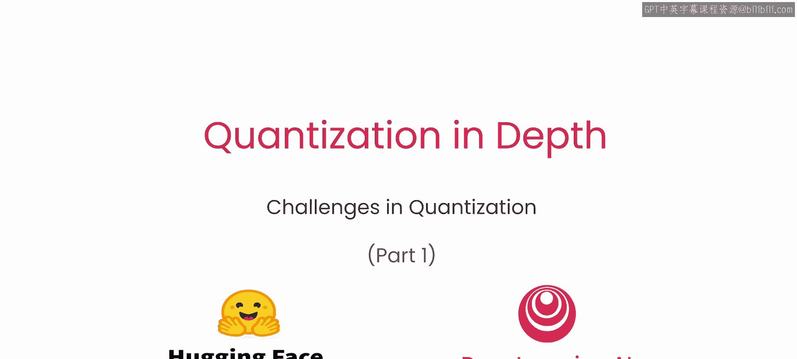
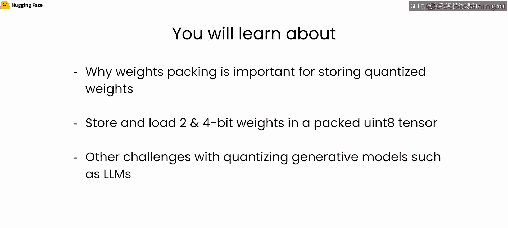
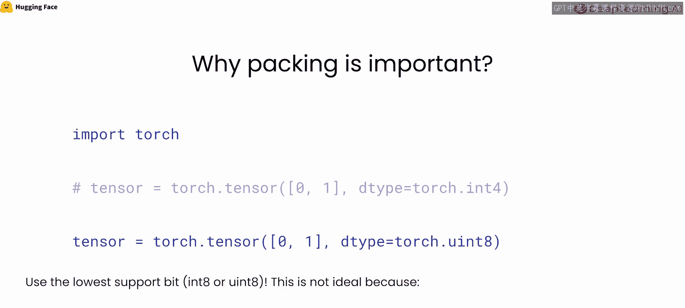
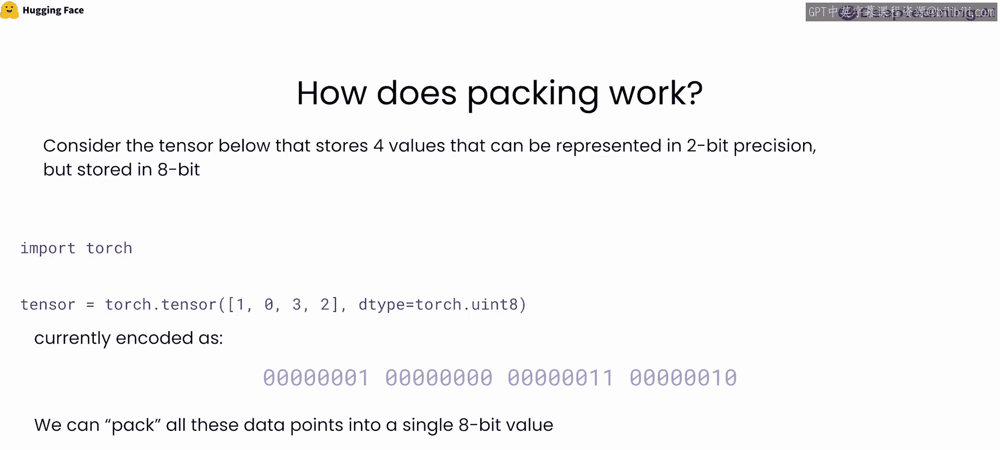
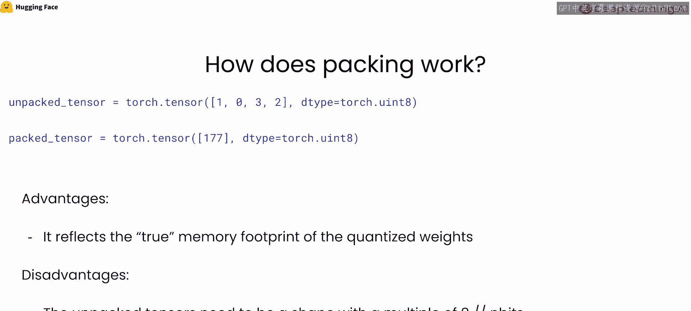

# 014：权重打包



在本节课中，我们将探讨应用低比特量化（例如2位或4位）时可能遇到的一些常见挑战，并通过深入实现权重打包来理解它。此外，我们将通过了解一些前沿的量化方法，来为本课程画上句号。

让我们开始打包权重。

## 概述

在本节中，我们将讨论尝试低比特量化（如2位或4位）时可能面临的挑战，并从零开始实现权重打包。具体来说，你将学习：
*   为什么权重打包对于存储量化权重很重要。
*   如何以打包格式在`int8`张量中存储和加载2位、4位权重。
*   量化生成模型（如大语言模型LLMs）的其他挑战。
*   快速回顾一些先进的LLM量化方法。

## 为什么需要权重打包？



在开始实验之前，我们先了解一下打包的重要性，以及为什么在存储量化权重时需要它。

假设你想将模型量化为4位精度，并希望将权重存储在PyTorch张量中。理想情况下，你希望调用类似下面的代码：
```python
# 理想情况（目前不支持）
torch.tensor(values, dtype=torch.int4)
```
或者之后进行转换。但问题是，截至目前，PyTorch并没有原生支持4位权重。因此，我们需要找到一种高效的方式来存储这些4位权重。

目前唯一的解决方案是，将张量保存在8位精度下，因为这是PyTorch中可用的最小精度数据类型。但在实践中，这并不理想，因为每个数据点将占用8位，而实际上它只需要4位（因为你已将参数编码为4位精度）。对于大型模型，这无疑会增加相当大的开销。

因此，如果我们采用这种简单的方法（即在8位张量中存储4位权重），将模型量化为2位或4位就失去了意义，因为所有参数最终都以8位精度存储。为了解决这个问题，我们需要将4位权重**打包**到8位张量中。

## 权重打包的工作原理

接下来，我们详细看看打包是如何工作的。

考虑下面这个张量，它存储了四个可以用2位精度表示的值。回想一下，在2位精度下，可以编码四个值（0, 1, 2, 3）。假设我们有一个模型参数，已用2位精度编码，其值为 `[1, 0, 3, 2]`。



目前，在PyTorch中我们无法以2位存储模型权重，必须用8位精度存储。因此，我们最终会得到一个这样的张量，它在内存占用上需要 `4 * 8位`。当前，这个权重张量被编码为：`1`（占8位）、`0`（占8位）、`3`（占8位）、`2`（占8位）。

正如之前所说，这并不最优，因为你需要分配 `4 * 8位` 的内存来存储原本只需2位编码的权重。

那么，我们如何忽略这些不需要的位呢？**打包**正是为了解决这一挑战，它将所有相关的位打包到一个单一的8位张量中。

例如，我们将这四个权重打包到一个8位张量中。我们从最右边的权重开始，将其放入新8位参数的前几位：`10`（二进制）。然后放入下一个权重：`00`。接着是 `11`，最后是 `01`。

如果我们将其以8位存储，最终会得到一个只有一个值的新张量，但这个张量编码了所有以2位存储的参数。这个8位无符号整数值将是 `0b10001101`，即十进制的 `141`。

打包的优势在于，它反映了量化权重的真实内存占用。在简单方法中，我们需要分配 `4 * 8位` 的精度；而在打包情况下，我们只需要存储一个8位精度的参数，它包含了我们所有的2位参数。

当然，这需要付出代价。每当我们想要执行推理时，都需要**解包**权重以恢复原始状态，因为PyTorch中原生不支持2位或4位的操作。此外，解包后的张量形状需要是 `(n_bits_per_packed_value / target_bits)` 的倍数。例如，如果我们有5个参数，我们仍然需要分配一个额外的8位参数，但它只编码一个2位值。理想情况下，我们需要让单个张量中的参数数量是 `8 / n_bits` 的倍数（对于2位是4的倍数，对于4位是2的倍数）。

## 实现与应用

现在，让我们看看在实现中这是如何体现的，并进入实验环节。



在接下来的部分，我们将动手实现权重打包和解包的逻辑，并探讨在量化生成式模型（如LLMs）时遇到的其他挑战，例如激活值分布、异常值处理等。最后，我们将简要介绍一些如GPTQ、AWQ等先进的LLM量化方法。

## 总结



本节课中，我们一起学习了低比特量化中的一个关键技术——权重打包。我们理解了为什么在现有框架限制下需要打包，掌握了其将多个低精度值高效存储到更高精度数据类型（如`int8`）中的基本原理。我们还认识到，虽然打包节省了存储空间，但在推理前需要额外的解包步骤。最后，我们了解到量化大型生成模型还存在其他挑战，并预览了当前解决这些挑战的先进方法。