# 015：2比特权重打包 🧩

在本节课中，我们将学习如何使用纯PyTorch实现2比特权重的打包。我们将编写一个函数，将多个低比特数值高效地打包到一个更高位宽的数据类型中，以节省内存。

---

## 概述

权重打包是模型量化中的一项关键技术，它允许我们将多个低比特数值（例如2比特）组合存储在一个更高位宽的数据单元（例如8比特）中。这能显著减少模型的内存占用。本节我们将通过一个具体的例子，逐步讲解其实现原理和代码。

---

## 准备工作

首先，我们需要导入必要的库并定义函数签名。

```python
import torch

def pack_weights(unpacked_tensor, num_bits):
    """
    将低比特权重打包到更高位宽的数据类型中。
    参数:
        unpacked_tensor: 未打包的低比特权重张量，应为无符号整数类型。
        num_bits: 每个原始值的比特数（例如2或4）。
    返回:
        打包后的张量。
    """
```

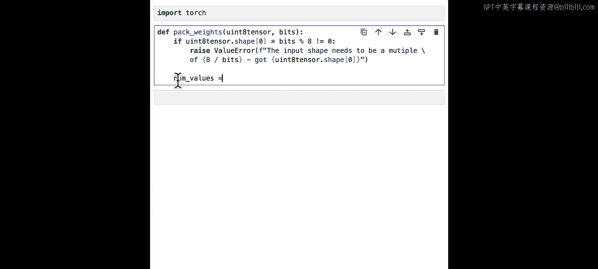

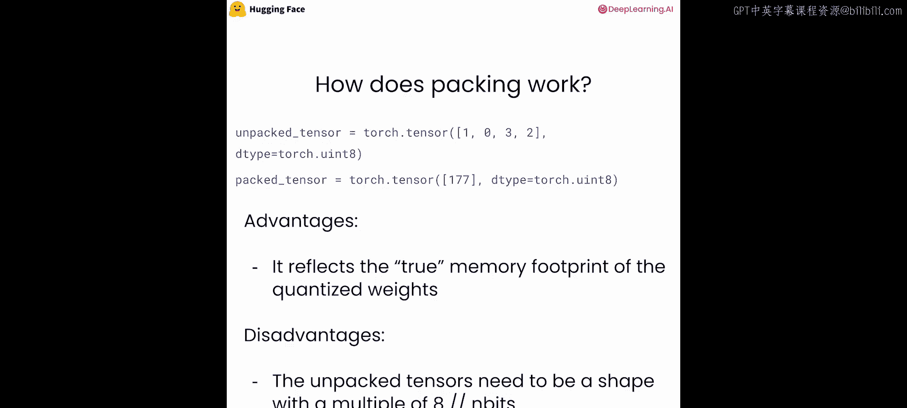

为了简化处理，我们使用无符号整数类型，这样可以避免处理符号位。

---

## 输入形状检查

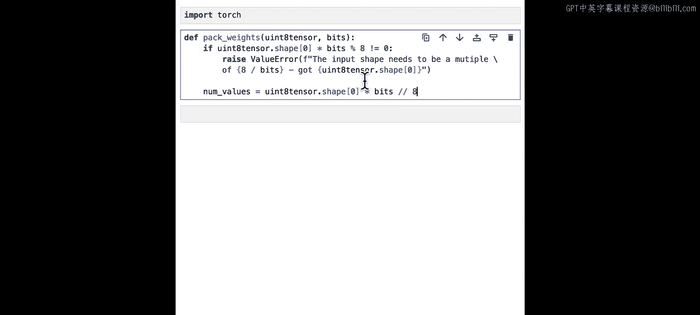

为了确保算法正确运行，输入张量的形状最好是4的倍数。我们添加一个检查条件。

```python
    # 检查输入形状是否为 num_bits 的倍数
    if unpacked_tensor.shape[0] % (8 // num_bits) != 0:
        raise ValueError(f"输入形状需要是 {8 // num_bits} 的倍数。")
```

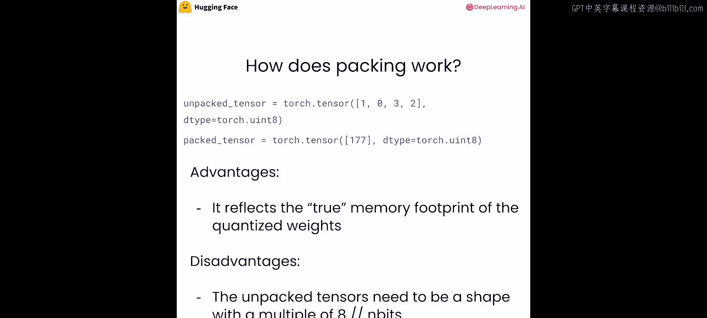

这个检查确保了我们可以将整数个低比特值完整地打包进8比特单元中。

---

## 计算预期输出大小

接下来，我们需要计算打包后张量应包含多少个值。

上一节我们介绍了输入检查，本节中我们来看看如何计算输出大小。

其核心公式是：
**`num_packed_values = (unpacked_tensor.shape[0] * num_bits) / 8`**

这个公式的原理是：总比特数（原始值数量 × 每个值的比特数）除以目标数据类型的比特数（8），就得到了打包后所需的数据单元数量。

```python
    # 计算打包后张量应包含的值的数量
    num_packed_values = (unpacked_tensor.shape[0] * num_bits) // 8
```

---

## 确定处理步骤

每个打包后的值（例如一个8比特整数）将包含多个低比特值。我们需要确定每个打包单元能容纳多少个原始值。

以下是计算处理步骤的逻辑：
**`num_steps_per_pack = 8 // num_bits`**

例如，对于2比特权重，每个8比特单元可以容纳4个值。

```python
    # 计算每个打包值需要处理的低比特值数量
    num_steps_per_pack = 8 // num_bits
```

---

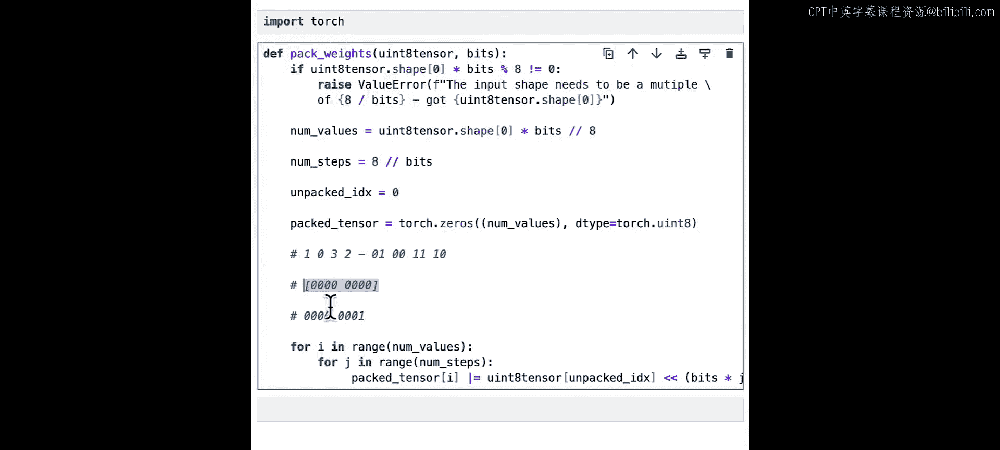

## 初始化与循环

现在，我们初始化打包后的张量，并开始核心的打包循环。

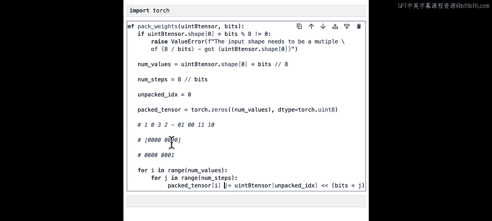

以下是实现打包算法的步骤：

1.  **初始化索引和输出张量**：我们创建一个全零的无符号8比特张量来存放结果。
2.  **外层循环**：遍历每一个即将生成的打包值。
3.  **内层循环**：对于每个打包值，循环处理`num_steps_per_pack`个低比特值。

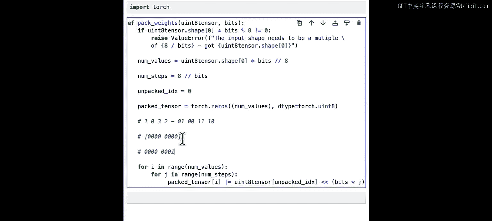

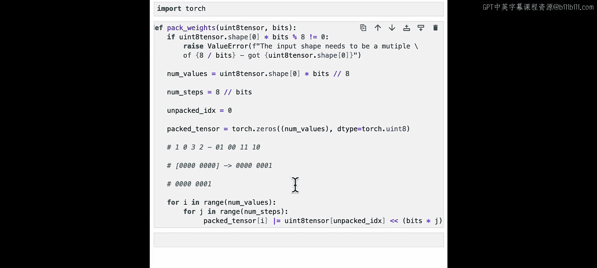

```python
    # 初始化打包后的张量
    packed_tensor = torch.zeros(num_packed_values, dtype=torch.uint8)

    # 用于跟踪当前正在处理的原始低比特值的索引
    unpacked_index = 0

    # 外层循环：遍历每个打包单元
    for i in range(num_packed_values):
        # 内层循环：将多个低比特值打包进当前单元
        for j in range(num_steps_per_pack):
            # 获取当前低比特值，并确保其类型为uint8
            low_bit_value = unpacked_tensor[unpacked_index].to(torch.uint8)
            # 将值左移相应的比特位
            shifted_value = low_bit_value << (j * num_bits)
            # 使用按位或操作将值“写入”打包单元
            packed_tensor[i] |= shifted_value
            # 移动到下一个低比特值
            unpacked_index += 1

    return packed_tensor
```

---

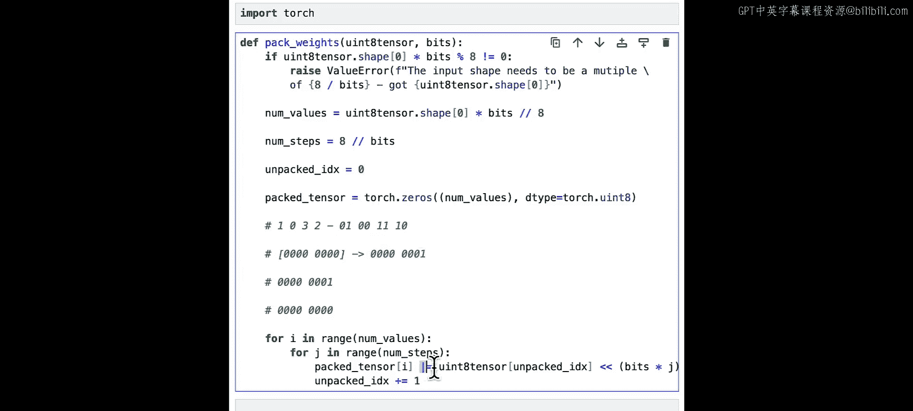

## 算法原理图解

让我们通过一个具体例子来理解上述代码。假设我们有一个包含四个2比特值的张量：`[1, 0, 3, 2]`。

我们的目标是将其打包成一个8比特整数。

1.  **第一次迭代** (`j=0`)：处理值 `1` (`01`)。不移位，直接通过按位或放入打包单元。结果：`00000001`。
2.  **第二次迭代** (`j=1`)：处理值 `0` (`00`)。左移2位，得到 `00000000`。与之前结果按位或，结果不变：`00000001`。
3.  **第三次迭代** (`j=2`)：处理值 `3` (`11`)。左移4位，得到 `00110000`。按位或后，结果：`00110001`。
4.  **第四次迭代** (`j=3`)：处理值 `2` (`10`)。左移6位，得到 `10000000`。按位或后，得到最终结果：`10110001`，即十进制的177。

这个过程直观地展示了比特是如何被逐步组合起来的。

---

## 测试与验证

现在，让我们测试我们编写的函数。

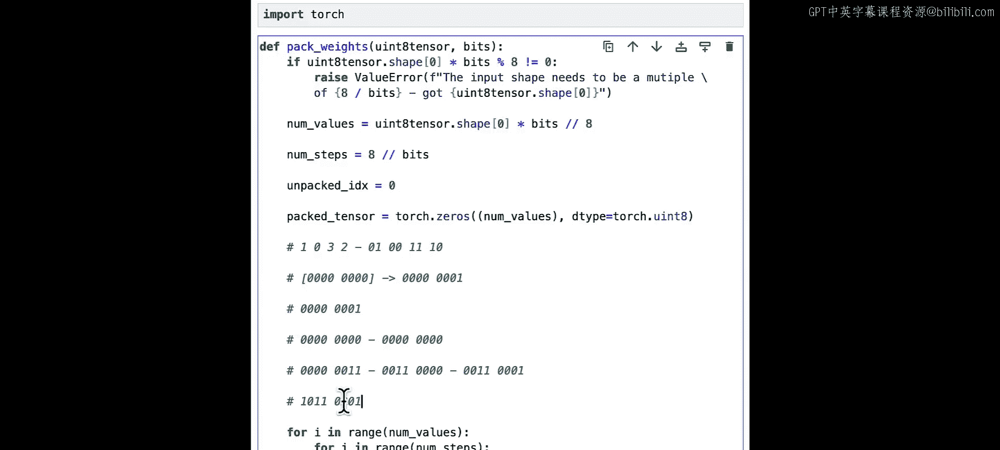

```python
# 创建一个示例张量，包含四个2比特值：1, 0, 3, 2
# 注意：在2比特表示中，这些值本身应小于4。
unpacked = torch.tensor([1, 0, 3, 2], dtype=torch.uint8)

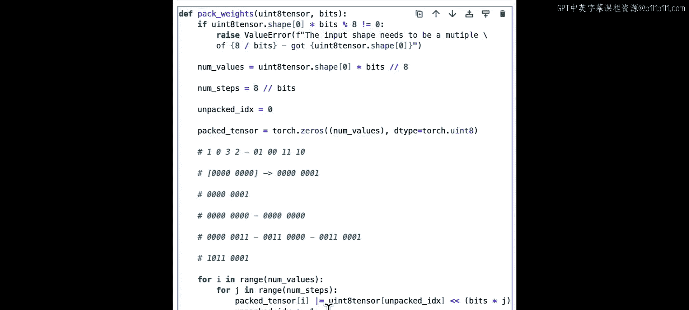

# 调用打包函数
packed = pack_weights(unpacked, num_bits=2)
print(f"打包后的值: {packed.item()}")  # 预期输出: 177
```

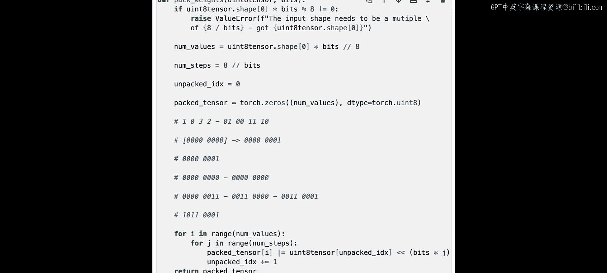

运行上述代码，如果得到177，则证明我们的打包函数工作正常。你可以尝试将177转换为二进制 (`10110001`)，验证其是否对应 `[1, 0, 3, 2]` 的2比特表示。

---

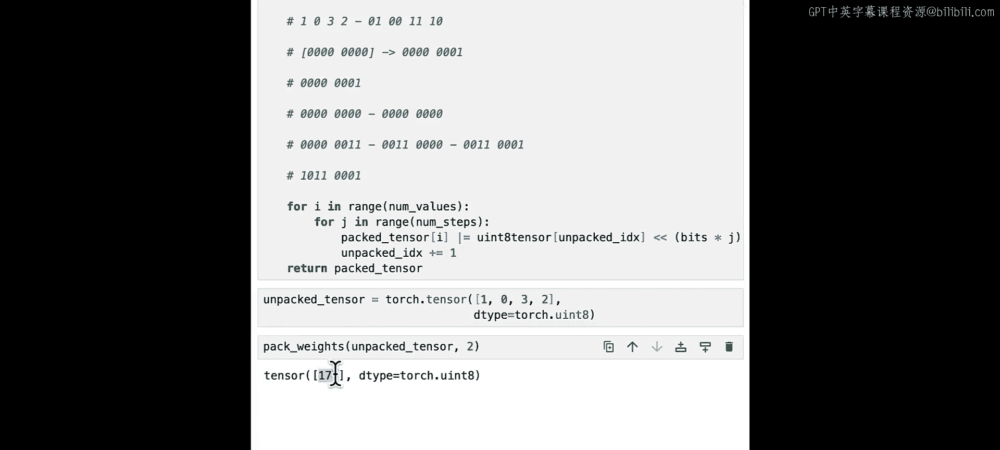

## 扩展与练习

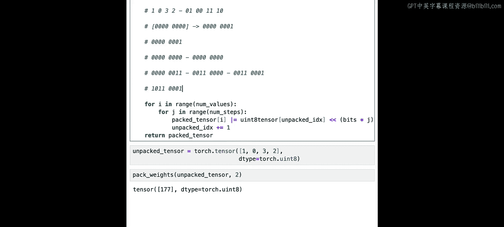

为了加深理解，你可以尝试以下练习：

*   **实现4比特打包**：修改函数，使其能处理4比特权重的打包。
*   **边界测试**：测试一些边界情况，例如所有值都为3（2比特最大值 `11`），看看打包结果是否为255。
*   **优化代码**：思考是否可以用更向量化的方式（减少显式循环）来实现这个功能。

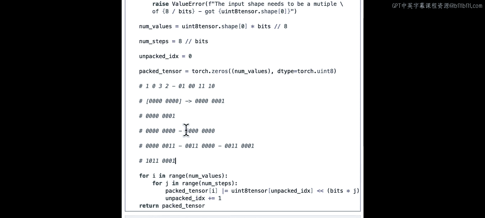

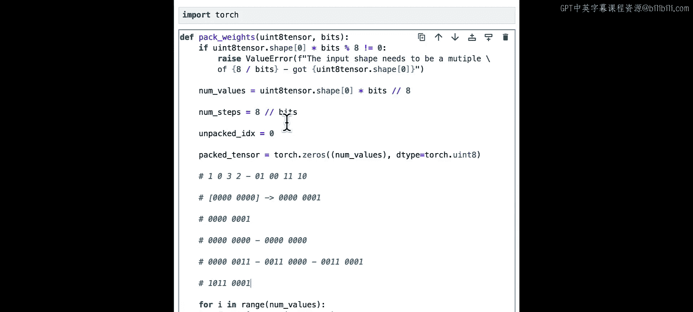

---

## 总结

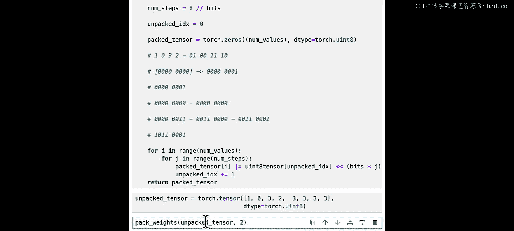

本节课中我们一起学习了2比特权重打包的核心原理与实现。我们了解了如何通过比特移位和按位或操作，将多个低比特数值高效地压缩到更高位宽的数据类型中。这项技术是模型量化中减少内存占用的关键步骤。通过动手实现，我们不仅掌握了算法，也加深了对底层比特操作的理解。