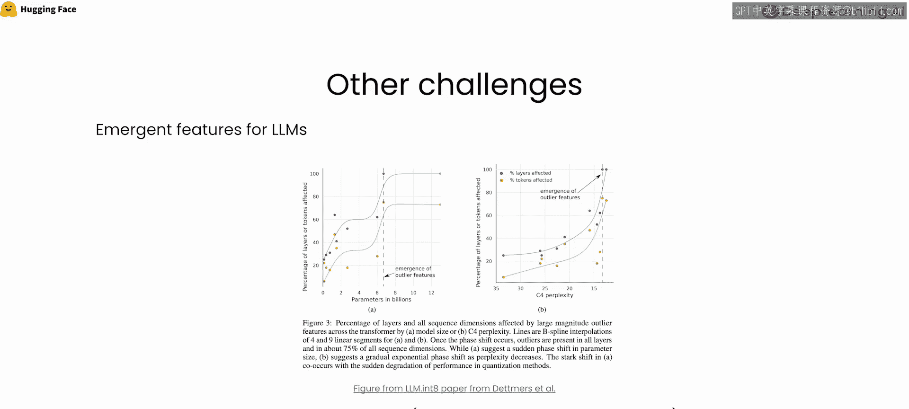
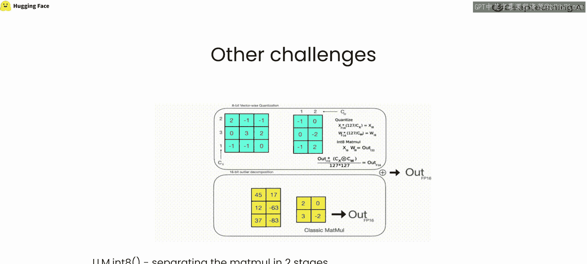
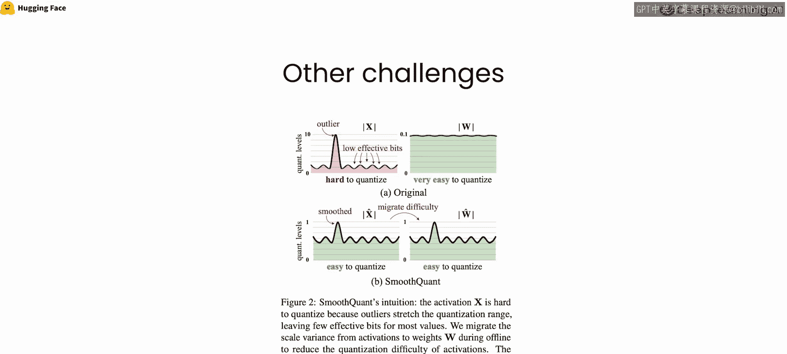
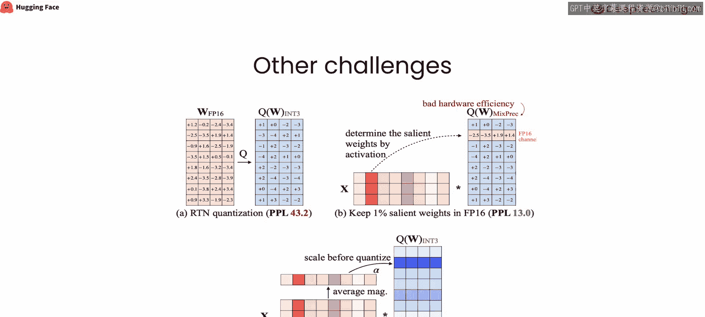
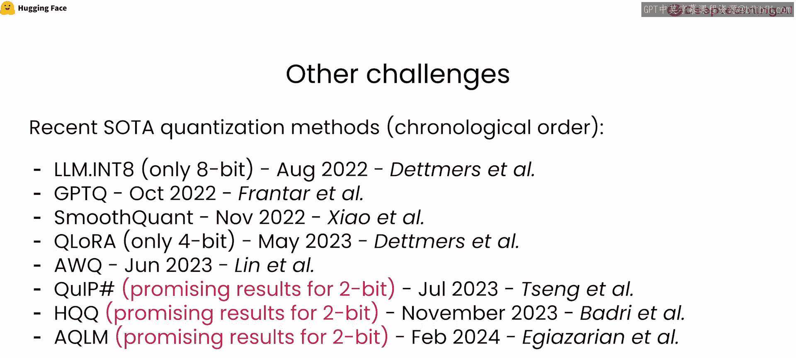
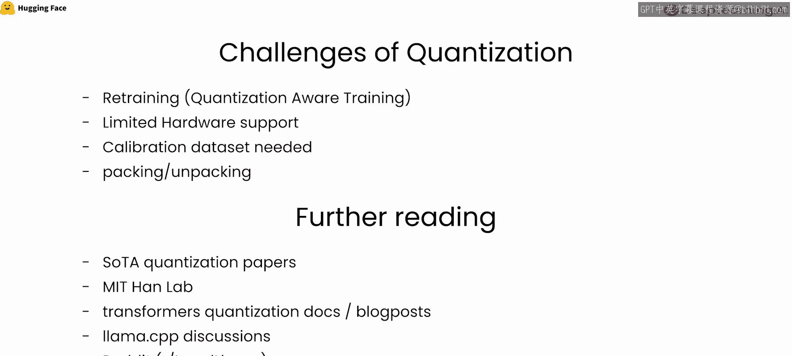

# 017：超越线性量化 🚀

在本节课中，我们将总结整个课程，并探讨大语言模型量化中的一个核心挑战——“涌现特征”，以及应对此挑战的几种前沿量化方法。

上一节我们介绍了线性量化的基本概念。本节中，我们来看看当模型规模变得非常大时，量化会遇到什么特殊问题。随着开源社区出现越来越多的大语言模型，研究人员在深入探索模型能力时，发现了一些所谓的“涌现特征”。涌现特征指的是模型在规模变大时才会显现出的某些特性或特征。具体来说，对于某些大模型，其预测的特征，即隐藏状态的大小，会变得非常大。这使得经典的量化方案变得不再适用，导致传统的线性量化算法在这些模型上失效。

自这些大语言模型开源以来，许多论文都致力于解决如何处理大语言模型中的离群特征这一具体挑战。离群特征简单来说就是数值非常大的隐藏状态。以下是一些有趣的论文，我们将简要解释每篇论文的核心思想，以提供解决此问题的潜在方案。

## 应对离群特征的量化方法 📄

以下是几种针对大语言模型离群特征问题提出的量化技术。

*   **LLM.int8()**：该方法提出将线性层的底层矩阵乘法分解为两个阶段。具体思路是，将输入隐藏状态矩阵分解为两部分：离群部分（所有超过某个阈值的隐藏状态）和非离群部分。然后，对非离群部分执行 int8 精度的矩阵乘法（即量化、计算、再反量化），对离群部分则使用原始高精度数据类型（通常是半精度）进行经典计算，最后将两部分结果合并。这种方式已被证明可以保持模型的完整性能，而不会造成性能下降。

*   **SmoothQuant**：这种方法专门应用于 W8A8 方案，即权重和激活值都量化为 8 比特精度。该论文同样处理大语言模型中的离群特征问题，并提出通过平滑激活值和权重来缓解此问题。具体做法是根据输入激活值确定一个平滑因子，将量化难度从激活值迁移到权重上，使得权重和激活值的量化难度均衡。这样也能保留模型的全部能力。

*   **AWQ**：这篇较新的论文也以特殊方式处理离群特征。它来自与 SmoothQuant 相同的实验室。其核心思想是，首先在一个校准数据集上进行迭代，以详细了解输入权重中哪些通道可能负责生成离群特征（称为显著权重）。然后，利用这一信息在量化前缩放模型权重，并在推理时使用相同的缩放因子来重新调整输入。

以上只是众多专门解决大语言模型高效量化问题的论文中的一小部分。如果你对此感到好奇，我邀请你详细阅读这些论文，深入理解它们。量化大语言模型时，除了离群特征，还存在其他挑战。

## 量化领域的其他挑战与资源 🔍

量化感知训练领域目前可能探索得还不够充分，在低比特下训练模型也是一个有趣的话题。此外，还有硬件支持有限的挑战。本课程主要关注 W8A16 方案，但对于更高效的 W8A8 方案，并非所有硬件都支持 8 比特运算。校准数据集的挑战也值得注意，某些量化方法需要校准数据集来进行模型预处理，以优化量化效果。当然，还有数据分布与打包的挑战。

如果你对这个话题真正感兴趣，我邀请你进行进一步的阅读。例如，可以查阅量化领域的综述论文。麻省理工学院的 HAN Lab 也发布过一些优秀的量化综述，提供了很好的学习资源。你还可以查看 Hugging Face Transformers 库的量化文档和博客文章。浏览 Llama.cpp 仓库的讨论区也能发现许多富有洞察力的实验和讨论。此外，Reddit 上有一个名为 r/LocalLLaMA 的子版块，那里分享了很多关于量化的精彩见解和新方法。

当然，可能还有很多其他资源未被提及，但这些是我所知道的。本节课就到这里，希望你通过本课程学到了很多，并能将我们展示的内容应用到你的工作或项目中。希望所有这些能给你带来一些灵感，去尝试一些很酷的事情。

感谢你学习本课程，我们将在下一个视频中再见。