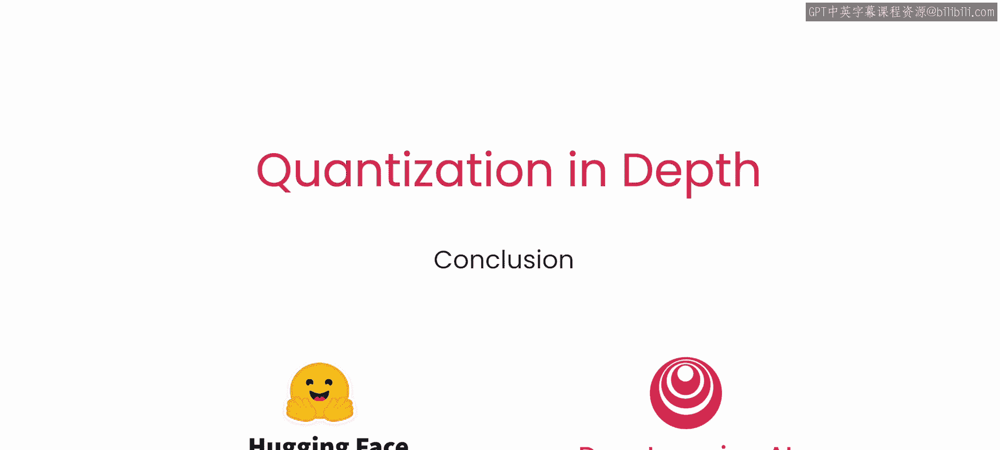

# 018：总结与展望 🎯

在本节课中，我们将对这门关于模型量化的简短课程进行总结，回顾所学到的核心知识与技能，并展望未来的学习方向。

祝贺你完成了这门短期课程的学习。在课程中，你尝试了线性量化方法的不同变体，并使用 PyTorch 从零开始实现了它们。你还构建了一个量化器，用于将任何模型量化为 8 位精度。最后，你了解了量化过程中的一些重要挑战，例如权重打包，并手动实现了打包和解包算法。

我们鼓励你探索 Hugging Face Transformers 库中提供的其他量化方法。我们希望这门课程能为你提供量化任何模型所需的所有工具。

如果你觉得这门课程有帮助，或许可以与你的朋友们分享。

---

**总结**

本节课中我们一起学习了模型量化课程的总结。我们回顾了从实现线性量化方法、构建量化器到处理权重打包挑战的完整学习路径。课程为你提供了实践性的工具和理论基础，帮助你迈出模型量化的第一步。