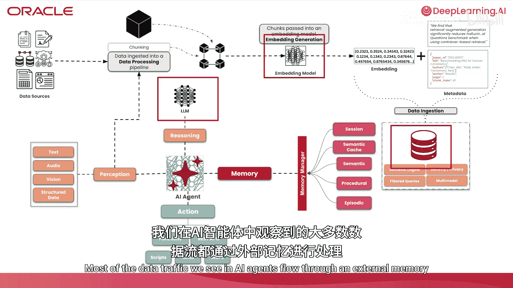
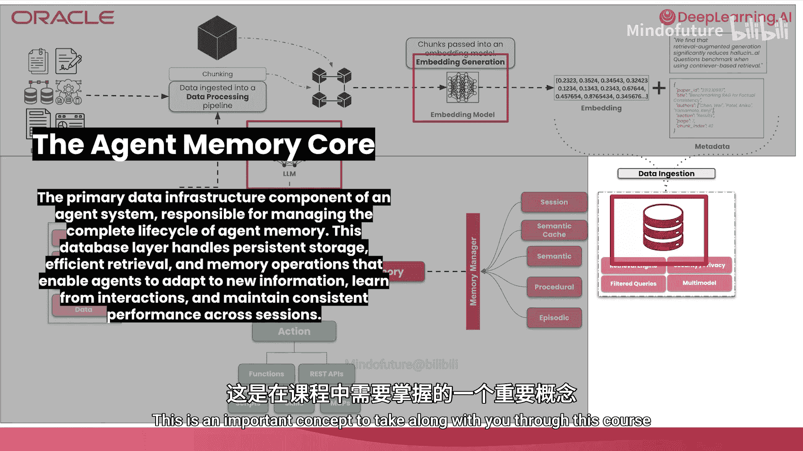

# 001：为何AI智能体需要记忆 🧠

在本节课中，我们将学习AI智能体为何需要记忆。具体来说，我们将概述什么是AI智能体，以及无状态智能体与具备记忆的智能体之间的区别。我们还将探讨对话历史记录的局限性，并介绍超越对话历史记录的必要性。最后，我们将通过介绍智能体记忆和智能体记忆核心这两个关键概念来总结本课。

## 什么是AI智能体？🤖

AI智能体是一种计算实体，它能够通过输入感知环境，通过工具使用采取行动，并借助大语言模型（LLM）具备推理能力。更重要的是，AI智能体通常具备某种形式的增强记忆，使其能够跨会话和交互存储、检索和应用知识。这就是我们所定义的AI智能体。

通常，AI智能体应能独立运行，在几乎无需人类反馈的情况下代表人类行动。它们是受目标和目的约束的。

## 无状态智能体与记忆增强智能体

既然我们了解了什么是AI智能体，现在我们需要非常清楚地理解记忆对AI智能体的重要性。我们将通过观察没有记忆的AI智能体如何运作来做到这一点。

### 无状态智能体的运作

想象一个用户在一个应用程序中与智能体交互。用户请求推荐该地区的餐厅，我们称之为**第一轮交互**。这条消息会被发送给智能体，智能体将生成响应，理想情况下会检测用户意图，对用户发送的消息进行推理，并使用一系列工具（如搜索位置和获取该位置的餐厅信息）来实现目标，最后向用户提供输出。我们可以称之为**第二轮交互**。

在后续的交互中，用户会再次与同一个智能体继续对话。我们称之为**第三轮交互**。当用户从智能体那里获得推荐后，用户可能会要求预订列表上的第一个推荐。

一个没有记忆的AI智能体会像屏幕上显示的那样回应：它不记得用户所指的对话，并要求用户具体说明。我们可以称之为**第四轮交互**。在这种情况下，由于缺乏记忆，智能体无法完成用户指定的任务。我们可以将这种需要多轮交互才能完成的任务称为**多轮交互**。

显然，这是没有记忆的情况。我们已经看到了一个仅具备感知、行动和推理特性的AI智能体在现实场景中的运作方式。本质上，我们将这类AI智能体称为**无状态智能体**。

### 无状态智能体的定义与局限

无状态智能体仍然可以通过输入感知环境，通过LLM的推理能力对输入进行推理，并将输出反馈给用户。但关键一点是，正如我们所见，没有记忆的AI智能体无法在单轮交互之外保留或回忆信息。

这带来了显著的缺点：
*   **无法完成长周期任务**：智能体无法完成需要运行数分钟、数小时甚至数天的任务，因为没有先前交互或已采取步骤的信息，完成任务将非常困难。
*   **缺乏跨会话的上下文感知**：如果用户与智能体交互后离开并返回，或开始新会话，之前提供给用户的信息将会丢失，无法跨会话传递。
*   **缺乏适应能力**：在交互过程中提供给智能体的任何新信息都不会被更新或用于后续交互。
*   **运营成本高**：为了保持或增强连续性，必须在每一轮交互中将大量信息塞入上下文窗口。

## 记忆增强智能体的优势

我们已经概述了无状态智能体（即没有记忆的智能体）。现在，我们可以继续看看具备记忆的AI智能体会是什么样子。

我们将使用与之前类似的场景，但从第三轮交互开始。在第一轮和第二轮交互中，记忆增强智能体会将对话历史存储在一个外部记忆存储（如数据库）中。

这意味着当用户请求推荐并随后要求预订列表上的第一个推荐时，智能体会做出适当的响应：识别出列表上的第一个餐厅，并提供合理的输出，例如询问用户希望预订的日期和时间。我们可以将第一、二轮和第三、四轮交互都视为**交互历史**，所有这些都将存储在数据库中，供所有后续轮次使用。本质上，我们拥有一个**记忆增强智能体**。

### 记忆增强智能体的深入探讨

与无状态智能体一样，记忆增强智能体可以感知输入，对输入进行推理并产生输出。所有这些都由LLM的推理能力驱动。但更重要的是，我们有一个数据库用于存储和检索信息。

这带来了许多好处，例如智能体能够完成长周期任务，具备持续的上下文感知能力，并且能够适应。让我们更详细地了解这些优势：
*   **完成长周期任务的能力**：主要因为它们可以引用先前交互和会话中保存的上下文。
*   **持续的上下文感知**：这使用户感觉与智能体进行了连续的交互。
*   **提高效率和降低运营成本**：因为我们减少了必须传入上下文窗口的信息量，只传入存储在外部记忆存储中与交互相关的信息。
*   **在多步骤工作流中具有更高的可靠性**：这主要是由于我们可以引用先前采取的步骤和先前的上下文，这使得所有后续步骤在成功结果方面更加可靠。

我们将在未来的课程中更深入地探讨所有这些优势。

## 超越对话历史：智能体记忆的类型

记忆增强智能体有各种形式和规模。我们看到的可能是一种简单的记忆增强智能体形式。从无状态智能体转变为能够记忆的智能体，意味着将交互历史存储在外部存储中。我们已经提到了其关键好处，但最重要的是交互的连续性。

本质上，我们通过对话或交互历史的存储，为智能体带来了连续性。这些交互通常发生在用户（或多个用户）与智能体（或助手）之间。

存储在外部存储中的交互历史可以被称为**对话记忆**。我们将进一步研究不同形式的记忆，但对话记忆是最容易理解的形式之一，也是交互历史所对应的一种形式。

一次交互通常是用户和智能体之间的来回信息。在对话记忆中，我们有非常具体的属性：**时间戳**（交互发生的时间）以及**用户消息和助手消息**。这些将存储在数据库（外部记忆）中。

理想情况下，对话记忆是按时间排序的，这意味着当我们检索任何对话记忆数据时，我们是按时间顺序检索的，以便我们可以看到所采取的行动和交互的顺序。

### 对话记忆在LLM上下文窗口中的体现

LLM有一个上下文窗口，可以容纳一定数量的标记。在上下文窗口中，我们会放置系统提示和指令。然后，交互历史将作为对话记忆被检索出来，我们将从外部存储中按顺序放置过去的交互轮次。最后，我们会放置最终的用户提示。这就是一个具备对话记忆的LLM上下文窗口的描绘。

### 为何需要超越对话记忆？

但我们实际上需要超越这一点。有几个原因说明为什么我们需要超越对话记忆，或者仅仅使用交互历史来创建记忆增强智能体：
*   **对话窗口是有限的，但用户关系不是**：我们可以通过查看对话或与对话相关的其他数据，来捕获用户与助手之间更多的关系。例如，交互中提到的实体信息，如地点、人物以及与人的关系。并非所有有价值的信息都存储在单一对话中。
*   **智能体需要结构化、可查询的知识，而不仅仅是聊天记录**：存储在对话记忆中的数据只是交互历史。但智能体可以在工作流中运行，其中工作流中采取的步骤以及结果实际上是有用的信息。这些不是对话历史或交互历史。

因此，我们需要扩展并超越对话记忆，这将在未来的课程中探讨。

## 智能体记忆的两种形式

既然我们已经了解了对话记忆，现在是时候探索你将遇到的不同形式的智能体记忆了。简单来看，智能体记忆可以分为两种不同的形式：**短期记忆**和**长期记忆**。

### 短期记忆

短期记忆的两种常见形式是**语义缓存**和**工作记忆**。
*   **语义缓存**：本质上是一种缓存机制，利用向量搜索和先前从推理提供商处获得的响应，来作为后续交互中类似查询的响应。
*   **工作记忆**：可以看作是LLM的上下文窗口和任何基于会话的记忆。这本质上被视为一个便签本，LLM可以在其中操作，但在交互或会话结束后会丢失。

### 长期记忆

对于长期记忆，我们有三种主要形式：**程序性记忆**、**语义记忆**和**情景记忆**。让我们看看这些记忆类型的例子：
*   **程序性记忆**：我们在智能体中常用的一种记忆类型是**工作流记忆**。在这里，我们存储智能体为实现后续目标必须采取的交互步骤。这些步骤可能包括调用工具和其他过程。理想情况下，以外部记忆的形式记录这些步骤，可以在后续交互中作为智能体参考的经验形式被引用。
*   **语义记忆**：一个很好的例子就是**知识库**，这是智能体完成任务需要知道的任何外部知识。这可能是智能体运作领域内的特定领域知识。
*   **情景记忆**：我们之前探讨的对话记忆被称为一种情景记忆，通常是因为我们在捕获的信息上具有时间戳属性，并且我们可以使用时间来引用这些特定数据。

## 智能体记忆与记忆核心

现在我们对不同类型的智能体记忆有了很好的理解，是时候具体理解什么是智能体记忆了。

智能体记忆可以定义为系统组件与一些架构组件的组合，以使智能体能够适应和学习。你在智能体记忆中找到的系统组件通常包括**嵌入模型**、**数据库**和**大语言模型**。理想情况下，这些系统组件与控制机制和软件框架（统称为**记忆管理器**）的结合，将使智能体能够存储、检索和回忆信息，从而使其能够适应交互并学习。

为了理解智能体记忆，我们可以利用你先前关于检索增强生成（RAG）的知识。我们将快速回顾RAG的工作原理，然后将其引入并与智能体记忆联系起来。

### 从RAG到智能体记忆

典型的RAG流程如下：
1.  拥有一个数据源，通过数据处理管道（包括将数据对象分解为后续块）。
2.  这些块被传递到嵌入模型，创建数据对象的数值表示（嵌入向量）。这个数值表示捕获了传入嵌入模型的数据对象的语义和上下文。
3.  连同嵌入向量和元数据，我们可以将不同的数据类型传递到单个数据库中进行存储。
4.  用户通过与应用程序交互，传入用户查询。
5.  用户查询通过嵌入模型进行向量化，生成用户查询的数值表示（通常使用与摄取管道相同的嵌入模型）。
6.  检索与用户查询语义相似的行。
7.  将这些行传递到重排序模型。
8.  重排序后的结果与用户查询连接，并传递到LLM，以使LLM的响应基于特定领域的数据。

为了建立RAG与智能体记忆的联系，我们将采取以下步骤：在RAG流程的前期部分，我们会有典型的摄取过程。同时，我们引入对AI智能体及其主要特征（感知、记忆、行动和推理能力）的了解。为了将RAG与智能体记忆联系起来，你会将我们在先前幻灯片中介绍的记忆类型（如语义记忆、程序性记忆或情景记忆/对话记忆）作为数据库中的计算形式（理想情况下是数据库中的表）。

然后，一个**记忆管理器**可以用来抽象化从这些表中读取、写入、更新和删除数据的方法和程序。我们的智能体通过工具连接记忆管理器，并将这些功能作为记忆能力提供给智能体，从而获得所有这些能力。这就是我们如何将先前关于RAG的知识、智能体的特征以及不同形式的记忆融入到智能体记忆中。

### 智能体记忆核心

现在，我们将介绍智能体系统中的术语——**智能体记忆核心**。在智能体系统中，记忆主要位于三个组件中：
1.  **大语言模型**：拥有其训练数据的所有参数记忆。
2.  **嵌入模型**：在生成嵌入向量时，可以从中提取语义和上下文信息的记忆。
3.  **数据库**：这是你在智能体系统中看到数据流量最多的地方。这是数据被存储、检索和优化的地方。

这些都是与智能体记忆相关的主要系统组件。但**智能体记忆核心**就是你的**数据库**。这是在整个智能体系统中存储和检索最多信息和数据的地方。

我们在AI智能体中看到的大多数数据流都通过由数据库支持的外部记忆。智能体记忆核心可以定义为主要的基础设施，它将在你的智能体系统中处理最多的数据流量。它应该能够处理信息的存储、检索以及存储本身内部信息的优化。这就是我们将数据库称为智能体记忆核心的原因。这是本课程中需要掌握的一个重要概念。

## 总结

在本节课中，我们一起学习了AI智能体为何需要记忆。我们首先定义了AI智能体，然后对比了无状态智能体与记忆增强智能体在交互中的表现，揭示了仅依赖对话历史的不足。我们探讨了智能体记忆的真正含义，将其分为短期记忆和长期记忆，并介绍了程序性、语义和情景等具体记忆类型。最后，我们引入了智能体记忆核心的概念，指出数据库作为处理数据存储与检索的核心基础设施的关键作用。这些基础知识为我们后续深入构建具备记忆能力的智能体奠定了坚实的架构理解。