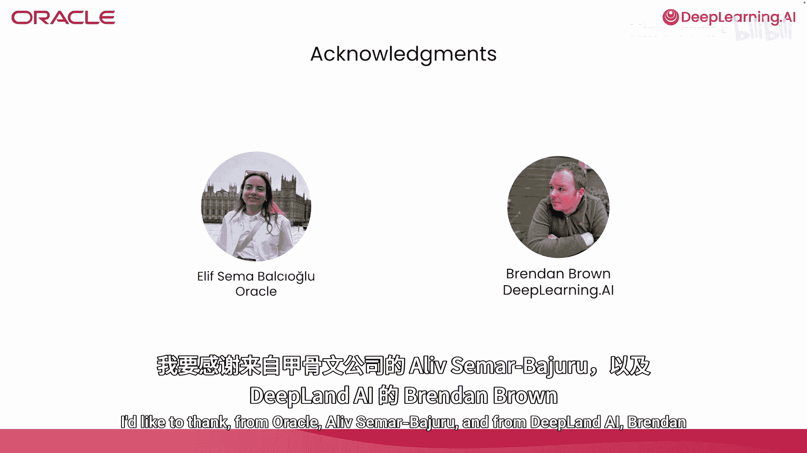

# 002：简介

在本节课中，我们将要学习为什么智能体需要记忆，并初步了解一种名为“记忆优先”的架构，以解决智能体在长期任务中容易遗忘的问题。

许多使用大语言模型进行开发的开发者都遇到过这样的场景：一个智能体在单次会话中可以正常工作，但当会话结束时，它会丢失或忘记所有学到的东西。本课程的目标，就是将这种不稳定的智能体转变为能够克服这一挑战的智能体。

在课程中，你将学习如何设计记忆系统，赋予智能体持久性、连续性以及随时间学习的能力。我们将使用Oracle AI数据库作为存储和检索智能体记忆的基础设施层。

我很高兴向大家介绍本课程的讲师：Richmond Alake和Nacho Martinez。

感谢Andrew。我很高兴能与你和你的团队合作。
谢谢，Andrew。

Richmond和Nacho将引导你学习如何使用数据库、LangChain以及一个用于记忆增强、提取和检索的端到端管道。通过这些工具，你将了解“记忆优先”架构如何解决智能体在长期任务中失败的问题。

你将构建一个记忆管理器，用于存储你的记忆树，并对不同类型的记忆进行操作。本课程最让我兴奋的一点，是它所代表的方向转变。过去几年，我们一直专注于提示工程和上下文工程，研究如何充分利用单个大语言模型的核心能力。但对于需要运行数天或数周的智能体来说，这还不够。

你需要的是记忆工程——将长期记忆视为一等公民的基础设施，它独立于模型之外，具有持久性和结构性。这正是本课程的核心内容。课程结束时，你将掌握构建智能体的工具，这些智能体不仅能做出回应，更能记住信息、持续改进并意识到自身的记忆能力。

我们所教授的模式并非纸上谈兵。我们将逐步讲解真实的实现过程：构建记忆存储、连接提取管道以及处理记忆中的矛盾。你将获得可以直接运行、并能为你自己的生产环境智能体所适配的代码。

许多人共同参与了本课程的创作。我要感谢来自Oracle AI团队的Sema Bajalu，以及来自DeepLearning.AI的Brendan Brown。

第一课将概述AI智能体及其为何需要记忆。我们将分析无状态智能体的失败模式，并介绍本课程后续内容所基于的“记忆优先”架构。

哦，等等，我忘了。你在做什么游戏？好吧，记忆。希望你享受这门课程。

---

**本节课中我们一起学习了**：智能体在长期任务中面临遗忘挑战，以及引入“记忆优先”架构作为解决方案的重要性。我们概述了课程目标，即通过构建持久、结构化的外部记忆系统，使智能体能够记住、改进并具备连续性。