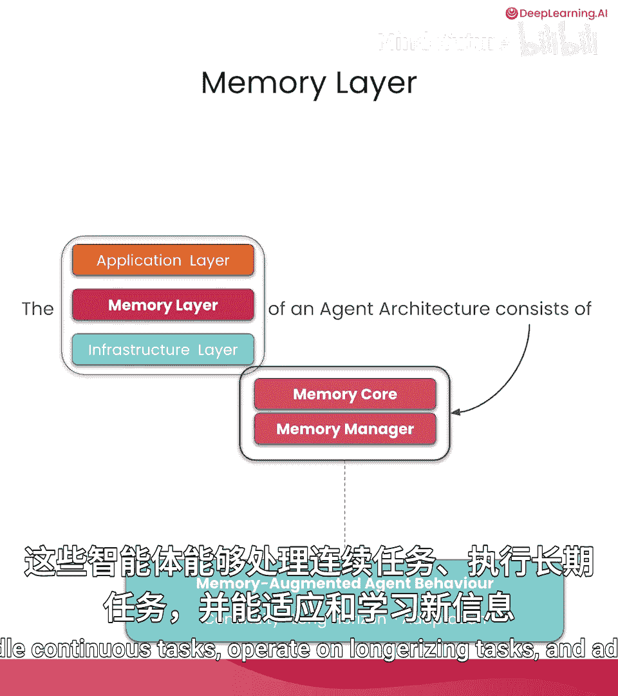
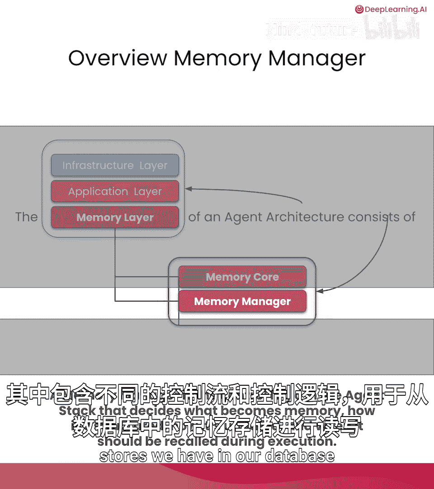
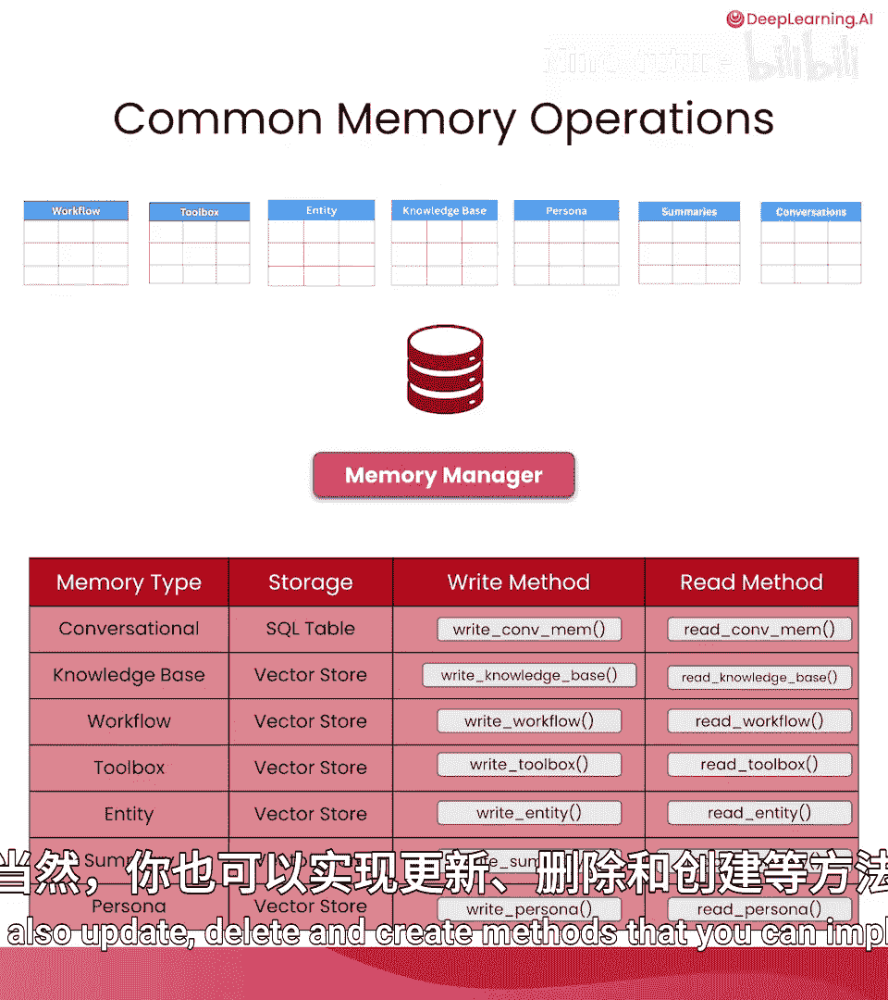
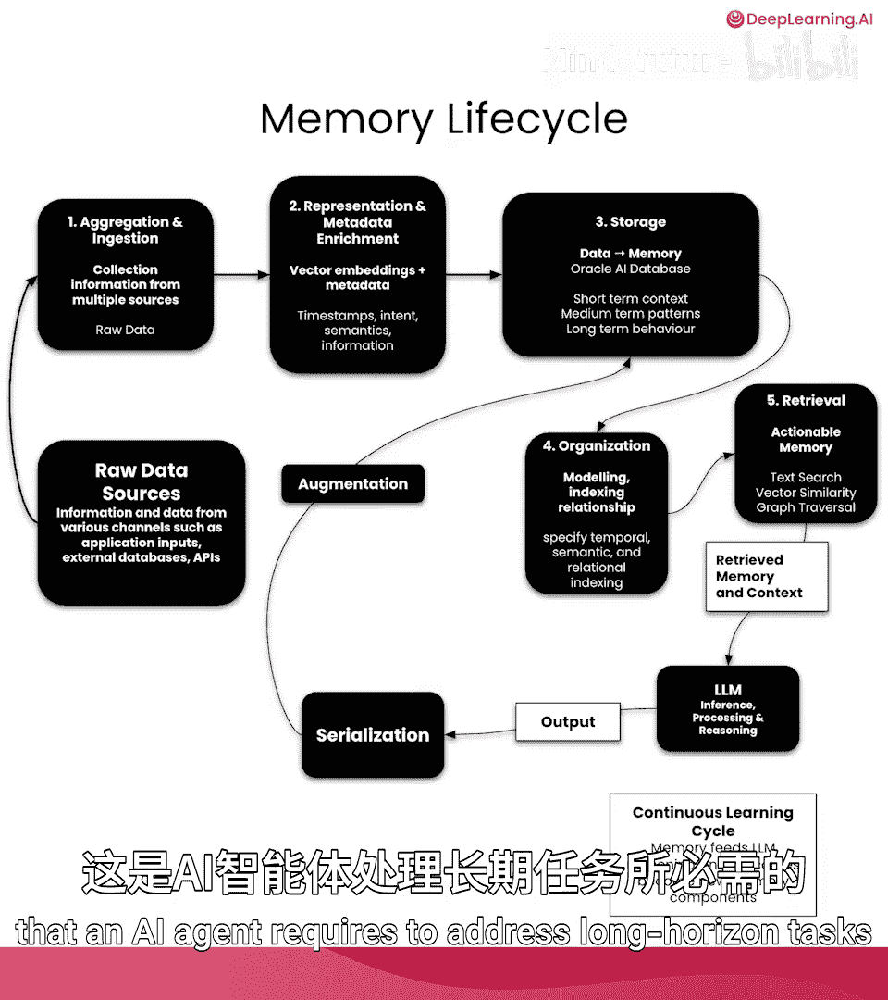
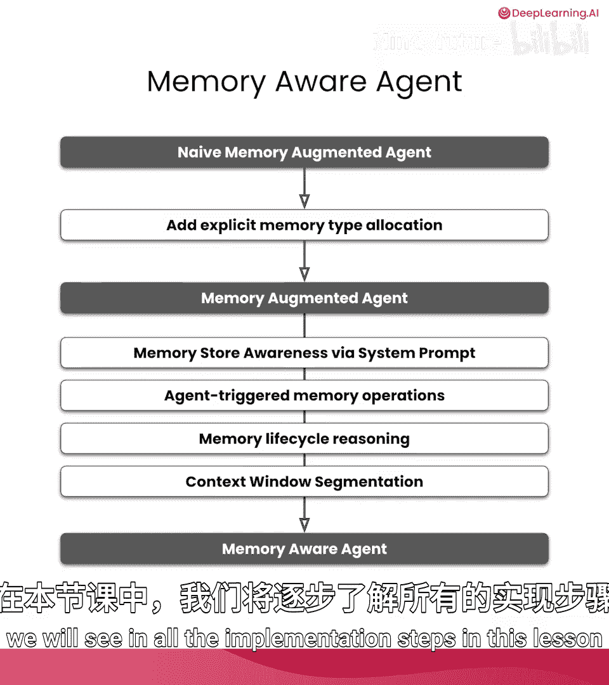
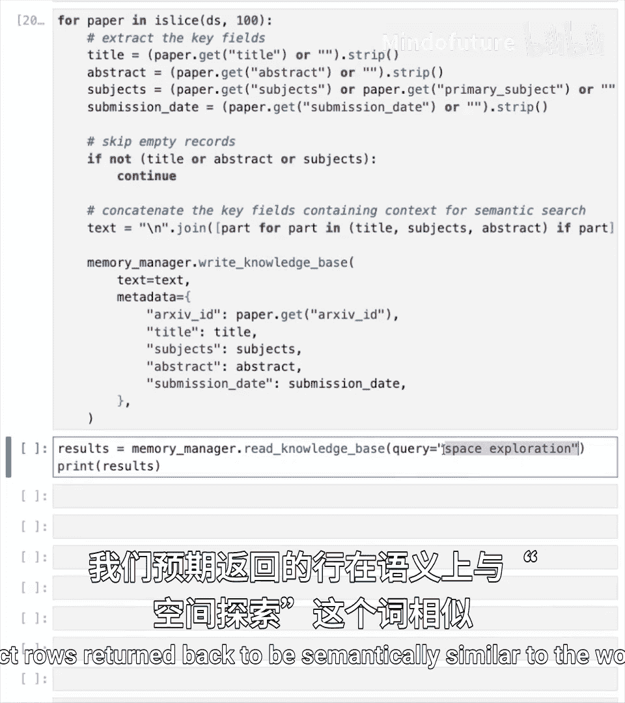

# 003：构建记忆管理器 🧠

在本节课中，我们将构建支撑本课程所有内容的核心记忆基础设施。你将学习如何为不同的智能体记忆类型设计持久化存储、如何为高效检索建模记忆数据，并实现一个在智能体执行过程中协调记忆读写与检索操作的内存管理器。

## 理解智能体技术栈与记忆层

上一节我们介绍了记忆的核心概念，本节中我们来看看智能体技术栈。智能体技术栈是指一系列协同工作的工具和技术，旨在使AI智能体在生产环境中可靠且高效地运行。

通常，技术栈包含屏幕上所示的多个层级，但为了本课程的目的，我们将其压缩为三个主要层级：应用层、数据层和基础设施层。然而，由于我们讨论的是AI智能体并从智能体视角出发，我们可以将数据层替换为**记忆层**。

现在，让我们更详细地了解记忆层。它通常是智能体技术栈中包含**记忆核心**（我们在前一课中已介绍）和**内存管理器**的部分。记忆核心和内存管理器共同协作，本质上创建了能够处理连续任务、执行长期任务并适应和学习新信息的**记忆增强型智能体**。

## 深入内存管理器

如果我们放大观察内存管理器，可以将其理解为数据库之上的一个抽象层。它包含不同的控制流和逻辑，用于从数据库中的记忆存储进行读写操作。我们将在本节课中看到其具体实现。

但在开始之前，让我们先了解一些常见的记忆操作。

## 常见的记忆操作

内存管理器将持有包含方法的抽象，这些方法用于对数据库内的记忆存储执行创建、读取、更新和删除操作。

这些记忆存储实际上就是我们之前介绍过的记忆类型。因此，对话记忆、知识库、工作流和摘要记忆都将在数据库中拥有其分配的表。

对于每种记忆类型，我们都有不同的存储需求。例如，对话记忆将使用关系型SQL表，而对于知识库和其他记忆类型，我们将以关系形式存储数据，但会使用能够保存向量嵌入的数据类型。

在每种记忆类型中，我们都会有读写操作。这只是为了向你展示内存管理器中可能包含的方法示例。当然，你也可以实现更新、删除和创建等方法。

## 记忆操作的分类

接下来要介绍的是记忆操作的分类。这种分类取决于记忆操作是如何被调用的。

我们可以将这些操作区分为两种形式：
*   **确定性操作**：这意味着当我们与智能体交互时，是以编程方式执行记忆操作。这些确定性操作将根据固定计划或预定义条件执行，无论任何情况都会执行。
*   **智能体触发操作**：这是指将记忆操作作为工具提供给智能体，智能体可以自行决定何时何地使用这些记忆操作。这些记忆操作的触发由AI智能体自行决定。

## 关键术语：记忆单元与上下文工程

另一个你将在本课程中遇到的术语是**记忆单元**。记忆单元可以被认为是智能体系统中使用的、存储在数据库内的信息或数据的最小原子单位表示。

例如，一个对话记忆单元可能包含时间戳、对话实体的角色以及对话内容本身。另一个例子是工作流记忆单元，其中可能包含工作流实际内容、工作流类型、时间戳以及工作流某些内容的向量表示。工作流记忆单元的内容通常是执行过程中采取的步骤及其结果。你将在后续课程中了解更多关于工作流的内容。

另一个关键术语是**上下文工程**。上下文工程是一种精心策划我们希望传入上下文窗口的特定内容的实践。这意味着我们有数据源可以提供大量信息传入上下文窗口，但我们并非将所有信息都塞入上下文窗口，而是非常仔细地思考传入哪些上下文。

上下文工程的目标是最大化上下文窗口中每个令牌的价值。理想情况下，我们希望上下文窗口中的每个令牌都具有高信噪比，这样我们就能获得期望的输出和结果。

## 记忆工程与记忆生命周期

你需要了解的最后一个术语是**记忆工程**，这是一门为AI智能体构建和维护记忆系统，使其能够适应和学习的学科。

在记忆工程中，你需要负责记忆生命周期内的流程和操作。现在，让我们看看什么是记忆生命周期。

记忆生命周期经历以下几个步骤：
1.  **原始数据源**：进入**摄取管道**。
2.  **数据丰富**：可能使用嵌入模型或LLM进行信息增强。
3.  **存储**：存储在数据库中，并存储在不同表中，代表短期或长期记忆。
4.  **信息组织**：涉及索引和映射信息间关系等过程。
5.  **信息检索**：记忆可以通过不同的检索策略进行检索，常见的有：
    *   文本或词汇检索
    *   向量检索
    *   混合检索（结合两种或多种不同检索策略）
6.  **LLM处理与反馈**：检索到的信息（记忆）被传递给LLM。LLM的输出也可以用作记忆，它会经过序列化和增强等步骤，然后再次进入存储、组织、检索的循环，并反馈给LLM。

这是一个非常简单的记忆生命周期概述。记忆生命周期实现了AI智能体处理长期任务所需的持续学习循环。

记忆工程可能是一个你刚刚接触到的新术语，但它是现有学科的融合，并借鉴了这些学科的实践和原则，以实现AI智能体内记忆操作的高效实施。例如：
*   **数据库工程**：在记忆工程中会利用ACID事务、持久化存储等原则，以及对存储架构的理解。
*   **智能体工程**：在构建AI智能体时，我们需要理解如何设计智能体以及何时何地植入记忆操作。
*   **机器学习工程**：我们可能需要对某些嵌入模型甚至较小的语言模型进行微调，模型版本控制、重排序管道和持续学习等过程在记忆工程中发挥作用。
*   **信息检索**：这门学科关注实施和优化检索策略，本质上是在实现向量索引或任何其他索引策略时运用记忆工程，以高效地从数据库中检索数据。

这些本质上就是记忆工程所涉及的学科。正如你所见，这里没有新东西，只是现有学科的交叉。

## 从记忆增强到记忆感知型智能体

现在我们将进入记忆感知型智能体的部分，这是本课程的重要环节，因为我们正从记忆增强型智能体转向记忆感知型智能体，理解其中的区别总是有益的。

我们从仅具有对话记忆（即只有交互历史）的记忆增强型智能体的简单实现开始。这使我们能够为AI智能体添加明确的记忆类型分配。

通过为AI智能体添加明确的记忆类型或分配，我们能够转向一个完全的记忆增强型智能体。这意味着我们拥有一个可以从不同记忆存储（如对话记忆、工作流记忆、工具箱记忆以及数据库中其他形式的智能体记忆）中检索信息的智能体。

但我们可以更进一步。我们可以通过几个步骤使我们的AI智能体具备记忆感知能力：
1.  通过系统提示，让AI智能体**感知到记忆存储的存在**。
2.  将记忆操作作为工具提供给AI智能体，使其能够**自行决定存储、检索、读取和遗忘记忆**。
3.  赋予AI智能体**推理记忆生命周期**的能力。
4.  转向记忆感知型智能体的最后一步是**将上下文窗口分割成分配给特定记忆类型的部分或分区**，我们将在本课的所有实现步骤中看到这一点。

## 第一部分：设置关键系统组件 🛠️

在本节中，我们将设置实现记忆感知型AI智能体所需的所有关键系统组件，包括数据库、嵌入模型和向量存储。

我们将从设置数据库开始。首先加载环境变量，以便访问环境中的所有API密钥。然后设置我们的Oracle AI数据库，创建数据库连接并传入正确的参数。通过查看数据库的横幅来确认我们拥有活跃的连接。执行单元格后，你应该能看到输出，它会经过一系列确认步骤成功连接到数据库，然后你应该能看到确认你正在使用的Oracle AI数据库版本的横幅（本课我们使用Oracle AI Database 26ai）。

第二个要设置的关键组件是我们的嵌入模型。我们将从Hugging Face获取嵌入模型，具体使用LangChain库中的Hugging Face集成。我们将使用`sentence-transformers`库并访问`paraphrase-mpnet-base-v2`模型。当这个单元格执行时，你将在本地机器上拥有一个嵌入模型。

接下来，我们将设置数据库表，这是我们的智能体记忆和记忆感知型AI智能体所需的关键系统组件。我们将为之前介绍过的不同形式的智能体记忆设置表名。例如，对于对话记忆，我们将有一个由文本`conversational_memory`标识的对话表。对于知识库表，我们将有语义记忆表，依此类推。所有表名都存储在一个列表中并分配给变量`tables`。然后我们遍历所有表的内容，如果表存在则删除它（因为我们是从头开始运行本课）。最后，我们提交数据库事务。运行单元格后，你应该能看到输出，显示表应该不存在（因为我们是第一次运行）。

现在我们已经创建了记忆存储，下一步是创建实际的对话历史表。这将通过指定一个名为`create_conversation_history_table`的函数来完成，该函数将我们的连接和表名作为参数。同样，如果表存在，我们将删除它，以确保我们从新表开始。然后，我们将运行一个SQL语句来实际创建具有我们期望的行属性的表。值得注意的是，对于一个对话记忆单元，我们希望捕获内容、角色、时间戳（这些我们在课程前面已经介绍过）。但也可以捕获额外的元数据，例如与对话记忆单元关联的实际文件元数据、创建时间（这与捕获对话记忆单元的时间戳不同）。我们还有一个`summary_id`，这将在本课程后面的部分解释。有了SQL语句后，我们可以执行它，稍后提交事务。为了确保能够进行更快的查找，我们将在`id`和`timestamp`属性上创建索引。这将确保遍历对话记忆表中的行不会花费大量时间，并且是高效完成的。

接下来，我们将调用函数来创建表。我们还将创建一个工具日志表，它将从辅助模块导入。创建表的过程与创建对话历史表相同。现在我们只需调用`create_conversation_history_table`，传入之前的数据连接以及之前在代码部分指定的名称。我们对工具日志历史表也执行相同的操作，调用从辅助模块导入的`create_tool_log_table`。执行此单元格后，你应该能看到一条消息，显示对话记忆和工具记忆表已成功创建并带有索引。

现在我们已经为对话记忆和工具日志创建了SQL表，是时候创建可以处理向量数据的SQL表了。对于这一部分，我们将使用LangChain库中的Oracle数据库集成。具体来说，我们将导入`OracleVS`模块，它允许我们在Oracle AI数据库中创建索引和实际创建可以处理向量数据的表。我们还将指定用于测量两个或多个向量之间距离的距离策略。我们还在LangChain Oracle数据库集成中输入了执行混合搜索的能力。

为了创建我们的向量存储，我们将使用一个类来抽象方法和向量存储，我们将其称为`StoreManager`。这个`StoreManager`将创建我们所有的向量存储。让我们看看用于创建向量存储的特定函数和方法。

对于知识库（即语义记忆），我们将使用Oracle Vector Store LangChain集成初始化一个向量存储。我们将指定客户端（即我们的数据库连接）、嵌入函数（将使用我们之前初始化的嵌入模型以及指定的表名），最后指定距离策略（在本例中为`cosine`）。这是一种用于测量高维空间中两个或多个向量之间距离的数学运算。

我们将为我们希望AI智能体拥有的每种记忆形式执行此步骤。具体来说，我们对知识库（语义记忆）、工作流（工作流记忆）、工具箱（工具箱记忆）、实体（实体记忆）和摘要（摘要记忆）执行此操作。

`StoreManager`还将包含检索每种记忆类型实际记忆存储对象的方法。通过初始化这些记忆存储，我们将能够检索它们的对象并对其执行操作。最后，对于知识库本身，我们将设置混合搜索功能，以启用利用多种检索策略从知识库中检索信息。

确保运行该单元格。接下来，我们创建之前指定的`StoreManager`类的一个实例。对于这个实例，我们将传入数据库连接作为客户端，嵌入函数是我们之前初始化的嵌入模型，同时传入我们最初指定的表名，以及我们提到的距离函数（`cosine`），以及对话表和工具日志名称。运行单元格后，你应该已经创建了记忆存储和向量存储。

在下一步中，我们可以通过使用`StoreManager`中指定的`get_specific_memory_store`函数，获取记忆存储的实例并将其分配给开发环境中的变量。

最后，为了确保从数据库中高效检索信息，你应该始终创建索引。索引是一种数据结构，无需扫描数据库中的所有项目即可从中检索信息。我们将通过使用从辅助模块导入的`save_c_index`函数，为我们创建的所有向量存储创建索引。我们将能够为我们为向量存储指定的每种记忆类型创建索引。执行该单元格后，你应该会收到一条输出消息，指定所有向量索引已创建。

## 第二部分：创建内存管理器实例并操作记忆

现在我们进入第二部分，创建内存管理器的实例。记住，内存管理器抽象了我们用于从数据库读写信息的所有操作。

我们将从辅助模块导入`MemoryManager`。`MemoryManager`将接收与数据库的连接，并且需要知道我们需要访问的所有表。

现在是时候使用内存管理器了。使用内存管理器的最佳方式实际上是向其写入数据并从中检索数据。记住，这些是本节强调的读写操作，我们将使用在上一单元格中实例化的内存管理器。

为了使用内存管理器，我们必须向其写入数据并从中读取数据。我们将使用的数据是使用`load_dataset`方法从Hugging Face检索的存档论文。为了确保检索到的数据遵循特定格式，以下单元格从加载的数据中提取每个论文数据点所需的关键信息，具体来说，我们提取每个数据点的标题、摘要、主题和提交日期。然后我们将所有这些数据连接起来并传入一个文本变量。

我们使用内存管理器写入知识库（即智能体的语义记忆），将文本放入`text`参数中，元数据将接收这些单元格中指定的后续分配属性。写入知识库会执行一些操作。首先，这个文本数据在知识库中创建了其向量表示，这使得能够对我们的语义摘要表中的行进行语义搜索。元数据也保存在语义摘要表中，因此每一行都包含元数据和向量表示。

为了完成对内存管理器及其操作的概述，我们将从知识库记忆中读取。我们将使用内存管理器，特别是`read_from_knowledge_base`函数来检索与查询匹配的特定行。记住，语义记忆表中的每一行实际上都包含文本的向量表示。我们期望返回的行在语义上与查询词“space exploration”相似。

执行此单元格时，你将看到一些信息，指定我们正在从哪种记忆类型（知识库记忆）读取、记忆是什么（包含此记忆内容的信息以及我们应如何查询），以及如何利用此记忆中的信息的规范（这专门针对LLM）。记住，我们正在构建记忆感知型智能体。这意味着这些智能体实际上知道它们拥有哪些记忆类型以及如何使用它们。但值得注意的是，与传入查询语义相似的段落，或者说从查询返回的这些特定段落，本质上构成了AI智能体的语义记忆，其中包含特定领域（即太空探索）的现有知识库。

## 总结

在本节课中，我们一起学习了构建记忆感知型智能体的核心——内存管理器。我们从理解智能体技术栈和记忆层开始，深入探讨了内存管理器的抽象概念、常见的记忆操作及其分类。我们还定义了记忆单元、上下文工程和记忆工程等关键术语，并梳理了记忆生命周期。

在实践部分，我们设置了包括Oracle AI数据库、嵌入模型和向量存储在内的关键系统组件，并创建了代表不同记忆类型的数据库表。随后，我们实例化了内存管理器，并通过向知识库写入论文数据并执行语义检索，演示了其读写操作的实际应用。

通过本节课的学习，你已为智能体构建了持久化、可高效检索的记忆基础设施，这是实现能够适应、学习并处理复杂任务的记忆感知型AI智能体的重要一步。