# 004：通过语义工具记忆扩展智能体工具使用 🧠


在本节课中，我们将学习如何应对一个实际的扩展挑战：当智能体可以访问数百个工具时，如何避免将所有工具定义都塞进提示词中。我们将把工具视为程序性记忆，将其存储在支持记忆的存储中，并在推理时通过语义搜索仅检索相关的工具。

## 大语言模型的工具感知能力

上一节我们讨论了智能体的基础架构，本节中我们来看看大语言模型如何为完成任务而变得“工具感知”。这意味着模型能够感知并理解其可支配的各种工具。

工具调用是一种技术或模式，大语言模型不直接执行代码，而是输出一个结构化请求，由环境实际执行代码并返回结果。这样，大语言模型就能利用这些信息来生成给用户的最终回复。

在一个典型场景中，你会拥有许多工具定义，每个定义包含**名称**、**描述**和一些**调用参数**。同时，还有一个用户查询，例如：
```python
user_query = "伦敦明天的天气怎么样？"
```
大语言模型将能够输出结构化请求，在环境中执行后，系统将结果返回给模型，模型再据此生成给用户的正确响应。

## 传统方法的局限性

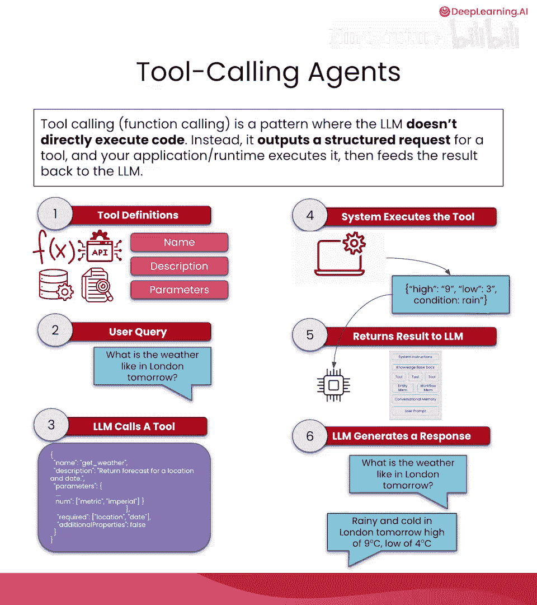

然而，这种方法存在一些限制。我们通常希望环境中能使用大量工具，这对大语言模型固然有益，因为工具和信息越多，响应质量可能越高。但当工具过多时，会带来明显的缺点。

大语言模型的上下文大小是有限的，我们显然不能将所有工具的名称、参数和描述都塞进上下文而不出问题。将所有工具放入上下文窗口可能导致智能体以多种方式失败。

以下是这种方法最明显的几个缺点：
*   **上下文混淆与污染**：当大语言模型同时看到大量工具信息时，上下文会被工具信息淹没，导致用于输入和实际输出的可用上下文减少。
*   **工具选择性能下降**：大语言模型的响应质量会因此下降。
*   **延迟与令牌数增加**：你需要支付更多令牌费用，并且由于大语言模型需要预先处理大量信息，生成响应的延迟也会增加，这通常会导致整体性能下降。

## 语义工具记忆：一种可扩展的解决方案

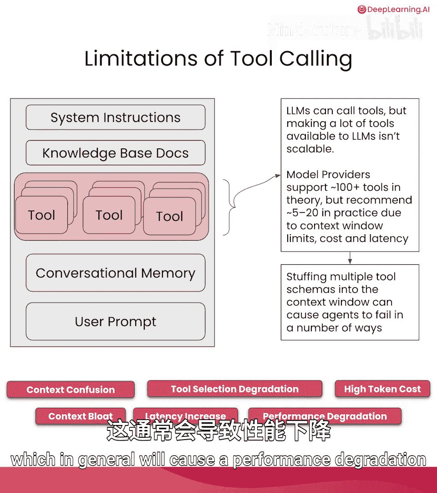

为了构建对大语言模型更有利的可扩展系统，我们采用以下方法。

首先，我们拥有所有工具的**名称**、**描述**和**参数**。如果我们对这些信息进行编码，通过嵌入模型创建其向量表示，就能为每个工具生成一个嵌入向量。然后，我们可以将这个嵌入向量连同工具的原始信息一起加载到数据库中，以便执行语义搜索和相似性查询。

这样，在大语言模型收到用户查询（例如我们最初的“伦敦天气如何”查询）后，我们可以获取该输入，并针对我们创建的嵌入向量执行相似性搜索。通过语义搜索，可以筛选出解决此用户查询的最佳工具。

随后，在选定正确工具后，大语言模型便能调用并执行该工具，将结果返回。如下图所示，如果这是我们的嵌入空间表示，所有工具都分布在这个空间中，通过执行相似性搜索，我们将找到与用户查询最接近的工具。

## 记忆单元增强：提升工具可区分性

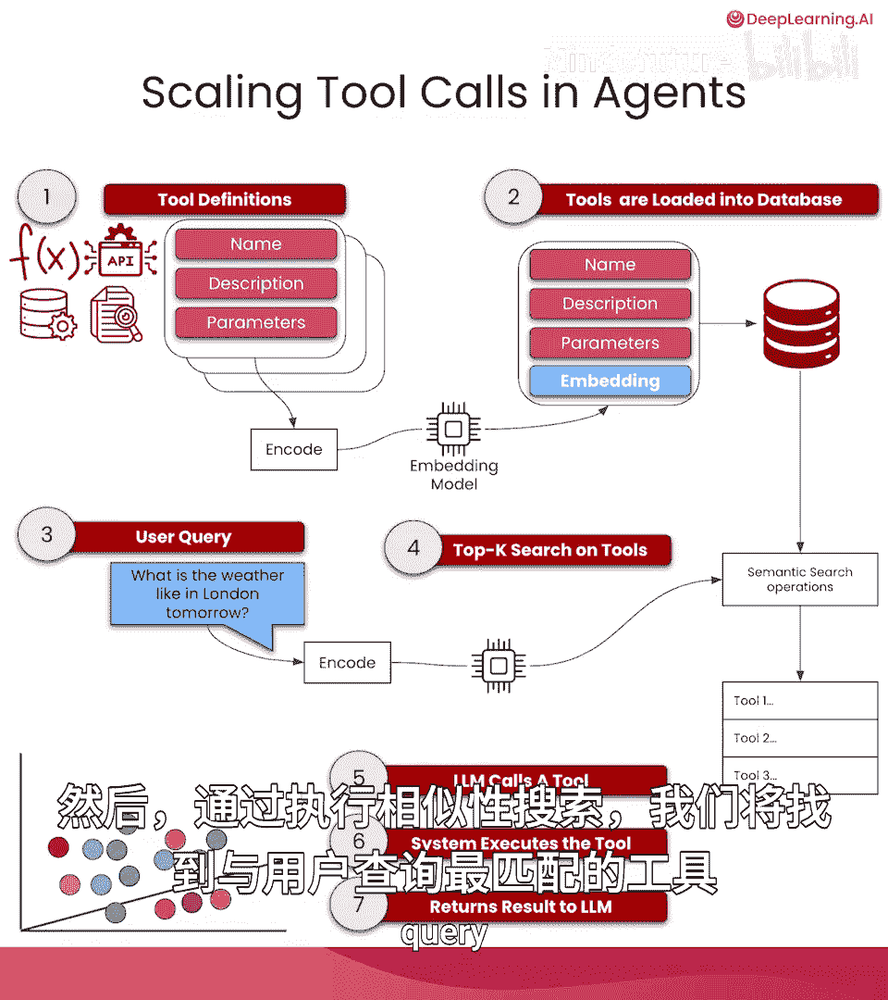

这个想法很好，但可能还不够。因此，我们提出了另一种增强策略，称为**记忆单元增强**。

这种策略略有不同：我们将获取工具定义（名称和描述），让大语言模型对其进行增强，然后使用增强后的名称和描述，通过嵌入模型进行编码，创建出新的嵌入向量。

此后，我们将得到一个增强后的工具定义，并将其加载到数据库中。本质上，我们让大语言模型来增强我们的工具定义。

这样做有一些明显的优势：
*   在嵌入空间中执行语义搜索时，工具之间将具有**更高、更好的可分离性**。
*   将获得**更高的召回率和高质量的信号嵌入文本**，这意味着我们放入此嵌入向量的所有内容都将具有更好的特性，更容易被模型区分。

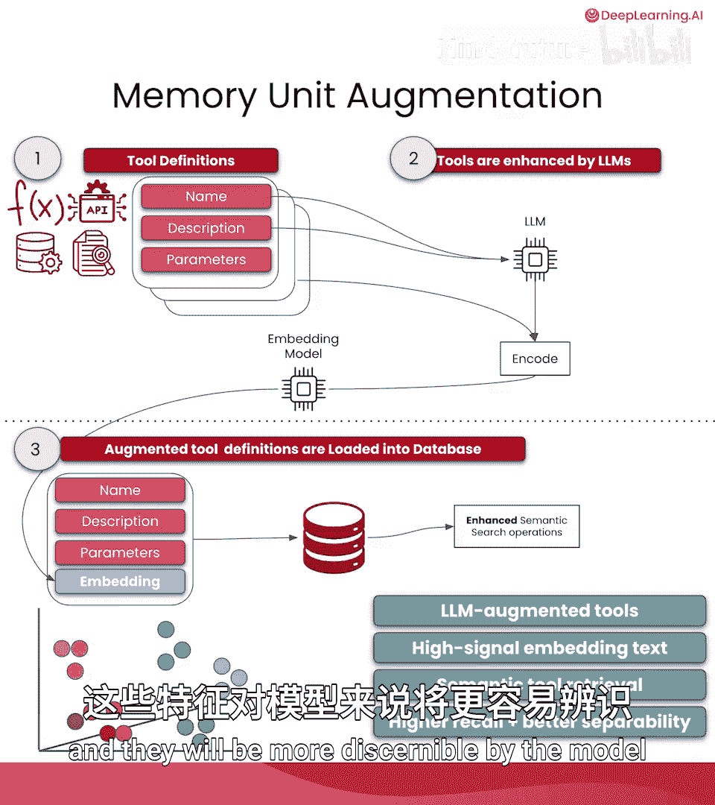

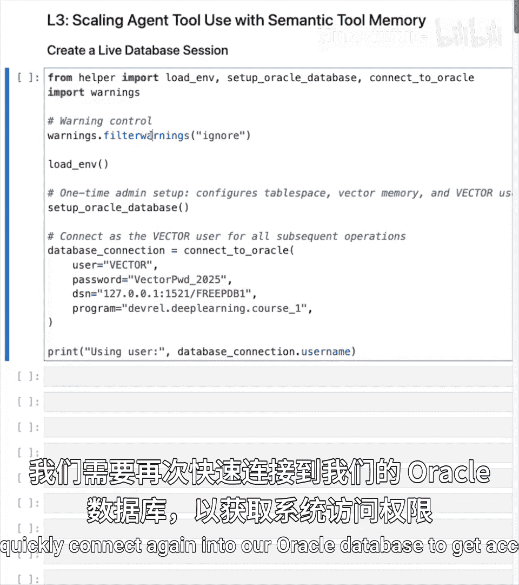

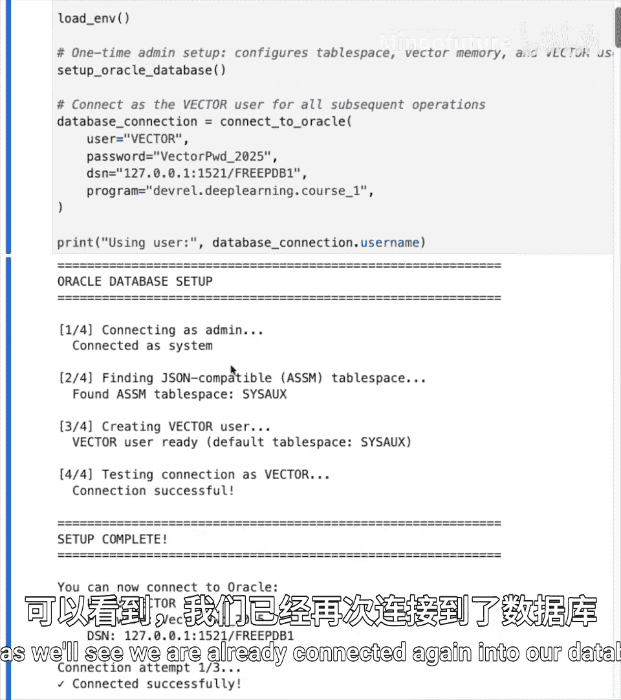

## 实战：实现语义工具记忆

接下来，我们将深入探讨如何实现具备语义工具记忆的智能体工具使用。和之前一样，我们首先需要快速连接到我们的Oracle数据库以访问系统。连接成功后，我们将重新加载之前使用的嵌入模型（paraphrase-MiniLM-L6-v2）来创建嵌入向量。

现在我们要开始使用大语言模型，因此需要实例化OpenAI客户端，以便以编程方式与模型交互。接着，像之前一样，我们将设置对话知识工作流以及用于存储管理器的所有表。我们还将配置日志历史和对话历史表以便访问。

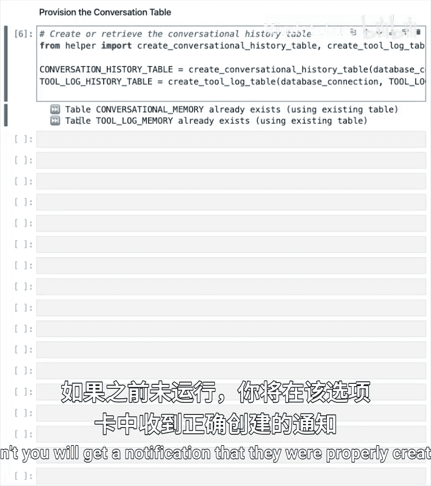

在这里，我们还将像之前一样实例化我们的存储管理器。创建存储管理器实例后，通过我们创建的管理器函数获取各个存储的对象。运行后，你将看到所有存储都通过存储管理器正确加载。

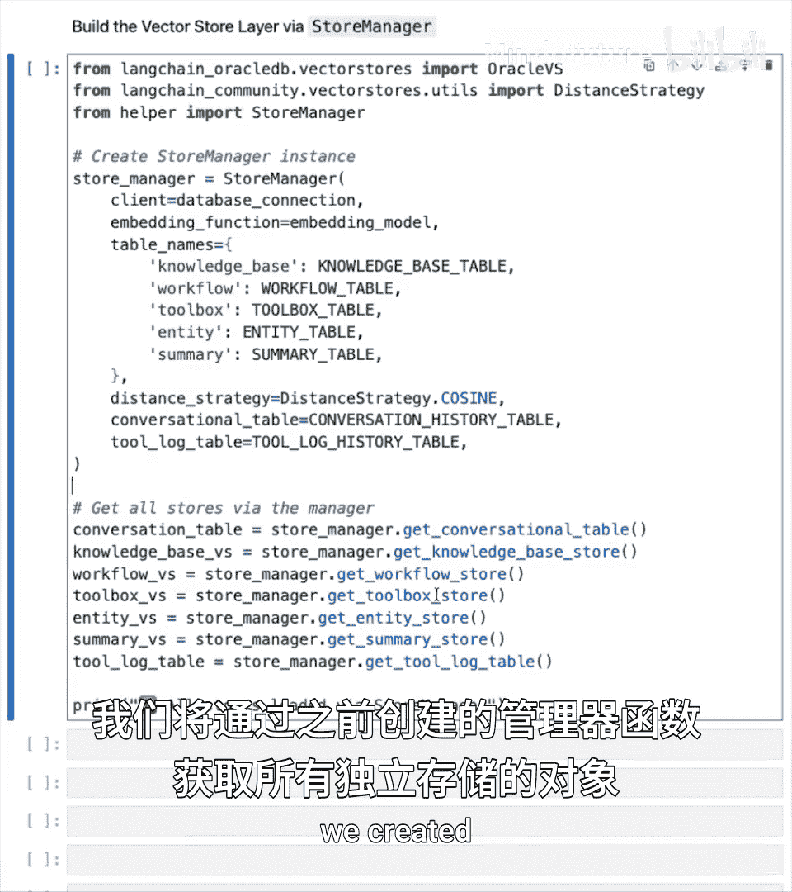

现在，我们开始本章的实际代码。我们首先要做的是像之前一样实例化内存管理器，然后初始化我们的**工具箱模式**对象。工具箱的目的是加载和存储大语言模型将有权访问的所有不同工具。我们需要传入内存管理器、我们创建的OpenAI客户端实例（以便进行我们将看到的某些增强操作）以及嵌入模型，这样工具箱对象也能在工具上执行向量相似性搜索。

现在我们已经正确初始化了工具箱对象，可以看到内存管理器和工作箱都已正确初始化。

## 注册与使用工具

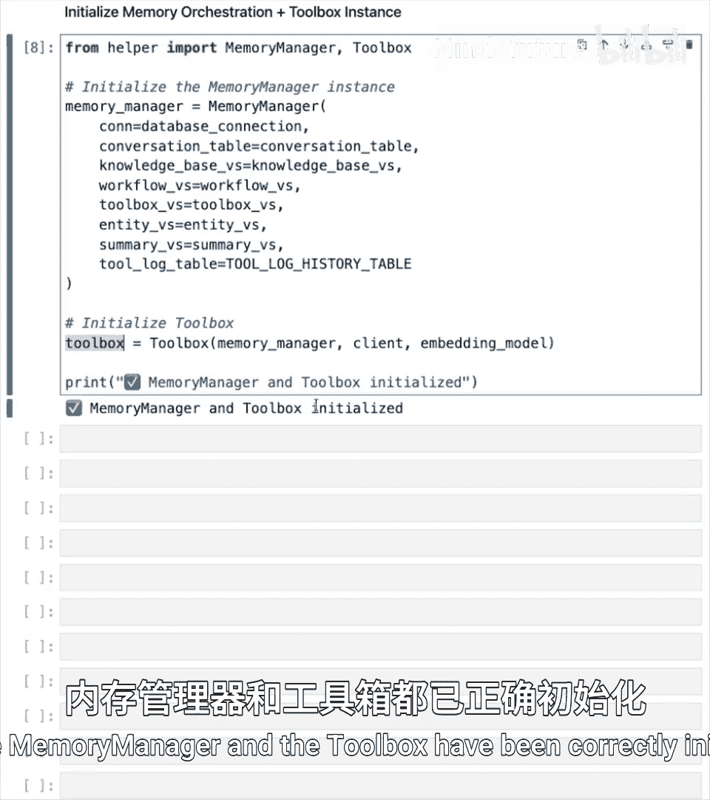

接下来，你要做的是向工具箱模式注册一个新工具，以便大语言模型在需要时能够方便地选择它。我们在这里注册一个带有参数类型的新工具，该参数允许我们通过本章中看到的大语言模型增强功能来增强它。

我们准备一个名为 `read_toolbox` 的函数，它接收用户输入的查询和一个数字（代表查询工具箱时希望相似性搜索返回的工具数量）。运行后，你将看到工具注册已正确执行，并在数据库的工具箱表上执行了相似性搜索。

定义函数后，我们将能够使用工具箱注册工具功能来注册更多工具，并从工具箱中读取。

创建了工具箱模式并准备好注册和读取工具的函数后，我们将创建一个新工具，它通过 **Tavily** 服务（一个允许我们在网络上搜索并将结果存储到知识库的服务）来实现。

为此，我们首先需要通过其库实例化Tavily客户端，然后使用我们的注册工具提示来创建这个新工具。这样，每次我们想使用Tavily时，都会重定向到这个名为 `search_tavily` 的函数，该函数默认返回最多5个结果，并通过其API对Tavily客户端执行查询。

在这里，我们使用Tavily客户端对我们想要的查询进行搜索，并将结果限制在最大结果数内。获取结果对象后，我们会将这个结果写入我们的知识库。为此，我们将创建一些要嵌入的文本内容，获取标题、内容和URL，并创建一些与之关联的额外元数据（例如标题、信息来源URL、代表信息可验证性的分数、查询本身以及查询时间戳），然后将所有这些信息放入知识库。

## 对比：原始文档字符串与增强文档字符串

在这个单元中，你将看到实际使用原始文档字符串（即函数创建者实际使用的）与允许大语言模型增强工具定义和名称之间的实时差异。

为此，我们将按名称获取之前注册的工具，获取其源代码，并比较原始文档字符串与由OpenAI模型生成的增强文档字符串。

正如你将在这里看到的，与原始文档字符串不同，你将得到一个由大语言模型增强的文档字符串。它不仅包含描述，还创建了函数每个参数和返回值的逐步调用定义。这将允许大语言模型将这些定义存储到数据库中，结果将更具可分离性，从而使我们的相似性搜索功能能让这些函数对大语言模型的使用更加可区分。

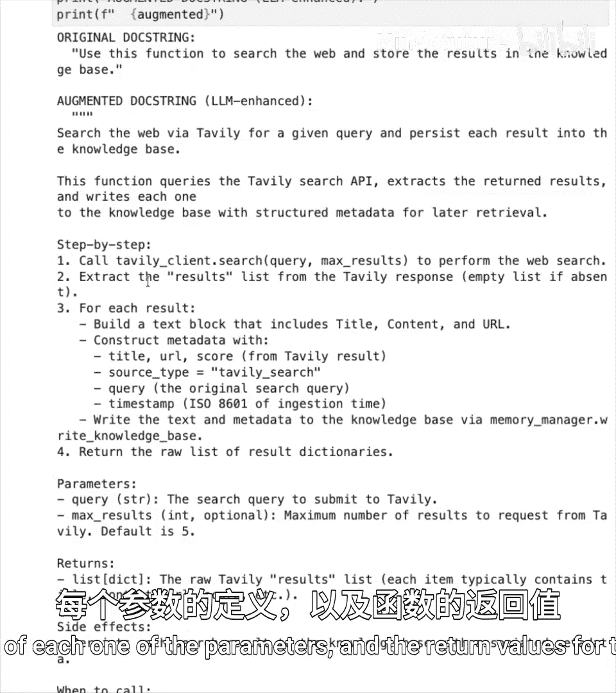

## 创建本地工具与集成第三方服务

在这里，你将创建一个**本地工具**，它将使用本地Python代码（例如在本地使用datetime库），而不是通过像Tavily这样的外部API第三方服务。每个工具既可以在本地实现，也可以外部实现。如果你像这样在本地运行，可以创建任意多的工具。如果使用第三方服务，则需要与可用的服务进行集成。

在这个单元中，我们将看一下 **ArxivRetriever**，这是LangChain社区包的一个自动集成，允许我们检索Arxiv论文，并设置最大论文数和每篇文档的最大字符数。在这里，我们将使用LangChain社区的ArxivRetriever对象来获取一些论文，以便未来能够检索Arxiv论文。

接下来，我们将注册一个Arxiv发现工具。首先，创建一个函数来处理Arxiv URL并实际获取论文URL、论文标识符。然后，在搜索候选函数中，我们将通过Arxiv进行搜索，并返回一个包含其ID和元数据的候选列表，这样我们就可以利用这些信息来增强大语言模型，为其提供来自Arxiv的外部第三方信息。在这里，我们获取一个文档列表，并为每个文档追加并获取元数据、论文的条目ID以及最接近实际用户查询的可能候选列表。

现在，我们将看看如何执行**深度摄取**。这不仅允许我们使用上一个单元中的Arxiv加载器，还能规范化所有信息，并通过加载完整的论文信息、从上一个单元提取的元数据，通过递归字符文本分割器（这是一种通过少量重叠来执行分块以提高每个块质量并减少上下文混淆的方法）对这些信息进行分块，然后将这些块存储到我们的Oracle向量存储中，从而将这些信息写入我们的内存管理器，以增加工具箱提供的信息和向量。

## 测试工具箱功能

现在到了关键时刻，我们将测试本章中集成的工具箱功能。我们将要求内存管理器读取数据库中现有的工具箱对象，并要求它为我们获取更多关于AI论文的详细信息，并将响应限制为最多一个。因此，将打印出针对此用户查询检索信息的最佳可用工具。

正如我们在这里看到的，通过对数据库中工具箱表执行相似性搜索，最佳工具是 `fetch_and_save_paper_to_kb`，这是我们为从Arxiv获取信息而关联的名称。

你可以自由定制并使用不同的K值进行测试，这样你将看到针对不同查询的最佳可用工具。

## 总结

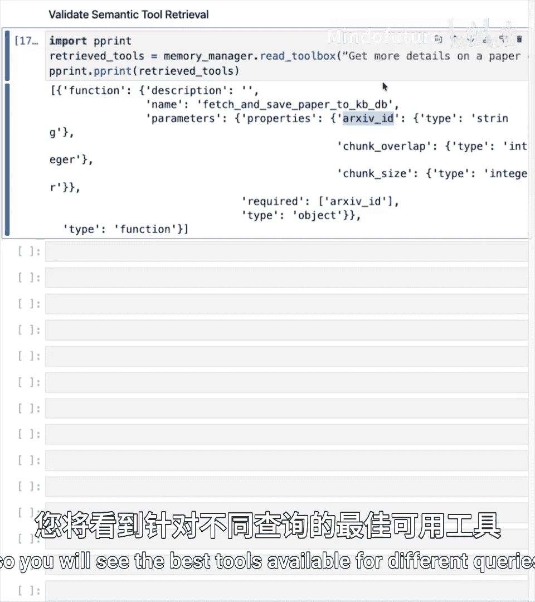

本节课中，我们一起学习了如何通过**语义工具记忆**来解决智能体工具扩展的挑战。我们探讨了将工具视为程序性记忆、使用嵌入向量和语义搜索来动态检索相关工具的方法，并介绍了通过大语言模型增强工具定义以提升其在向量空间中可区分性的**记忆单元增强**技术。通过实战，我们实现了工具箱模式的注册、查询以及与第三方服务（如Tavily和Arxiv）的集成，最终成功测试了基于语义搜索的工具选择功能。这套方法使得智能体能够在拥有大量工具时，依然保持高效、准确的响应能力。