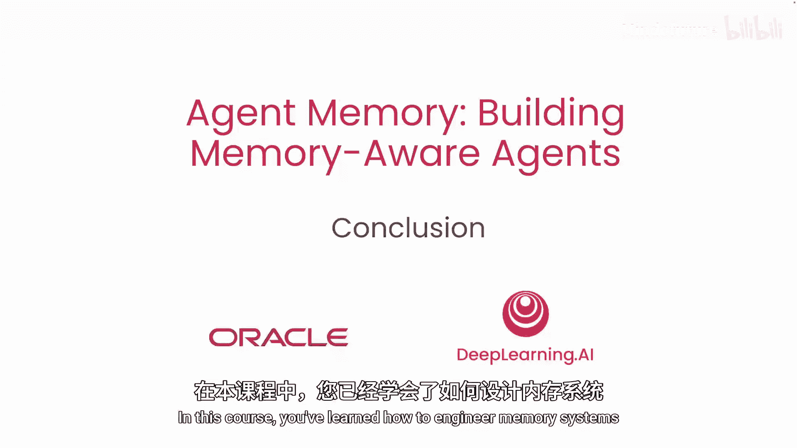

# 007：结论 🎯

在本课程中，我们学习了如何设计记忆系统，将无状态的LLM转变为具备持久记忆能力的智能体。

## 课程回顾 📚

上一节我们探讨了智能体如何通过自主循环来完善自身知识。现在，让我们对整个课程的核心内容进行总结。

### 学习路径与核心成果

以下是我们在本课程中完成的主要步骤和构建的模块：

1.  **理解无记忆的缺陷**：我们首先分析了智能体在没有记忆系统时会失败的原因。
2.  **构建记忆管理器**：我们建立了一个记忆管理器，并为不同类型的记忆配置了持久化存储。
3.  **实现语义检索**：我们利用语义工具构建了记忆检索功能。
4.  **设计提取与整合流程**：我们构建了提取和整合管道，将原始对话转化为持久的知识。
5.  **集成自主循环**：我们接入了智能体的自主循环，使其能够自主完善所知信息。
6.  **组装完整智能体**：最终，我们将所有部分整合成一个具备完整状态感知能力的记忆型智能体。这个智能体能够在开始时加载先前的上下文，检查其推理过程，并在多个会话中保持记忆的持久性。

### 核心构建模块

您在本课程中学到的模式——**记忆建模**、**语义检索**、**信息提取**、**知识整合**和**回写机制**——是构建生产级智能体的基石。这些模块使得智能体能够真正地随着时间推移而不断改进。

## 总结与展望 🚀

本节课中，我们一起学习了记忆工程的基础。您所构建的是一个坚实的内存工程基础。

请运用这些模式，将它们适配到您自己的应用场景中，去构建不仅仅是能够回应，更能够**记忆并变得更好**的智能体。

我期待看到您将独立构建出怎样的成果。