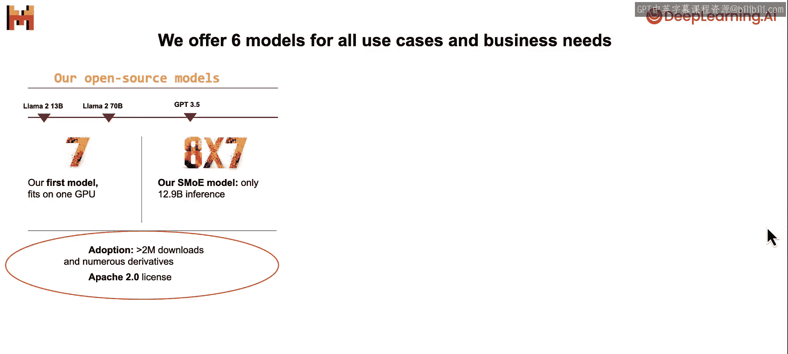
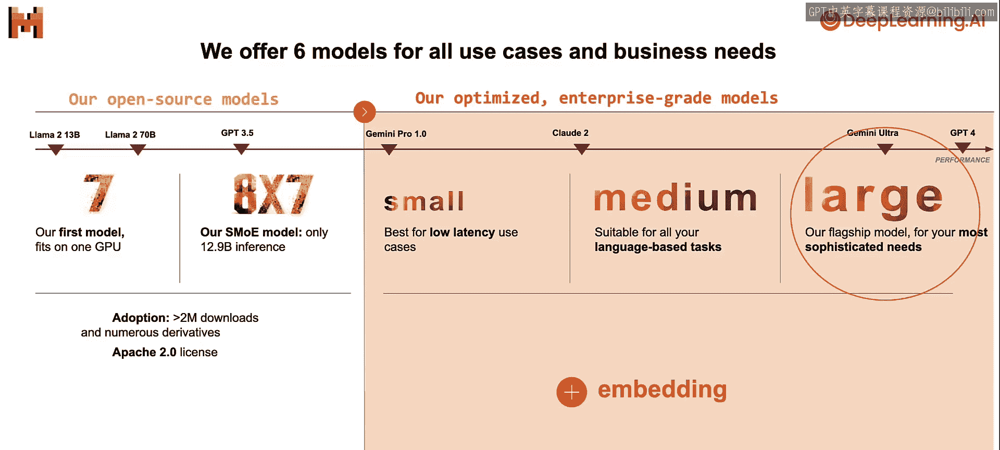
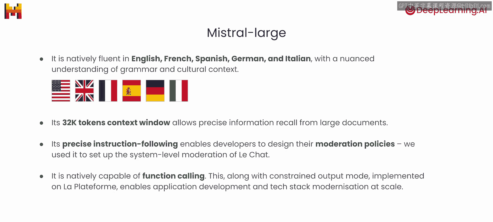
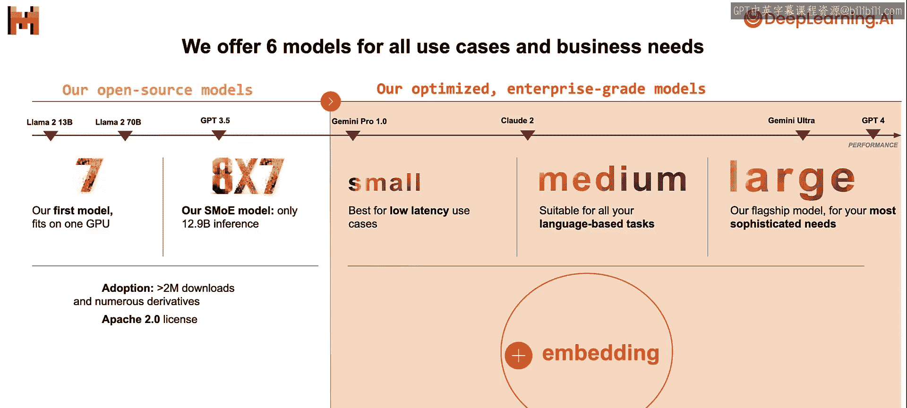
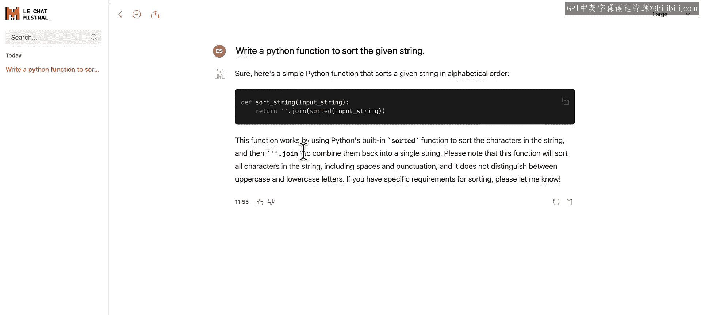
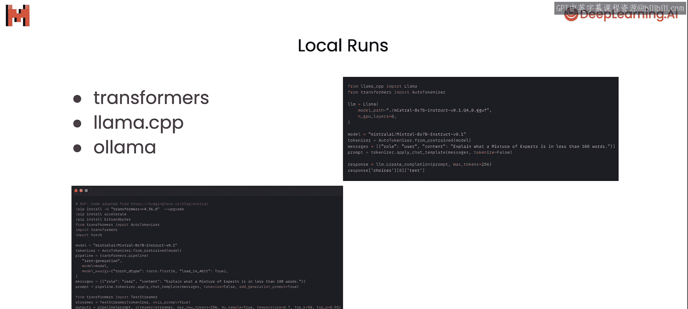
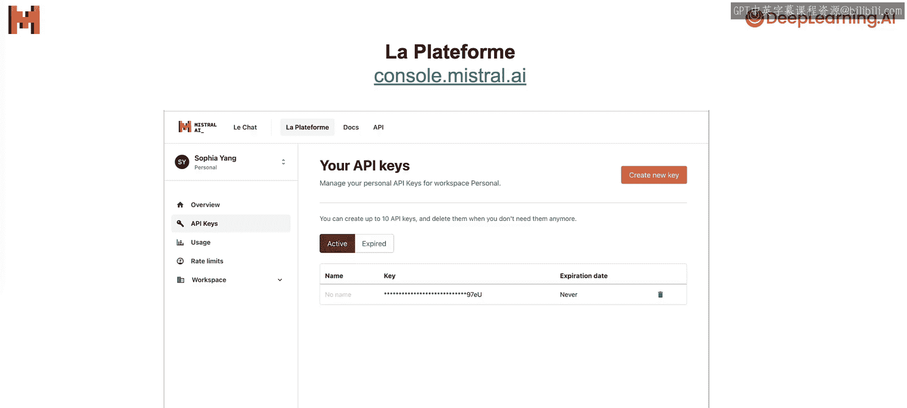

# 002：模型概览 🧠

在本节课中，我们将对Mistral提供的各类模型进行概览，了解其特点与适用场景。

## 概述

Mistral致力于构建最好的基础模型。目前，我们为所有用例和商业需求提供了六种模型。

## 开源模型

我们提供两种开源模型，你可以下载模型权重并无限制地在任何地方使用。

以下是两种开源模型的介绍：

*   **Mistral 7B**：这是我们于去年九月发布的第一个模型。它在多项标准评估基准测试中，性能优于参数规模相似甚至更大的Llama模型。例如，在知识、推理、代码等综合基准测试中，其表现（图表中的橙色柱）超越了其他颜色的Llama模型。该模型可单GPU运行，非常适合初学者开始实验。
*   **Mistral 8x7B**：这是一个稀疏专家混合模型，于去年十二月发布。简单来说，该模型有八个“专家”来处理文本，但并非每次调用所有专家，而是通过一个路由器为每个输入标记选择最相关的少数几个专家。其基础是Transformer块，包含前馈层和多头注意力层。虽然模型总参数量为467亿，但每个标记实际仅使用约129亿参数，从而在实现高性能的同时保证了快速的推理速度。它在大多数基准测试中超越了Llama 2 70B，且推理速度快八倍；在多数标准基准测试中，其表现与GPT-3.5相当或更优。

这两种模型均在开源Apache 2许可证下发布，这意味着你可以下载模型权重，针对自己的用例进行微调和定制，且无任何使用限制。例如，你可以创建用于商业用途的AI应用。我们致力于开源模型，未来将发布更多开源模型。

## 企业级模型

除了开源模型，我们还提供四种优化的企业级模型，以满足不同需求。

以下是四种企业级模型的介绍：

*   **Mistral Small**：最适合低延迟用例。
*   **Mistral Medium**：适用于仅需中等推理能力的语言任务，例如数据提取、摘要和邮件撰写。
*   **Mistral Large**：这是我们功能最强大的模型，具备高级推理能力，适用于最复杂的任务。其性能接近GPT-4，拥有原生多语言能力，在常识和推理基准测试中显著优于Llama 2 70B。它擅长遵循指令，并原生支持函数调用功能。
*   **Embedding模型**：提供最先进的文本嵌入，可用于聚类、分类等多种用例。

所有我们提供的服务模型均支持32K令牌的上下文窗口。函数调用功能在Mistral Small和Mistral Large模型中均可使用。

## 如何开始使用

许多客户已在银行、电信、媒体、法律科技等行业广泛应用我们的模型，用于文本检索增强生成、内容生成、内容合成、代码生成、洞察生成等。

通过本课程，你将学习如何在类似用例中使用我们的模型。要立即开始使用我们的模型，你可以通过以下方式：

*   **Le Chat（聊天界面）**：你可以使用我们的聊天界面直接与模型交互。访问 chat.mistral.ai，在聊天框中输入请求即可，例如“编写一个Python函数来对给定字符串进行排序”。目前Le Chat可免费使用，只需注册即可。
*   **本地运行开源模型**：如果你有兴趣在本地运行我们的开源模型，可以使用 Transformers、Llama.cpp 或 Ollama。请注意，许多人使用模型的量化版本以将其加载到内存中，但量化可能会影响模型性能，因此量化模型的表现若不如预期，无需惊讶。
*   **使用托管服务**：虽然在自己机器上运行模型很有趣，但为了获得更快的推理速度、更可靠的性能并节省精力，我们推荐使用托管服务，例如Mistral AI平台。通过该平台，你不仅可以访问开源模型，还能通过简单的API调用使用企业级模型。平台定价比一些其他托管平台更便宜。

## 设置API密钥

要通过平台访问我们的模型，你需要创建自己的API密钥。

设置API密钥的步骤如下：

1.  访问 console.mistral.ai。
2.  创建账户。
3.  设置账单信息。
4.  点击“API keys”创建新的API密钥。

本课程将重点讲解如何使用我们的API端点，并在后续课程中深入探讨许多使用API的用例。为了方便学习，在后续课程中你实际上无需创建账户，我们将提供一个预置的API密钥供课堂使用。

## 总结

本节课我们一起学习了Mistral提供的两大类模型：开源模型（Mistral 7B, Mistral 8x7B）和企业级模型（Small, Medium, Large, Embedding），了解了它们的特点、性能和应用场景。我们还介绍了三种开始使用模型的方式：通过聊天界面、本地运行以及使用托管API服务。

在下一节课中，你将学习如何使用Mistral API以及一些提示词技巧。让我们开始下一课的学习。