# 003：提示工程基础 🚀


在本节课中，你将学习如何通过API调用访问并提示Mistral模型，以执行分类、信息提取、个性化回复和摘要总结等多种任务。


## 概述

我们将从编写代码开始。在课程环境中，所需的库已经预先安装。但如果你在自己的机器上运行，需要安装以下库：

```python
pip install mistralai
```

由于本次课程无需执行此命令，我们将其注释掉。这里提供了一个辅助函数，用于帮助你加载Mistral API密钥和模型，以便轻松开始运行Mistral API。

我们可以向模型提问：“你好，你能做什么？”。你可以随时暂停视频，按喜好修改提示词。在本节课结束时，我将带你了解辅助函数中的代码，以便你理解API调用原理，并能在课堂环境之外使用API。

## 分类任务示例

首先，我们来看看如何使用模型对银行客户咨询进行分类。在这个提示词中，我们设定了角色和任务：

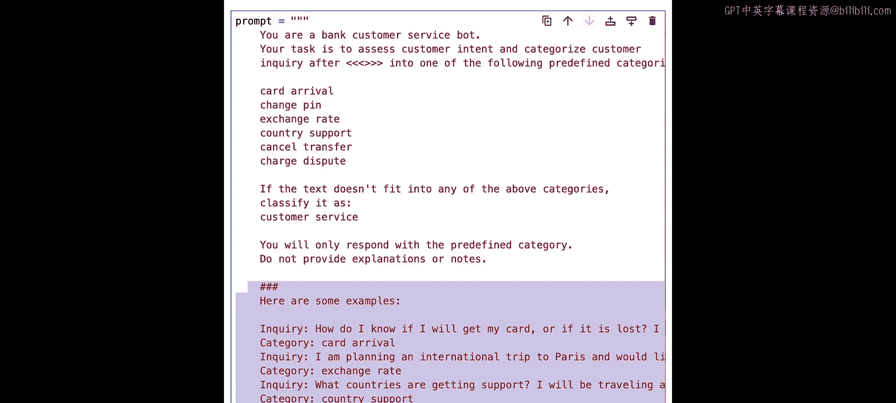

```
你是一名银行客服机器人。你的任务是评估客户意图，并将客户咨询分类。
```

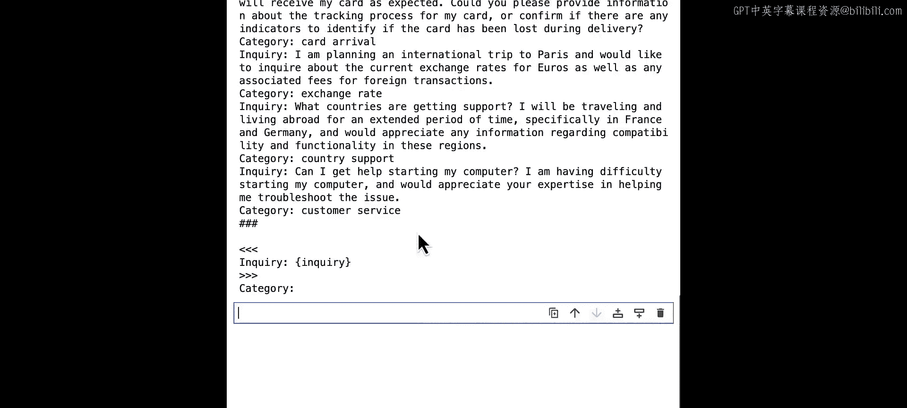

我们有一个预定义的类别列表。如果文本不符合任何类别，则将其归类为“客户服务”。你可以看到，这里我们提供了一些示例，让模型确切了解我们的期望。

### 提示词优化

如果我们想确保提示词没有拼写或语法错误，可以请模型先进行校正。运行以下代码：

```python
# 示例：请求模型校正提示词
corrected_prompt = model.correct_spelling_and_grammar(original_prompt)
print(corrected_prompt)
```

然后打印响应。我们可以看到一些语法修正，例如，“customer inquiry”被修正为“the customer inquiry”。现在，我们可以使用这个校正后的提示词，并将“inquiry”替换为实际的咨询内容：“我正在询问贵行卡片在欧盟地区的可用性”。

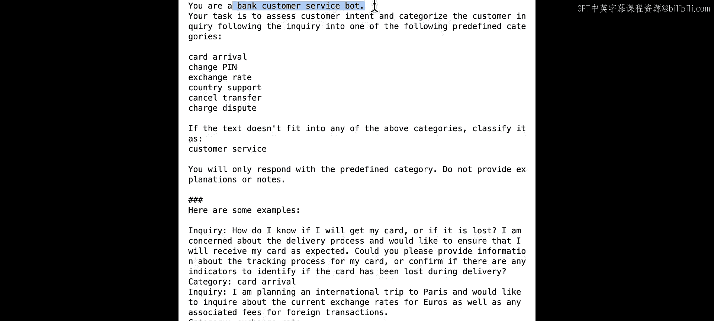

运行后，我们得到分类结果“国家支持”，这符合预期。现在，运行另一个咨询：“今天天气如何？”，因为它不属于任何预定义类别，模型正确地将其归类为“客户服务”。

### 提示词技术分析

现在，让我们回头仔细分析这个提示词，看看我们使用了哪些提示技术。

首先，我们使用了**角色扮演**，为模型提供了一个“银行客服机器人”的角色。这为模型提供了个性化的上下文。

其次，我们使用了**少样本学习**，在提示词中提供了几个示例。少样本学习通常能提高模型性能，尤其是在任务较复杂或我们希望模型以特定方式响应时。

第三，我们使用了**分隔符**，如井号或尖括号，来指定文本不同部分之间的边界。在我们的例子中，使用三个井号表示示例，使用尖括号表示客户咨询。

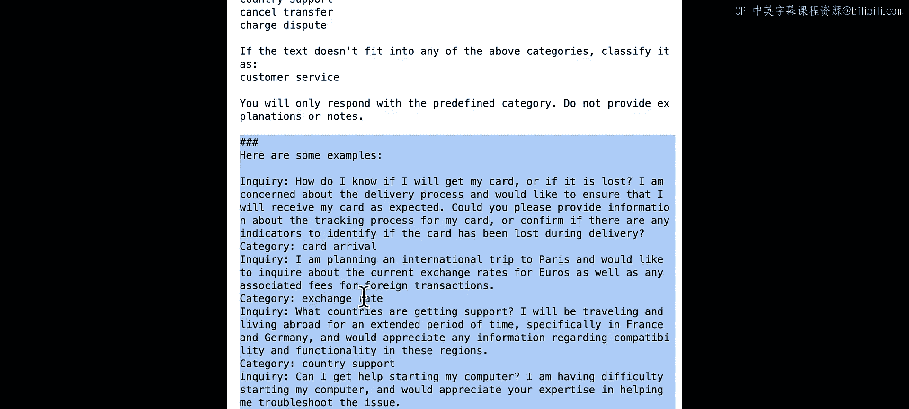

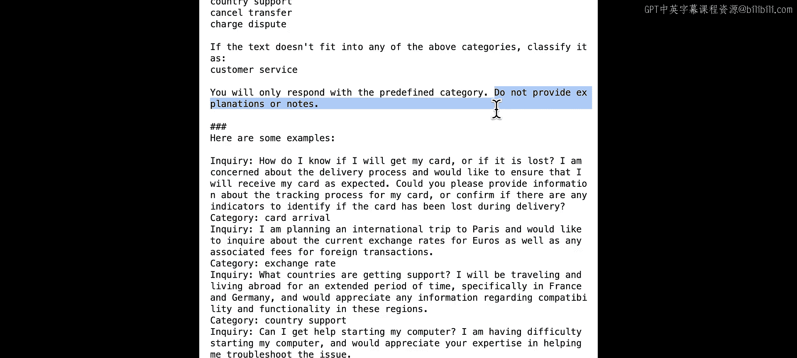

最后，如果模型回答过于冗长，我们可以添加“**请勿提供解释或备注**”的指令，以确保输出简洁。如果你想知道使用哪种分隔符，这并不重要，选择你喜欢的即可。

## 信息提取示例

接下来，我想展示一个信息提取的例子。信息提取在很多场景下都非常有用。在这个例子中，假设你有一些医疗笔记，并希望从中提取特定信息。

在提示词中，我们提供了医疗笔记，并要求模型按照以下JSON模式返回JSON格式的数据：

```json
{
  "diagnosis": "string",
  "medication": "array",
  "follow_up": "boolean"
}
```

我们定义了要提取的变量、其类型以及输入选项列表。例如，对于“诊断”，模型应从四个选项中选择一个输出。

运行此提示词，我们得到了与定义完全一致的JSON格式输出。在Mistral函数中，我们通过设置 `json=True` 来启用JSON模式。我们将在课程末尾详细讲解Python API调用。

### 信息提取策略

让我们再次审视这个提示词。我们使用的一个策略是，在提示词中明确要求返回JSON格式。当启用JSON模式时，要求JSON格式非常重要。

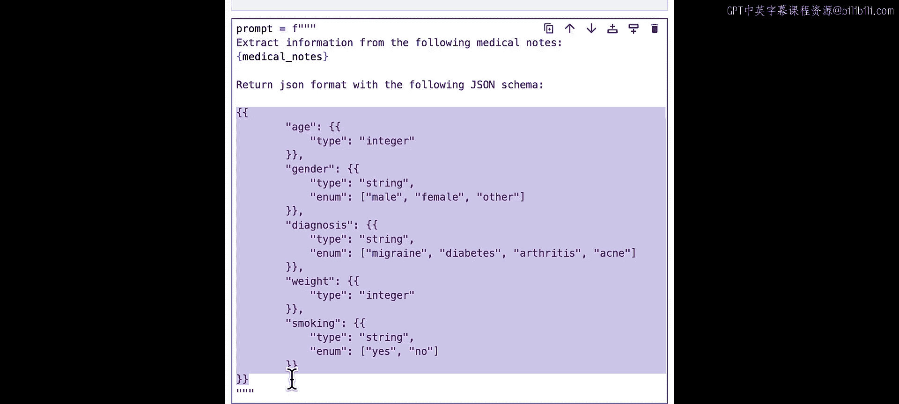

我们使用的另一个策略是定义了JSON模式。我们在提示词中使用这个JSON模式，以确保JSON输入的一致性和结构。请注意，即使我们没有设置 `json=True`，输出可能仍然是JSON格式，但我们建议启用JSON模式以获得可靠的JSON格式输出。

## 个性化回复示例

现在，让我们看看我们的模型如何创建个性化的电子邮件回复来解答客户问题，因为大语言模型非常擅长个性化任务。

这里有一封客户Anna询问抵押贷款利率的电子邮件，以及我们的提示词：

```
你是一名抵押贷款机构的客服机器人。你的任务是创建个性化的电子邮件回复来解答客户问题。
请使用下面提供的事实来回答客户咨询。
```

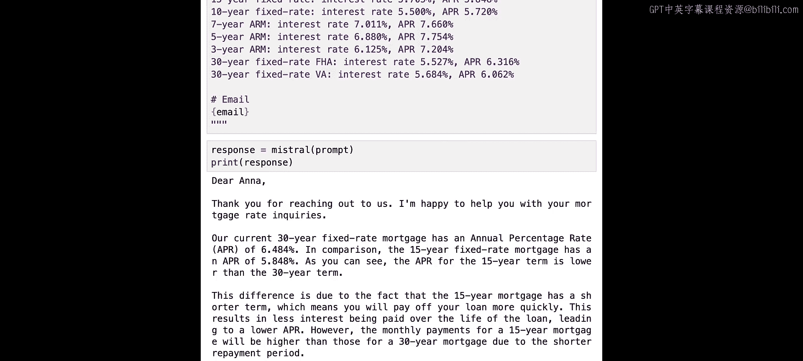

然后，我们在提示词中提供了一些关于利率的数据。与之前类似，我们使用字符串格式将实际的电子邮件内容添加到这里的“email”变量中。

运行代码后，我们得到了一封针对Anna的个性化邮件，根据提供的事实回答了她的问题。通过这种提示词，你可以轻松创建自己的客服机器人，回答关于你产品的问题。

在呈现这些事实或产品信息时，使用清晰简洁的语言非常重要。这有助于模型为客户查询提供准确、快速的响应。

## 摘要总结示例

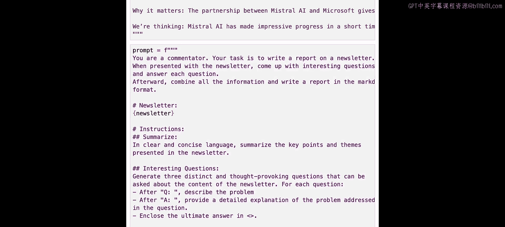

最后，我们来看摘要总结。摘要是大语言模型的常见任务，我们的模型在这方面可以做得很好。

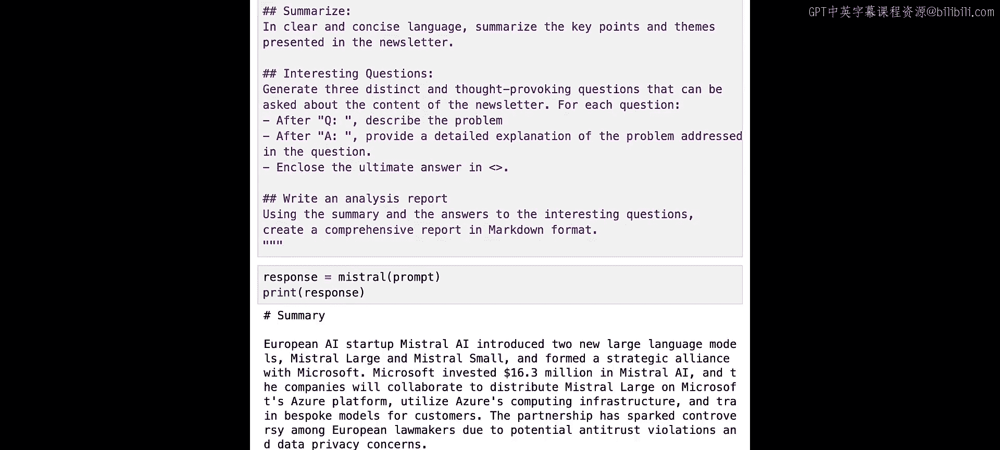

假设你想总结这份来自Batch的新闻简报。以下是我尝试的提示词：

```
你是一名科技评论员。你的任务是在阅读新闻简报后撰写一份报告。
当呈现一份新闻简报时，请提出有趣的问题并逐一回答。
之后，整合所有信息，以Markdown格式撰写一份报告。
```

然后，我有一个部分用于插入新闻简报内容，以及一个指令部分：第一，总结关键点；第二，生成三个独特且发人深省的问题；第三，撰写分析报告。

运行我们的Mistral模型后，我们得到了我们要求的一切：一份摘要、一些有趣的问题以及分析报告。当然，你也可以直接要求模型总结新闻简报，而无需这些详细指令。

如果你有一个复杂任务，提供分步指令通常有助于模型使用一系列中间推理步骤来解决复杂问题。在我们的例子中，使用这些步骤可能有助于模型在每一步进行思考，从而生成更全面的报告。

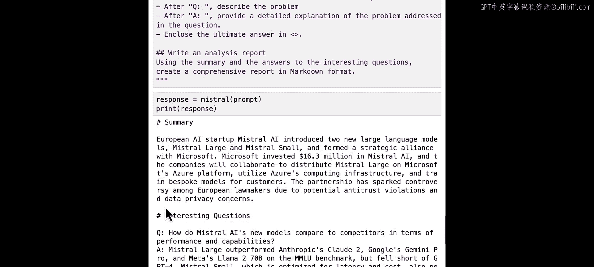

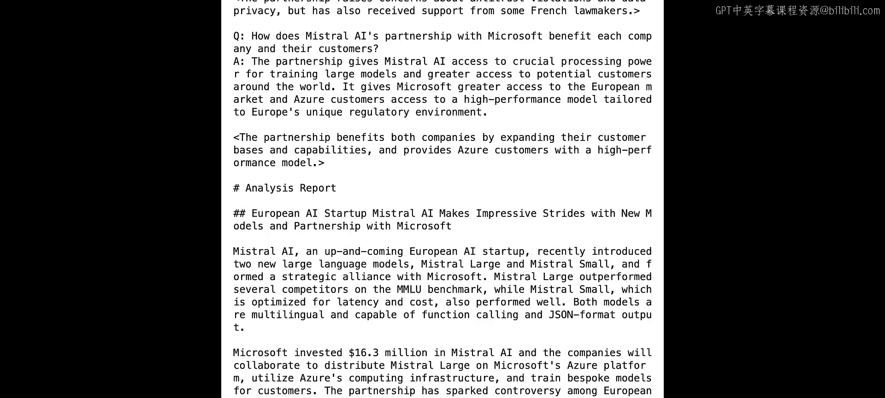

这里一个有趣的策略是，我们要求模型通过生成带有解释和步骤的示例，来自动引导推理和理解过程。另一个常用策略是，你可以要求模型以特定格式输出，例如使用Markdown格式。

## API调用详解

以上就是本节课我想展示的所有提示词示例。本节课我们使用了辅助函数来加载Mistral模型，以下是API调用的工作原理。

我们首先需要定义Mistral客户端。如果你在课堂环境之外运行Mistral模型，需要将这里的API密钥变量替换为你自己的API密钥。

我们还需要定义聊天消息。聊天消息可以以用户消息、系统消息或助手消息开始。系统消息通常为AI助手设置行为和上下文，但它是可选的。你可以同时拥有系统消息和用户消息，或者只使用用户消息，并通过实验看看哪种消息能产生更好的结果。本节课我们将所有内容都放在用户消息中。

然后，我们定义如何获取模型响应，需要指定模型和消息。如果我们启用了JSON模式，需要添加一行代码：`response_format={"type": "json_object"}`，以指定我们希望响应格式为JSON。

这里还有其他几个非必需的参数可以更改，你可以查看API规范以了解所有细节。

## 总结

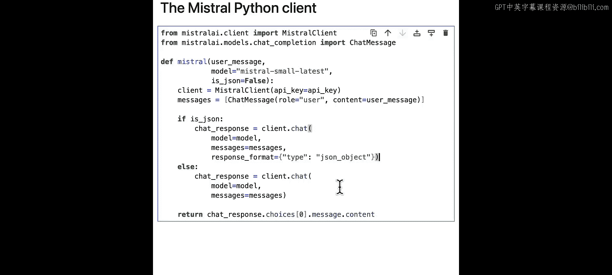

本节课，我们一起学习了如何提示Mistral模型执行各种任务。在下一节课中，我们将探讨如何针对不同的使用场景选择合适的Mistral模型。下节课见！