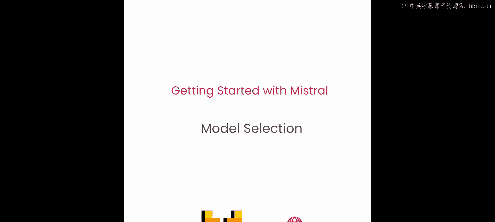
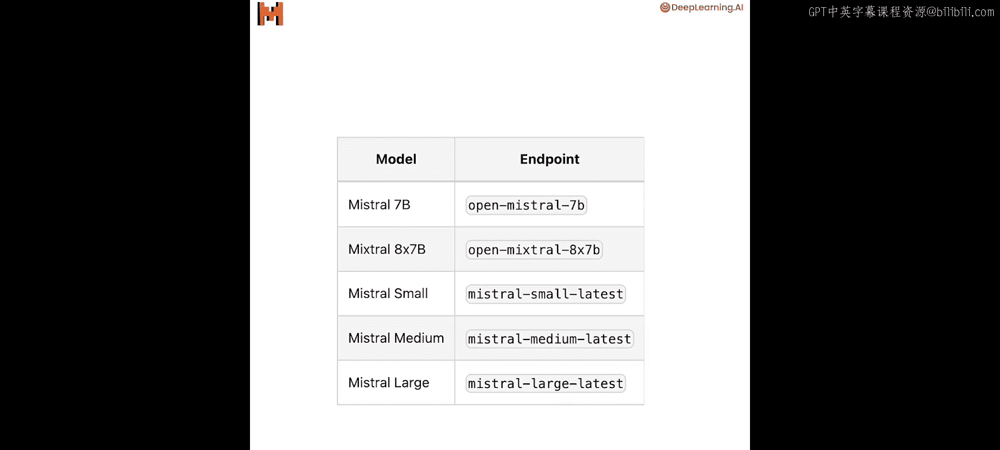
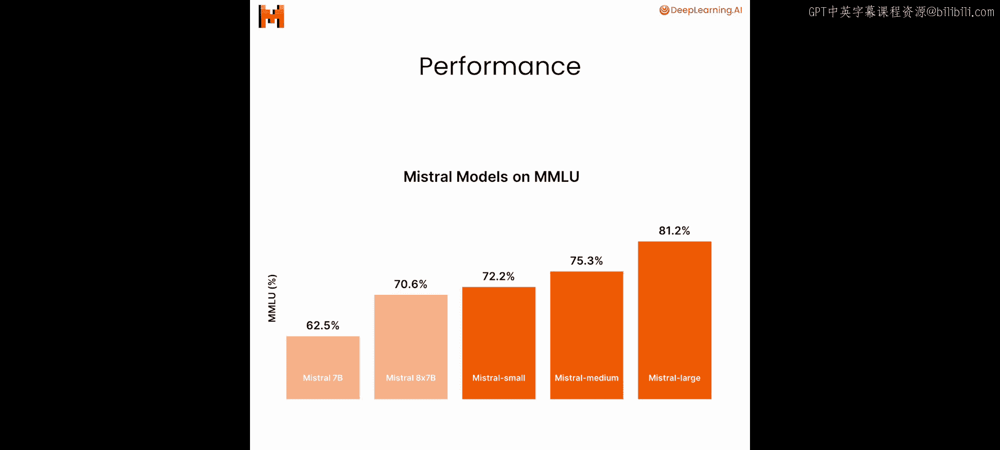
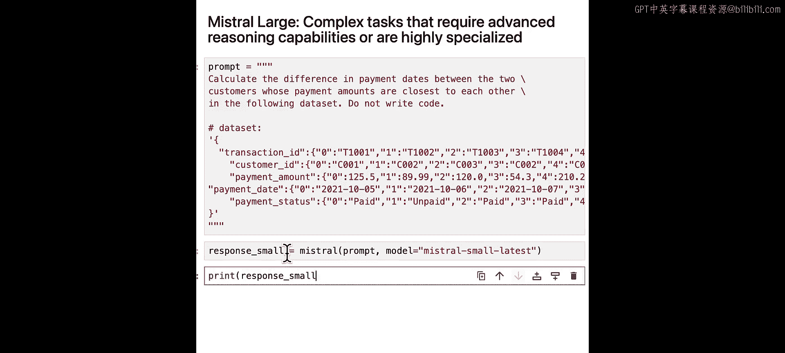
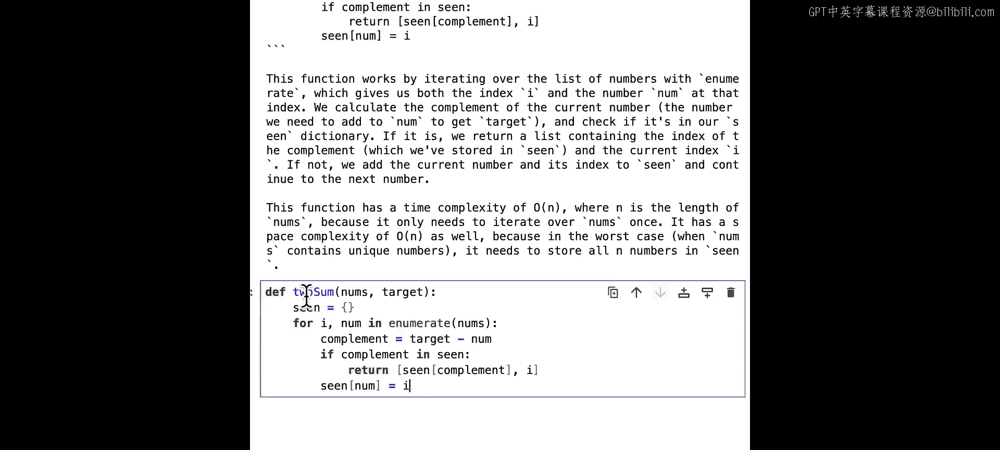
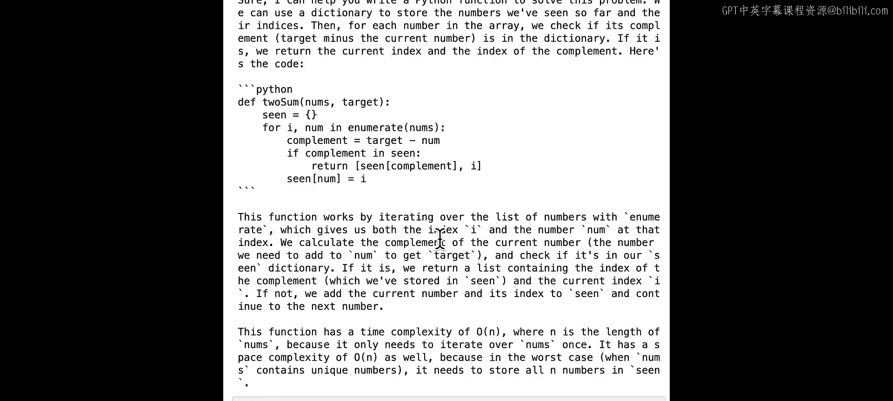
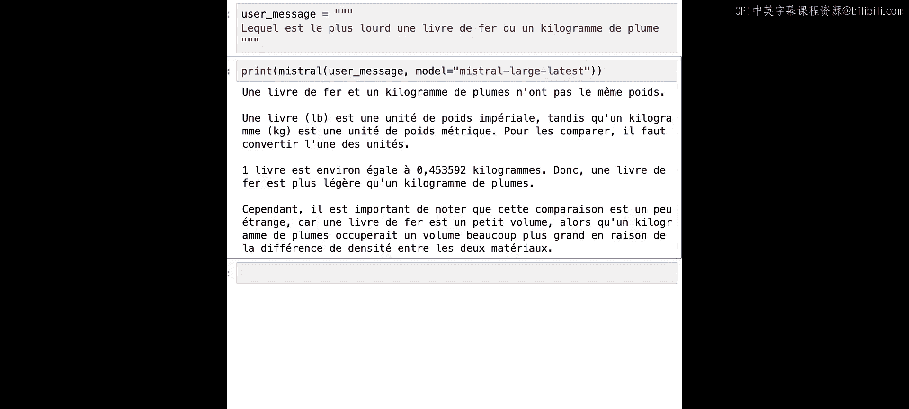

# 004：模型选择 🧠



在本节课中，你将学习如何根据你的具体使用场景，选择合适的Mistral模型。


Mistral AI提供了五个API端点，对应五个领先的语言模型：Mistral 7B、Mixtral 8x7B、Mistral Small、Mistral Medium和Mistral Large。从模型性能来看，例如在MMLU（多任务语言理解）任务上，Mistral Large表现最佳。事实上，在包括推理、多语言任务、数学和编码在内的各种基准测试中，Mistral Large的表现都优于其他所有模型。

然而，性能可能不是唯一的考量因素。对于你的应用，你可能还需要考虑定价。我们的模型提供有竞争力的价格，值得权衡性能与成本。Mistral模型是许多大型语言模型应用背后的技能支撑。

以下是不同类型用例及其对应推荐Mistral模型的简要概述。

## 用例与模型匹配 📊

以下是常见的任务类型及其推荐的Mistral模型。

*   **简单任务**：可以批量处理的任务，例如分类、客户支持或文本生成，由 **Mistral Small** 驱动。
*   **中等任务**：需要适度推理的任务，例如数据提取、摘要、撰写邮件等，由 **Mistral Medium** 驱动。
*   **复杂任务**：需要高级推理能力或高度专业化的任务，例如合成文本生成、代码生成、RAG或智能体，由 **Mistral Large** 驱动。

## 实践示例 💻

上一节我们介绍了不同模型的定位，本节中我们来看看具体的代码示例。首先，我们使用辅助函数加载API密钥。如果你在课堂环境外运行，可以替换为你自己的API密钥。

```python
# 加载API密钥的辅助函数
def load_api_key():
    # ... 你的代码 ...
```





接着，我们定义一个`Mistral`函数，以便轻松调用Mistral Python API。这段代码在之前的课程中已经见过。

```python
# 定义调用Mistral API的函数
def call_mistral_model(model, prompt):
    # ... 你的代码 ...
```

### 示例1：简单分类任务

对于像分类这样的简单任务，我们可以使用较小尺寸的模型，例如Mistral Small。比如，让我们将一封电子邮件分类为垃圾邮件或非垃圾邮件。

```python
prompt = "Classify this email as spam or not spam: 'Congratulations! You've won a free cruise!'"
response = call_mistral_model("mistral-small", prompt)
print(response)
```

Mistral Small能够正确地将电子邮件分类为垃圾邮件。实际上，我们所有的模型在这里都能给出好结果。使用Mistral Small更具成本效益且速度更快，因此我们推荐使用Mistral Small来处理简单任务。

### 示例2：中等语言转换任务

Mistral Medium非常适合需要语言转换的中等任务。例如，我们可以要求模型为刚完成首次购买的新客户撰写一封邮件。确保在提示中包含订单详情。

```python
prompt = "Compose a welcome email for a new customer named Anna who just made her first purchase. Order details: Product: 'Learning Kit', Order ID: 12345."
response = call_mistral_model("mistral-medium", prompt)
print(response)
```

现在我们得到了一封格式美观的邮件，收件人是客户Anna，并包含了她的订单详情。

### 示例3：复杂推理任务

Mistral Large非常适合需要高级推理能力或高度专业化的复杂任务。在这个例子中，我们要求Mistral Large计算给定数据集中，支付金额接近的两位客户之间的付款日期差异。

我们先试试Mistral Small。

```python
prompt = "Given this dataset: [{'customer': 'A', 'amount': 100, 'date': '2023-01-01'}, {'customer': 'B', 'amount': 105, 'date': '2023-01-05'}], calculate the difference in payment dates between the two customers whose payment amounts are close to each other."
response = call_mistral_model("mistral-small", prompt)
print(response)
```

你可以看到Mistral Small给出了错误的最终答案。但由于我们的模型结果是概率性的，如果你多次运行，有时可能会得到正确结果。

现在让我们运行Mistral Large。

```python
response = call_mistral_model("mistral-large", prompt)
print(response)
```

正如你所见，Mistral Large能够将这个问题分解为多个步骤，并给出正确答案。



让我们尝试另一个有趣的例子：根据购买详情，计算我在每个类别（餐厅、杂货、毛绒玩具和道具）上花了多少钱。交易详情如下。

```python
transactions = "Paid $30 at 'World Food Wraps', $15 at 'Grocery Mart', $25 for 'Teddy Bear', $10 for 'Magic Wand'"
prompt = f"Given these purchases: {transactions}. How much did I spend on each category: restaurants, groceries, stuffed animals, and props?"
```

首先运行Mistral Small。

```python
response = call_mistral_model("mistral-small", prompt)
print(response)
```

你可以看到这里有一些错误，例如，“World Food Wraps”应该属于餐厅类别。

现在试试Mistral Large。

```python
response = call_mistral_model("mistral-large", prompt)
print(response)
```

它恰好将“World Food Wraps”正确归类为餐厅，并给出了每个类别的正确答案。

### 示例4：编码任务

在下一个例子中，假设你即将见到一位非常重要的人物Andrew。你希望给他留下好印象，但你只有20分钟准备。他问你：“顺便问一下，我如何找到两个相加等于第三个数的数字？” Mistral如何帮助你留下好印象？让我们看看这个编码任务。Mistral Large在编码任务中表现最佳，所以让我们试一试。

```python
prompt = "Write a Python function called `find_two_sum` that takes a list of integers `nums` and an integer `target`, and returns the indices of the two numbers such that they add up to `target`. Assume exactly one solution exists."
response = call_mistral_model("mistral-large", prompt)
print(response)
```

很好，现在让我们运行这个函数，并看看代码是否能通过这些测试。

```python
# 假设从响应中提取了函数代码
def find_two_sum(nums, target):
    # ... Mistral生成的代码 ...
    pass



# 测试用例
print(find_two_sum([2, 7, 11, 15], 9))  # 应返回 [0, 1]
print(find_two_sum([3, 2, 4], 6))       # 应返回 [1, 2]
```



看起来我们的函数运行正常。现在，Andrew会因为你给出了正确答案而感到非常高兴。

### 示例5：多语言能力

此外，Mistral Large经过专门训练，能够理解和生成多种语言的文本，尤其是法语、德语、西班牙语和意大利语。这是一个用法语提问的例子：“哪个更重？一磅铁还是一公斤羽毛？” 😊

```python
prompt = "Lequel est plus lourd ? Une livre de fer ou un kilogramme de plumes ?"
response = call_mistral_model("mistral-large", prompt)
print(response)
```

我不懂法语，但我希望它正确回答一公斤羽毛更重。

## 总结与展望 🎯

本节课中，我们一起学习了如何根据任务复杂度（简单、中等、复杂）来选择Mistral模型（Small、Medium、Large）。我们通过分类、邮件撰写、复杂计算、分类汇总和编码等具体示例，实践了不同模型的应用场景和效果差异。

到目前为止，我们已经看到了许多使用我们模型的用例，但还没有讨论外部工具。将我们的模型连接到外部工具可以帮助我们构建更强大的应用程序。在下一课中，你将学习如何使用函数调用来将Mistral模型连接到各种工具。



下节课见。