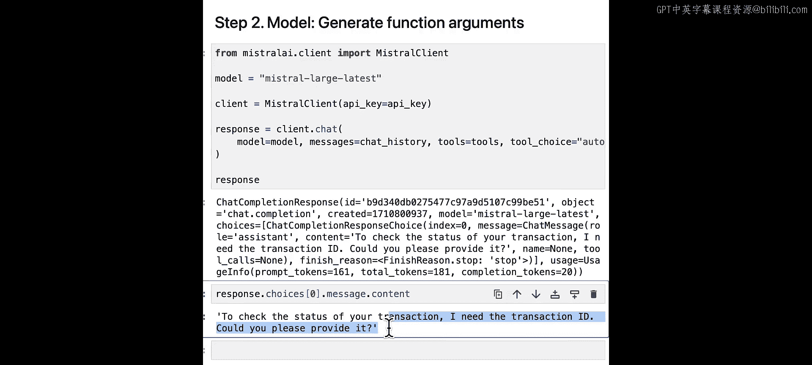
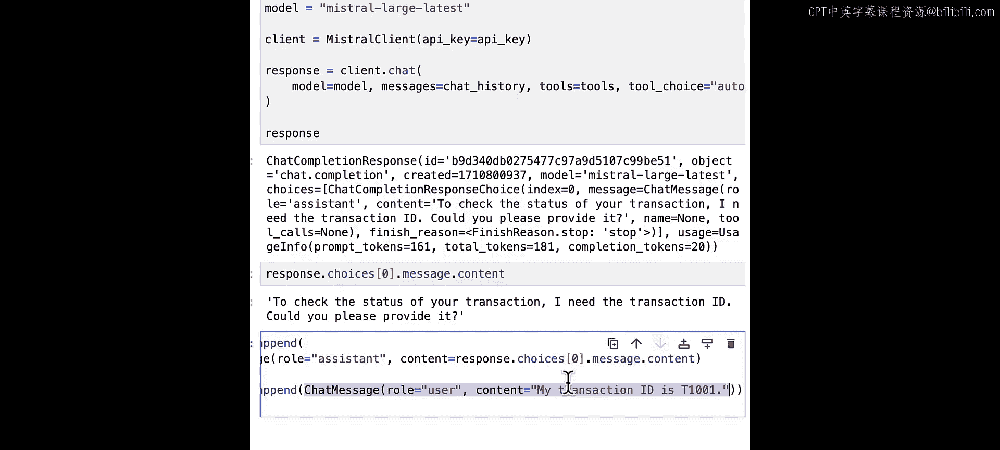
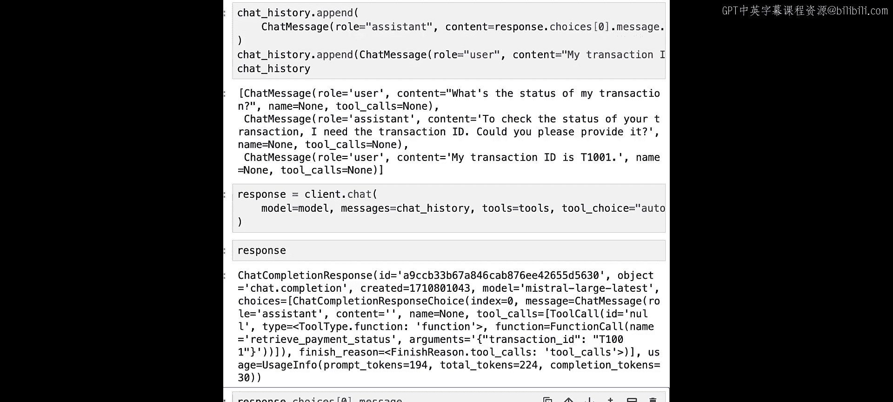
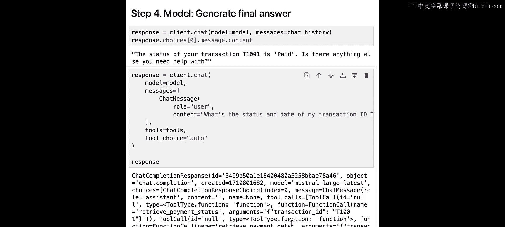

# 005：函数调用 🛠️


在本节课中，我们将学习如何为Mistral模型实现函数调用功能。函数调用允许Mistral模型连接到外部工具，使你能够轻松构建针对特定用例和实际问题的应用程序。

## 概述

函数调用使大型语言模型能够与外部函数或API交互，从而获取模型自身无法直接访问的信息或执行特定操作。整个过程分为四个核心步骤。

## 函数调用的四个步骤

上一节我们介绍了函数调用的概念，本节中我们来看看其具体实现的四个步骤。

### 步骤一：用户定义工具

用户需要为特定用例定义所有必要的工具。一个工具可以是一个用户定义的函数，也可以是一个外部API。

以下是定义两个函数的示例，一个用于提取支付状态，另一个用于提取支付日期。

```python
import pandas as pd

# 假设我们有以下交易数据
data = {
    'transaction_id': ['T1001', 'T1002', 'T1003'],
    'status': ['paid', 'pending', 'failed'],
    'date': ['2024-01-15', '2024-01-16', '2024-01-17']
}
df = pd.DataFrame(data)

def retrieve_payment_status(transaction_id):
    """根据交易ID检索支付状态"""
    result = df[df['transaction_id'] == transaction_id]['status'].values
    return result[0] if len(result) > 0 else "Transaction ID not found"

def retrieve_payment_date(transaction_id):
    """根据交易ID检索支付日期"""
    result = df[df['transaction_id'] == transaction_id]['date'].values
    return result[0] if len(result) > 0 else "Transaction ID not found"
```

为了让Mistral模型理解这些函数，我们需要使用JSON模式来定义函数规范。

以下是定义函数规范的代码：

```python
# 定义 retrieve_payment_status 函数的JSON规范
status_tool_spec = {
    "type": "function",
    "function": {
        "name": "retrieve_payment_status",
        "description": "根据交易ID获取支付状态",
        "parameters": {
            "type": "object",
            "properties": {
                "transaction_id": {
                    "type": "string",
                    "description": "交易的唯一标识符"
                }
            },
            "required": ["transaction_id"]
        }
    }
}

# 定义 retrieve_payment_date 函数的JSON规范
date_tool_spec = {
    "type": "function",
    "function": {
        "name": "retrieve_payment_date",
        "description": "根据交易ID获取支付日期",
        "parameters": {
            "type": "object",
            "properties": {
                "transaction_id": {
                    "type": "string",
                    "description": "交易的唯一标识符"
                }
            },
            "required": ["transaction_id"]
        }
    }
}

# 将工具规范组合成一个列表
tools = [status_tool_spec, date_tool_spec]

# 创建一个函数名到实际函数的映射字典
available_functions = {
    "retrieve_payment_status": retrieve_payment_status,
    "retrieve_payment_date": retrieve_payment_date
}
```

### 步骤二：模型生成函数参数

在定义了工具之后，我们需要让模型根据用户查询和工具规范来决定是否以及如何调用函数。

以下是让模型处理用户查询并生成函数调用的代码：

```python
# 假设我们有一个用户查询
user_query = "我的交易状态是什么？"
chat_history = [{"role": "user", "content": user_query}]

# 调用模型，传入工具定义和用户查询
# 注意：以下为伪代码，实际调用需使用Mistral API客户端
response = mistral_model.chat(
    messages=chat_history,
    tools=tools,
    tool_choice="auto"  # 让模型自动决定是否使用工具
)

# 检查模型的响应
print(response.choices[0].message)
```

模型可能会识别出缺少必要信息（例如交易ID），并请求用户提供。

### 步骤三：用户执行函数并获取结果

模型返回函数调用建议后，需要由用户端来实际执行这些函数。





以下是执行函数并获取结果的代码：

```python
# 从模型响应中提取函数调用信息
tool_calls = response.choices[0].message.tool_calls

# 遍历所有工具调用（支持并行调用）
for tool_call in tool_calls:
    function_name = tool_call.function.name
    function_args = json.loads(tool_call.function.arguments)  # 解析参数字符串为字典

    # 根据函数名找到对应的函数并执行
    function_to_call = available_functions[function_name]
    function_result = function_to_call(**function_args)

    # 将函数执行结果构建成一条“工具”角色的消息
    tool_message = {
        "role": "tool",
        "content": str(function_result),
        "tool_call_id": tool_call.id  # 关联到对应的函数调用
    }
    chat_history.append(tool_message)
```



### 步骤四：模型生成最终答案

最后，我们将包含函数执行结果的完整对话历史再次提供给模型，让它生成面向用户的最终答案。

以下是让模型生成最终答案的代码：

```python
# 将包含工具执行结果的对话历史再次发送给模型
final_response = mistral_model.chat(messages=chat_history)

# 输出模型的最终回答
print(final_response.choices[0].message.content)
# 示例输出：“您的交易 T1001 状态为‘已支付’。还有什么可以帮您的吗？”
```

## 并行函数调用

Mistral模型支持并行函数调用。如果用户在一个查询中请求多个信息，模型可以同时建议调用多个函数。

例如，用户查询：“我的交易T1001的状态和日期是什么？”，模型可能会同时返回 `retrieve_payment_status` 和 `retrieve_payment_date` 两个函数调用。

## 总结



本节课中我们一起学习了Mistral模型函数调用的完整流程。我们了解到，通过四个步骤——定义工具、模型生成参数、执行函数、模型生成答案——可以让大型语言模型安全、可靠地接入外部数据和功能，从而解决更复杂的实际问题。在下一课中，我们将学习RAG（检索增强生成），并了解如何将RAG作为函数调用的一个工具来使用。