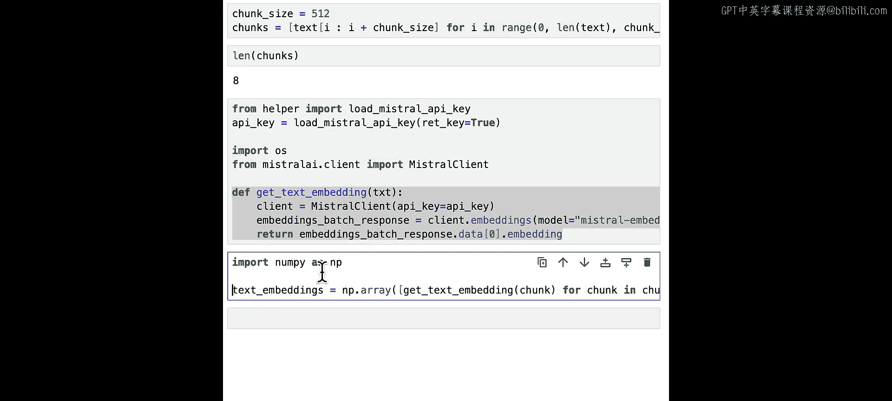
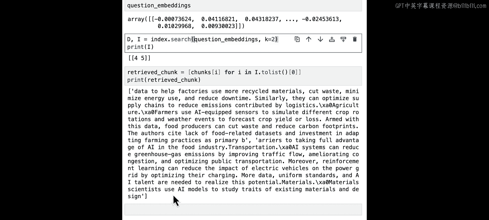
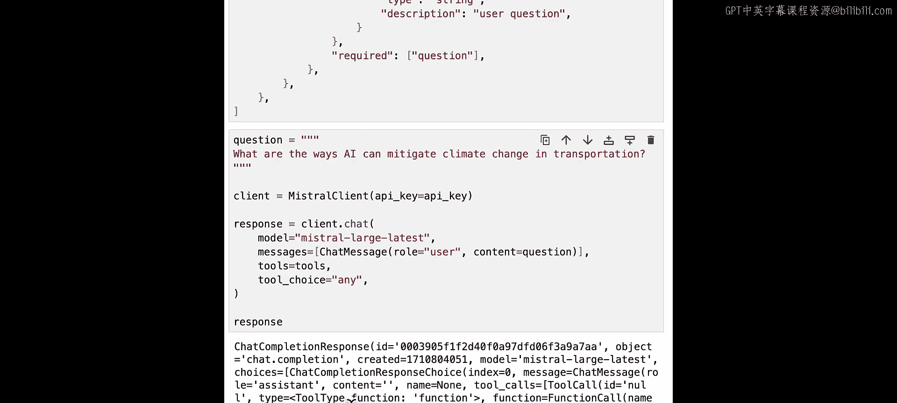
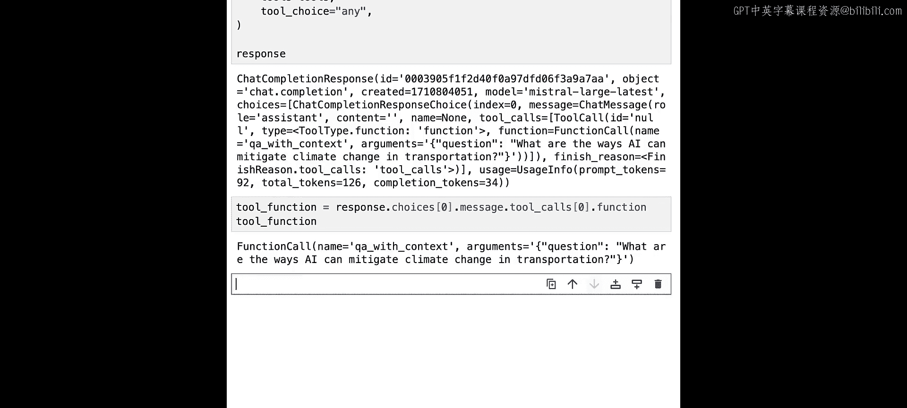
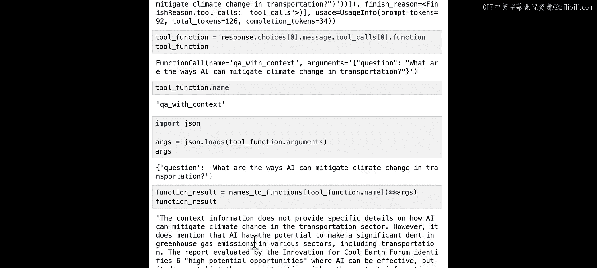
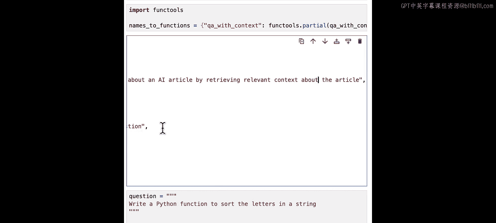
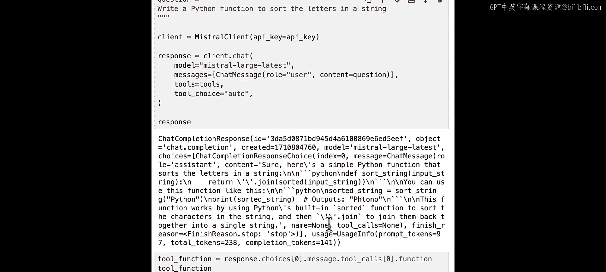
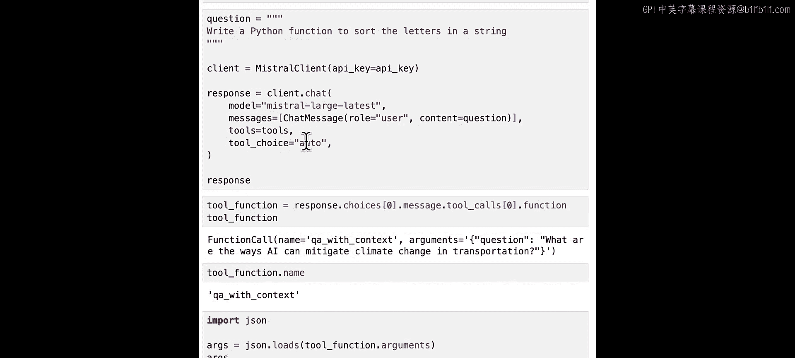
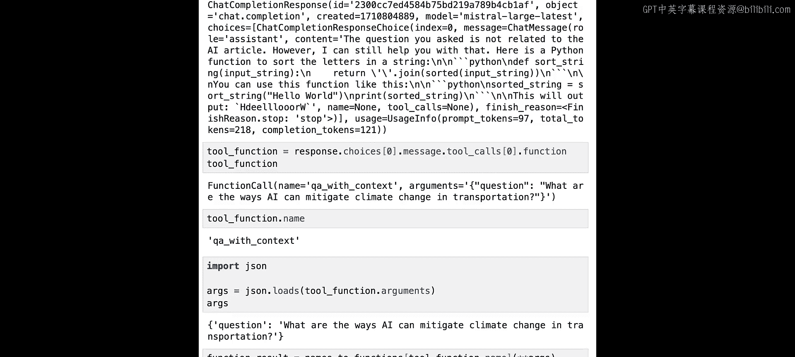

# 006：检索增强生成(RAG) 🧠

在本节课中，我们将学习并实践如何为Mistral模型实现检索增强生成。这是一种结合了大型语言模型和信息检索系统能力的AI框架，能有效利用外部知识来回答问题或生成内容。

## 概述

检索增强生成是一个AI框架，它结合了大型语言模型和信息检索系统的能力。该框架对于利用外部知识来回答问题或生成内容非常有用。

## 为什么需要RAG？

大型语言模型可能面临许多挑战。例如，它无法访问你的内部文档，不具备最新的信息，并且可能产生幻觉。针对这些问题，一个潜在的解决方案就是RAG。

## RAG的工作原理

从高层次来看，以下是RAG的工作流程。

当用户询问关于内部文档或知识库的问题时，我们从知识库中检索相关信息，其中所有文本片段都存储在向量数据库中。这一步称为**检索**。

接着，在提示词中，我们同时包含用户查询和相关检索到的信息。这样，我们的模型就可以基于相关上下文生成输出。这第二步称为**生成**。

## 从零开始实现RAG

在本节中，我们来看看如何从零开始实现RAG。

### 获取并解析文档

首先，我们从Hugging Face获取一篇文章。这是我们感兴趣的文章链接。我们使用一个名为BeautifulSoup的HTML解析器来查找文章的主要文本。

### 分割文档

接下来，我们将这个文档分割成块。在RAG系统中，这样做至关重要，以便能更有效地识别和检索最相关的信息片段。

在这个例子中，我们简单地按字符分割文本，将每512个字符组合成一个块。我们得到了8个块。根据你的具体用例，可能需要定制或尝试不同的块大小。

此外，在如何分割文本方面有多种选择，你可以按标记、句子、HTML标题等进行分割，具体取决于你的应用。

### 创建嵌入向量

现在，有了这8个文本块，让我们为每个块创建嵌入向量。我们再次使用一个辅助函数来加载API密钥，你可以在课程环境外用你自己的API密钥替换它。

我们定义这个`get_text_embedding`函数，使用Mistral嵌入API端点来获取单个文本块的嵌入向量。然后，我们使用这个列表推导式来获取所有文本块的文本嵌入向量。

让我们看看它是什么样子。

这些生成的文本嵌入向量是表示向量空间中文本的数值向量。如果我们查看第一个嵌入向量的长度，它返回1024，这意味着我们的嵌入维度是1024。

### 存储与检索

一旦我们获得了嵌入向量，常见的做法是将它们存储在向量数据库中，以便高效处理和检索。有几种向量数据库可供选择。在我们的简单示例中，我们使用开源向量数据库Faiss。

我们定义`IndexFlatL2`类的一个实例，以嵌入维度作为参数。然后，我们将文本嵌入向量添加到这个索引结构中。

当用户提问时，我们也需要使用与之前相同的嵌入模型为这个问题创建嵌入向量。这里我们获取问题嵌入向量。

现在，我们可以从向量数据库中检索与所提问题相似的文本块。我们可以在向量数据库上使用`index.search`执行搜索，该函数返回向量数据库中与问题向量最相似的K个向量的距离和索引。

然后，基于返回的索引，我们可以检索与这些索引对应的实际相关文本块。如你所见，我们得到了两个文本块，因为我们定义了K=2来检索向量数据库中最相似的两个向量。

请注意，有许多不同的检索策略。在我们的示例中，我们在嵌入向量内部使用了简单的相似性搜索。根据你的用例，有时你可能希望先执行元数据过滤，或者为检索到的文档提供权重，甚至检索原始检索块所属的更大的父块。

### 生成最终答案

最后，我们可以将检索到的文本块作为上下文信息包含在提示词中。这是一个提示词模板，它可以在提示词中同时包含检索到的文本块和用户问题。

让我们再次使用之前见过的`min`函数。通过这个提示词，我们得到了一个响应。

以上就是从零开始实现RAG的工作原理。你可以自由使用另一篇Hugging Face文章，或结合多篇文章，并就这些文章提问。

## 高级RAG与函数调用

我们刚刚经历了一个非常基础的RAG工作流程。如果你对更高级的RAG策略感兴趣，有几门其他课程可以学习。

如果你正在开发一个复杂应用，其中RAG是你可调用的工具之一，或者如果你有多个RAG作为多个可调用的工具，那么你可以考虑在函数调用内部使用RAG。

让我们看一个简单的例子。

### 封装RAG逻辑

我们将上面定义的RAG逻辑封装在一个名为`qa_with_context`的函数中。

现在，我们将这个函数组织成一个名为`name_to_function`的字典中。正如我们在上一课中看到的，如果只有一个函数，这可能看起来不那么有用，但如果你有多个工具或函数，将它们组织到一个字典中是非常有用的。

### 定义函数规范

现在，我们可以使用JSON模式来定义函数规范，以告诉我们的模型这个函数是关于什么的。其中函数名是`qa_with_context`，必需的参数是用户问题。

### 调用模型与工具

通过将用户问题和工具传递给模型，我们得到了工具调用结果，其中函数名为`qa_with_context`，参数是我们的用户问题。

让我们从模型响应中提取函数信息，我们得到函数名和函数参数。

然后，我们执行该函数以获取函数结果。

作为练习，请自由编写另一个RAG函数，询问关于另一篇Hugging Face文章的问题，并将它们都作为工具提供给我们的Mistral模型。

### 工具选择策略

作为练习，如果我们将用户查询改为“编写一个Python函数来对字符串中的字母进行排序”，会发生什么？它不应该使用我们的工具`qa_with_context`，因为这个问题与这个工具无关。

那么为什么会发生这种情况？这是因为我们将`tool_choice`设置为`any`，这会强制使用工具。现在我们将它改为`auto`，这意味着模型决定是否使用工具，但现在它仍然使用`qa_with_context`工具。

这可能是因为我们对工具的描述太笼统了。我们需要指定工具更具体。让我们在描述中添加一些细节：“你通过检索相关上下文来回答用户关于AI的问题。”

让我们运行这个。现在，让我们将描述更改为：“通过检索文章的相关上下文，回答用户关于一篇AI文章的问题。”这样描述就更具体了。

当我们再次运行它时，我们可以看到它返回了我们所要求的Python函数内容，并且现在没有返回工具调用，这正是我们需要的。

当然，如果你知道这个问题不应该使用工具，我们可以在这里将`tool_choice`设置为`none`。这将保证我们不会调用任何工具或函数。

现在让我们再试试`any`。记住，`any`会强制进行函数调用，现在我们可以看到，即使我们更改了函数描述，它仍然使用函数调用，因为我们的`tool_choice`是`any`，这会强制进行函数调用。

所以，默认行为是`auto`，我建议你将`tool_choice`设置为`auto`。

## 总结

在本节课中，我们一起学习了检索增强生成的基本概念和从零开始的实现步骤。我们了解了RAG如何结合检索和生成来利用外部知识，并实践了文档获取、分割、嵌入、存储、检索以及最终生成答案的完整流程。我们还探讨了如何将RAG逻辑封装为函数，并在函数调用框架中管理它，同时学习了`tool_choice`参数的不同设置（`auto`， `any`， `none`）如何影响模型是否以及如何使用工具。

请注意，你可以使用Mistral与其他工具（如LangChain、LlamaIndex和Haystack）一起进行RAG，请查看我们的文档以了解其工作原理。

在下一课中，我们将学习如何使用Mistral模型和Panel创建简单的UI界面。