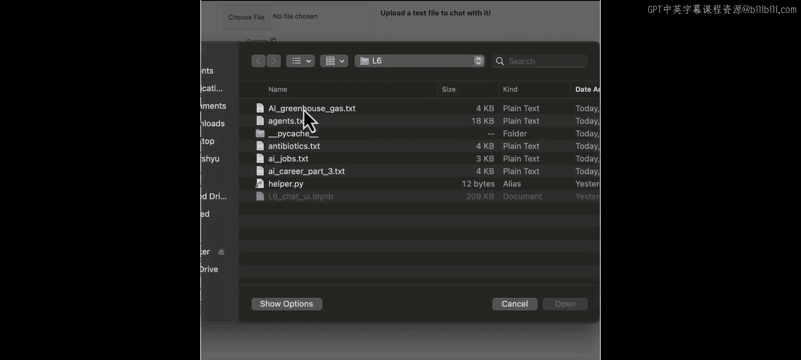
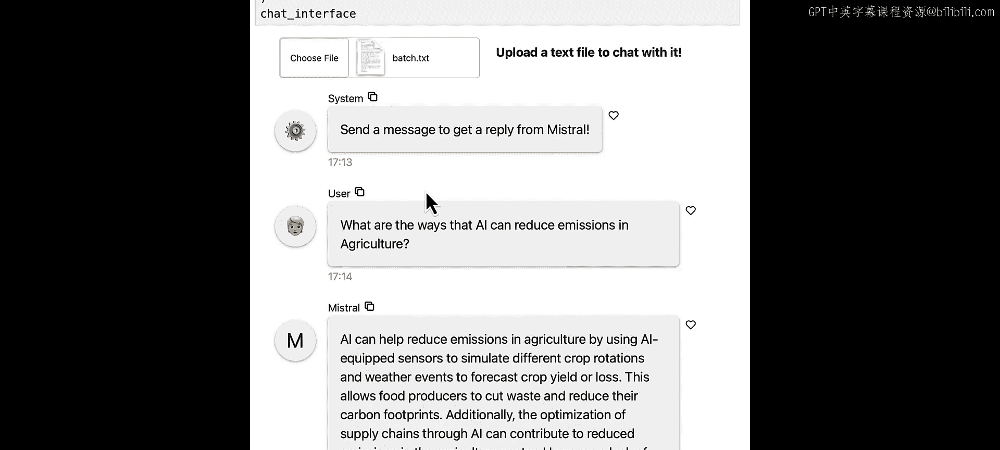

# 007：创建聊天界面


## 概述
在本节课中，我们将学习如何创建两种简单的聊天界面，用于与Mistral模型交互以及与外部文档进行对话。

---

## 导入必要包

首先，我们需要导入必要的Python包。除了之前课程中见过的包，我们还需要引入一个新的包：`panel`。`panel`是一个开源的数据探索和Web应用框架。

```python
import panel as pn
```




导入后，我们需要运行以下代码行来加载Panel应用的自定义JavaScript和CSS扩展。

```python
pn.extension()
```

---

## 创建基础聊天界面

上一节我们导入了必要的工具，本节中我们来看看如何创建一个基础聊天界面。

我们定义一个之前见过的`myal`函数。请注意，这里我们添加了两个额外的参数`user`和`chat_interface`。虽然函数本身不使用它们，但为了UI的兼容性，我们需要将其包含在参数列表中。

接下来，我们只需运行以下四行代码，就能获得一个可以与模型交互的聊天界面。

```python
chat_interface = pn.chat.ChatInterface(callback=myal, callback_user="Mistral")
chat_interface.send("Write an email to schedule an appointment with my CS professor to discuss research opportunities.", user="User", respond=False)
chat_interface.servable()
```

效果相当不错。现在，让我们更仔细地看看代码。

我们使用`pn.chat.ChatInterface`定义了一个聊天界面小部件。这个小部件处理了聊天应用的所有用户界面和逻辑。然后，我们在回调函数中定义系统如何响应，这个回调函数就是我们上面定义的`myal`函数。我们可以将回调用户名定义为“Mistral”，以指示来自Mistral模型的响应。

由此可见，仅用几行代码，你就可以获得一个与我们的模型交互的简单聊天界面。

---

## 创建文档问答聊天界面

接下来，让我们看看如何创建一个能与外部文档对话的聊天界面。

我们之前见过这部分代码。我们从Batch获取一份新闻简报，并将其文本内容保存为`batch.txt`文件。

以下是相关代码的简要回顾：

首先，在提示词中，我们包含了基于用户查询检索到的文本块信息，然后是用户查询本身，我们试图据此获得答案。

我们有一个使用`text-embedding`模型获取文本嵌入向量的函数。
另一个函数用于运行Mistral模型。对于RAG任务，我们推荐使用`Mistral-Large`模型以获得最佳性能。

主要函数是`answer_question`函数。它的工作流程是：
1.  从上传的文件中获取文本。
2.  将文档分割成块。
3.  将文本块加载到向量数据库中。
4.  为问题创建嵌入向量。
5.  从向量数据库中检索相似的文本块。
6.  最后，基于检索到的相关文本块生成响应。

以下是该聊天界面的代码。在这个聊天界面中，我们首先需要定义一个文件输入小部件，用于上传文件。

让我们看看这个小部件：`file_input`，我们可以选择并上传一个文件。

然后，我们需要定义聊天界面小部件，在回调函数中定义系统如何响应，这个回调函数就是我们刚刚定义的`answer_question`函数。

我们可以将文件输入小部件安排在界面的顶部。如你所见，我们首先看到的是文件输入小部件和一些文本描述。我们还可以选择用一条系统消息来启动聊天界面，以便用户了解这个聊天应用的预期用途。

现在让我们再试一次。我们上传`batch.txt`文件。我们问一个关于这个文件的问题。然后我们从Mistral-Large模型得到一个答案。

这就是这个聊天用户界面的代码。作为练习，你可以尝试通过更改这里的URL来使用Batch的不同文章。然后尝试上传不同的文章并询问相关问题，看看Mistral-Large模型如何响应。

---



## 总结
本节课中，我们一起学习了如何创建两种聊天界面：一种是基础的、直接与Mistral模型对话的界面；另一种是更高级的、能够处理并回答关于上传文档问题的界面。我们使用了`panel`库来构建用户界面，并集成了文本嵌入和检索增强生成技术来实现文档问答功能。