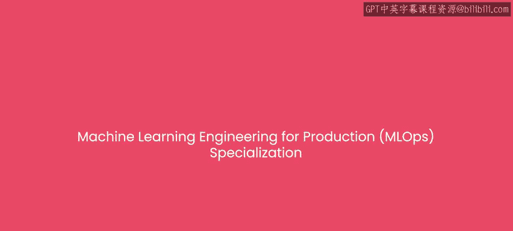
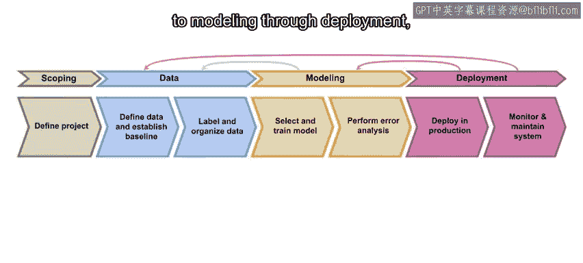
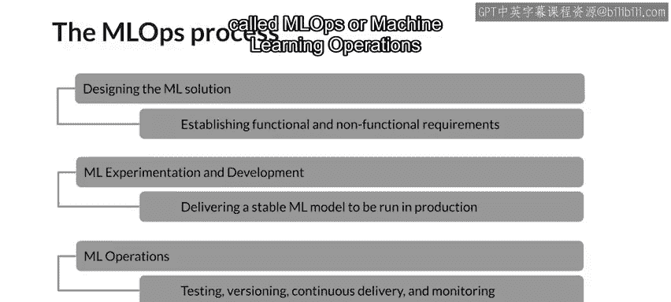

#  001：专项课程概述 🎯

在本节课中，我们将要学习《机器学习工程师的生产实践（MLOps）》专项课程的整体介绍。我们将了解课程的目标、涵盖的核心主题、讲师团队以及学习本课程所需的基础知识。

---

## 欢迎与课程目标

欢迎来到《机器学习工程师的生产实践与MLOps》专项课程。

假设你已经在Jupyter笔记本中训练了一个准确的机器学习模型，并为此感到高兴。你可能会想，接下来该做什么？

在开发出一个好模型之后，实际上将模型投入生产，构建一个能够持续做出有用预测的工作系统，仍然需要完成大量工作。

本专项课程将教授你构建和部署生产级机器学习系统所需的技能。你将学习完整的机器学习项目生命周期，从项目范围界定、数据处理、建模到部署，从而真正从头到尾执行一个机器学习项目。

一个常见的误解是，在本地机器的Jupyter笔记本中开发模型与将该模型部署到生产环境之间的唯一区别，仅仅在于“部署”这一步，可能只是一些软件工程工作。但事实并非如此。这不仅仅是软件工程，生产环境也带来了独特的机器学习挑战。在Jupyter笔记本中开发模型的过程，与构建和维护生产系统的学科是不同的。

构建和维护生产系统的流程与工具，有时被称为MLOps（机器学习运维），你也将学习这方面的内容。

---

## 讲师介绍

我很高兴能与来自Google TensorFlow团队的两位杰出讲师——Robert Crowe和Laurence Moroney——共同为大家带来这个新的专项课程。

Robert Crowe是Google的TensorFlow开发工程师、数据科学家和TensorFlow倡导者。Robert热衷于帮助开发者快速学习他们需要掌握的知识，希望这正是你们所需要的。

Laurence Moroney在Google领导AI倡导工作，同时也是DeepLearning.AI另外三门TensorFlow专项课程的讲师，并且是《AI and Machine Learning for Coders》一书的作者。非常高兴你们两位能加入这个专项课程的教学工作。

正如Andrew所说，除了在生产系统中构建第一个可工作的模型，你还需要处理一系列问题，包括**数据漂移**——你训练所用的数据分布最终可能会变得与进行推理时所用的数据分布非常不同。我们将讨论的一个关键主题是**变化**。世界在变化，你的模型需要意识到这种变化。

在本专项课程中，我们还将向你介绍机器学习之外的几个相关主题。你可以将生产机器学习视为机器学习本身与现代软件开发所需知识和技能的结合。

如果你在工业界的机器学习团队工作，你确实需要同时具备机器学习和软件方面的专业知识才能成功。这是因为你的团队不仅仅是产出一个单一的结果，你们将开发一个持续运行的产品或服务，并可能成为公司工作中至关重要的一部分。

根据我自己的经验，构建机器学习系统最具挑战性的方面，往往是那些你最意想不到的事情，比如部署。能够构建一个模型固然很好，但将其交到用户手中并观察他们如何使用它，可能会让人大开眼界。你可能认为自己为完美场景构建了完美模型，但你的用户可能有不同的看法，向他们学习总是非常有益的。

例如，用户可能可以接受为了频繁更新的模型而将数据轮询发送到服务器，也可能坚持他们的数据绝不能离开设备。因此，你需要了解保持他们设备上模型新鲜度的最佳方法。

---

## 课程结构与内容

本专项课程包含四门课程，为你提供启动和运行生产机器学习系统所需的知识和实践经验。

以下是四门课程的简要介绍：

*   **课程一（由我讲授）**：你将看到生产机器学习项目从范围界定、获取数据、建模到部署的整个生命周期的概述。
*   **课程二（关于数据及其随时间演变）**：在这门课程中，你将使用TensorFlow Extended（TFX）及其系列库，通过收集、清理和验证数据集来构建数据管道。为了理解数据的演变，你将使用数据溯源作为概念框架，通过ML元数据来跟踪变化。
*   **课程三（专注于生产中的机器学习建模管道）**：在这门课程中，你将学习如何管理建模资源，以最佳方式服务推理请求并最小化成本。你还将使用分析工具来解决模型公平性、可解释性问题并缓解瓶颈。
*   **课程四（关于部署）**：这意味着你需要准备好服务用户的请求。这既令人兴奋又充满挑战。在课程四中，你将交付部署管道，用于可能需要多种不同基础设施的模型服务。你还将应用最佳实践来维护一个持续运行的生产系统，使其保持最新状态，并且重要的是，始终将用户需求放在首位。

---

## 学习前提

作为本专项课程的学习者，我们假设你熟悉Python编程和机器学习，并对Python中的一种深度学习框架（如TensorFlow、Keras或PyTorch）有一定了解。

如果你已经完成了DeepLearning.AI提供的深度学习专项课程，那么你将非常适合开始学习本专项课程。当然，如果你已经完成了DeepLearning.AI的TensorFlow开发者专业课程，你将为本专项课程的学习做好充分准备。

---

## 总结

本节课中，我们一起学习了《机器学习工程师的生产实践（MLOps）》专项课程的概述。我们了解了课程旨在解决从模型开发到生产部署的完整流程挑战，认识了讲师团队，预览了四门核心课程的内容（生命周期概述、数据处理、建模管道和部署），并明确了学习本课程所需的Python编程、机器学习及深度学习框架基础。现在，让我们开始正式的学习之旅。