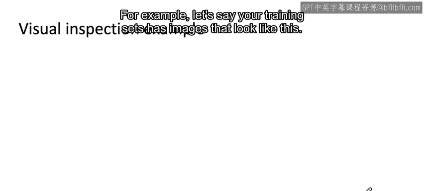
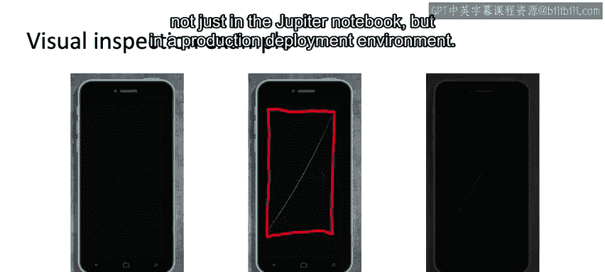
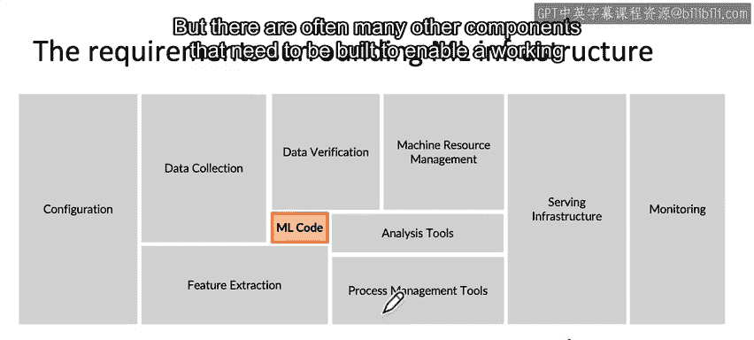

#  002：欢迎与机器学习工程概述 🚀

在本课程中，我们将学习机器学习工程的核心概念，了解将模型从实验室部署到生产环境所面临的挑战，并概述一个完整的机器学习项目生命周期。

---

许多学习者曾问我：“Andrew，我已经学会了训练机器学习模型，接下来该做什么？” 机器学习模型固然重要，但除非你知道如何将其投入生产，否则很难发挥其最大价值。对于寻求机器学习职位的人来说，许多面试官也会问：“你是否曾将机器学习算法部署到生产环境中？”

在这个由四门课程组成的专项课程中，第一门课程由我讲授，第二、三、四门课程则由来自谷歌的专家Robert Crowe讲授。我们希望与大家分享实用的动手技能和技术，不仅教你如何构建模型，更教你如何将其部署到生产环境中。在本课程和整个专项课程结束时，我希望你能对机器学习项目的完整生命周期——从模型训练到生产部署，以及如何管理整个项目——有一个清晰的认识。

让我们开始吧。

---

## 一个生产部署的实例

让我们从一个例子开始。假设你正在使用计算机视觉来检查生产线上的手机，以发现是否存在缺陷。左侧显示的完好手机没有任何划痕。但如果存在划痕或裂纹，计算机视觉算法有望发现这类缺陷，并可能为其绘制边界框，作为质量控制的一部分。

如果你获得了一个有划痕手机的数据集，你可以训练一个计算机视觉算法（例如神经网络）来检测这类缺陷。但为了将其部署到生产环境中，你现在需要做什么？

以下是一个可能的部署系统示例。你可能会使用一个边缘设备。所谓边缘设备，是指位于制造这些智能手机的工厂内部的设备。该设备上会运行一个检测软件，其职责是拍摄手机照片，判断是否存在划痕，然后决定该手机是否合格。这在工厂中实际上很常见，被称为自动视觉缺陷检测。

检测软件会控制一个摄像头，在手机下线时拍摄照片。然后，它需要发起一个API调用，将图片传递给一个预测服务器。预测服务器的职责是接收这些API调用和图像，判断手机是否有缺陷，并返回预测结果。随后，检测软件可以做出相应的控制决策：是让手机继续在产线上流转，还是因其有缺陷且不合格而将其分拣到一旁。

因此，在你训练了一个学习算法（例如，训练一个以手机图片X为输入，输出缺陷预测Y的神经网络）之后，你仍然需要将这个机器学习模型放入预测服务器，设置API接口，并编写所有其他软件，才能真正将这个学习算法部署到生产环境中。这个预测服务器有时位于云端。

有时，预测服务器实际上也位于边缘。事实上，在制造业中，我们大量使用边缘部署，因为你不能让工厂在每次互联网连接中断时都停工。但将预测服务器部署在云端的云部署，也用于许多应用。

---

## 部署后可能遇到的问题

假设你已经编写了所有软件。那么，可能会出什么问题呢？

事实证明，仅仅因为你训练了一个在测试集上表现良好的学习算法（这值得庆祝），并不意味着你的工作已经完成。要获得一个有价值的、运行中的生产部署，可能仍然存在大量工作和挑战。

例如，假设你的训练集中的图像看起来是这样的：

左侧是完好的手机，中间的手机有一道大划痕。你训练的学习算法可以识别出左侧这类手机是合格的（即无缺陷），并可能在发现的划痕或其他缺陷周围绘制边界框。

然而，当你将其部署到工厂时，你可能会发现实际生产部署返回的图像是这样的：由于工厂的照明条件与收集训练集时相比发生了变化，图像变得暗得多。这个问题有时被称为概念漂移或数据漂移（你将在本周后续课程中了解更多相关术语）。

这只是我们作为机器学习工程师，为了确保系统不仅在测试集上表现良好，而且能在实际生产部署环境中创造价值，所必须解决的众多实际问题之一。

我参与过不少项目，在这些项目中，我的机器学习团队和我成功地完成了概念验证。所谓概念验证，是指我们在Jupyter笔记本中训练了一个模型，并且它运行得很好，我们会为此庆祝。当你的学习算法在Jupyter笔记本或开发环境中运行良好时，确实值得庆祝。

但事实证明，有时我看到许多项目在取得这一巨大成功后，距离实际部署可能还需要六个月的工作。这只是机器学习团队为了真正部署这些系统而必须注意和处理的众多实际问题之一。

有些机器学习工程师会说，解决这些问题不是机器学习问题。例如，数据集发生了变化，一些机器学习工程师会想：“这算机器学习问题吗？” 我的观点是，我们的工作是让这些东西运转起来。因此，如果数据集发生了变化，我认为我在项目中工作时，有责任介入并尽我所能去处理数据分布的实际状况，而不是我期望的状况。本专项课程将教你许多这类重要的实用知识，帮助你构建不仅在实验室、不仅在Jupyter笔记本中，而且能在生产部署环境中工作的机器学习系统。

---

## 生产部署的第二个挑战：远不止机器学习代码

在生产环境中部署机器学习模型的第二个挑战是，它需要的远不止机器学习代码。过去十年，人们对机器学习模型（即你的神经网络或其他学习从输入到输出映射函数的算法）给予了大量关注，并且机器学习模型取得了惊人的进展。

但事实证明，如果你观察一个生产环境中的机器学习系统，假设这个橙色小矩形代表机器学习代码（即机器学习模型代码），那么这就是整个机器学习项目所需的全部代码吗？

对于许多机器学习项目，我认为机器学习代码可能只占全部代码的5%到10%，甚至更少。我想，这也是为什么当你有一个概念验证模型在Jupyter笔记本中运行良好后，从最初的概念验证到生产部署之间仍然存在大量工作的原因之一。有时人们称之为“概念验证到生产的鸿沟”。这个鸿沟很大程度上有时仅仅是因为还需要编写所有这些模型之外的代码。

那么，所有这些其他东西是什么呢？这张图改编自D. Scully等人的一篇论文。除了机器学习代码，还有许多组件，特别是用于管理数据的组件，例如数据收集、数据验证、特征提取。在模型上线服务后，还需要监控系统或监控返回的数据，以帮助你进行分析。通常，为了建立一个可运行的生产部署，还需要构建许多其他组件。在本课程中，你将学习到一个有价值的生产部署所需的所有这些其他软件组件是什么。

---

## 组织项目工作流的有用框架

与其审视所有这些复杂的部分，我发现组织机器学习项目工作流最有用的框架之一是，系统地规划出机器学习项目的生命周期。

让我们进入下一个视频，深入探讨什么是机器学习项目的完整生命周期。我希望这个框架对你未来计划部署的所有机器学习项目都非常有用。让我们进入下一个视频。

---

## 总结

在本节课中，我们一起学习了机器学习工程的重要性，它关注如何将训练好的模型部署到生产环境以创造实际价值。我们通过一个手机缺陷检测的实例，了解了生产部署的基本架构（如边缘设备、预测服务器和API调用）。我们探讨了部署后可能遇到的挑战，例如数据分布变化（概念漂移/数据漂移），并认识到从概念验证到生产部署往往需要大量额外工作。最后，我们了解到一个生产级的机器学习系统，其机器学习代码通常只占很小一部分，还需要数据管理、监控等诸多其他组件。下一节，我们将深入探讨机器学习项目的完整生命周期框架。