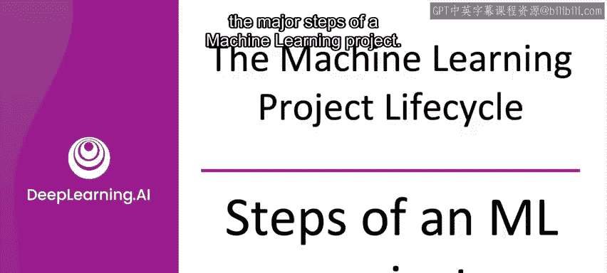
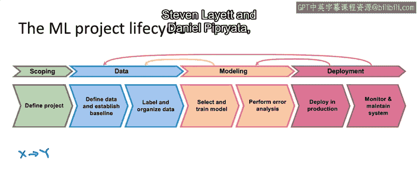

#  003：机器学习项目生命周期 🚀


在本节课中，我们将学习机器学习项目的完整生命周期。理解这个框架有助于你规划项目步骤，确保系统顺利运行并减少意外情况。

---

## 项目范围界定 📋

上一节我们介绍了课程概述，本节中我们来看看项目生命周期的第一步：范围界定。

范围界定是指定义项目目标。你需要决定将机器学习应用于何处，并明确输入 **X** 和输出 **Y**。

**公式**：`项目目标 = f(X, Y)`



---

## 数据收集与整理 📊

在确定了项目范围后，下一步是收集或获取算法所需的数据。

以下是数据阶段的关键任务：

*   **定义数据**：明确需要哪些数据。
*   **建立基线**：设定一个性能基准。
*   **数据标注与组织**：对数据进行标记和整理。

本周后续课程将介绍一些关于数据的最佳实践。

---

## 模型训练与迭代 🔄

拥有了数据之后，接下来进入模型训练阶段。

在模型阶段，你需要选择和训练模型，并进行错误分析。机器学习通常是一个高度迭代的过程。

**代码示例**（伪代码）：
```python
model = select_model()
model.train(training_data)
performance = error_analysis(model, validation_data)
```

在错误分析过程中，你可能会返回更新模型，甚至可能回到前一阶段决定收集更多数据。

---

## 部署前检查与部署 🚀

在将系统部署到生产环境之前，我通常会进行最终检查或审计，以确保系统性能足够好且足够可靠。

有时人们认为部署系统就意味着项目结束。但我现在告诉大多数人，首次部署系统时，你可能只走完了全程的一半。因为往往只有在系统处理真实流量后，你才能学到让系统表现良好的另一半重要经验。

部署步骤包括：

*   **生产环境部署**：将所需软件投入生产。
*   **系统监控**：跟踪持续流入的数据。
*   **系统维护**：例如，当数据分布发生变化时，可能需要更新模型。

---

## 监控与持续维护 🔧

初始部署后，维护工作通常意味着返回进行更多的错误分析，可能重新训练模型。这也可能意味着将系统在实时数据上运行后得到的新数据，反馈到你的数据集中，从而更新数据、重新训练模型，如此循环，直到可以将更新后的模型再次部署。

---



## 总结与展望 📝

本节课中，我们一起学习了机器学习项目的完整生命周期框架，包括范围界定、数据收集、模型训练、部署前检查、部署以及持续的监控与维护。

我发现这个框架适用于非常广泛的机器学习项目，从计算机视觉、音频数据到结构化数据等众多应用。你可以随时截取这张框架图，与朋友或自己一起用它来规划你的机器学习项目。

为了加深对这个生命周期的理解，在下一个视频中，我们将通过一个语音识别应用的具体例子，逐步了解机器学习项目生命周期各个步骤的实际操作。让我们进入下一个视频。