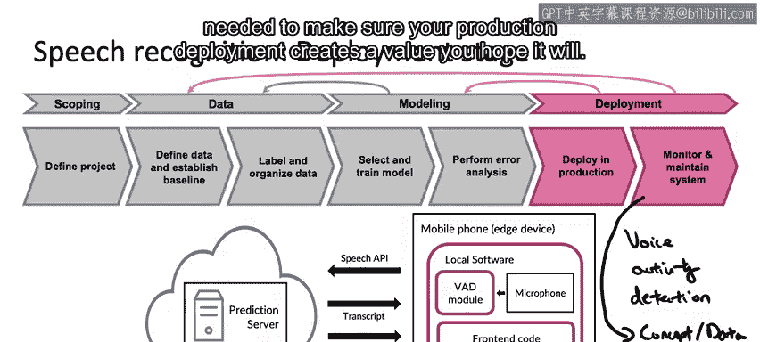

#  004：语音识别案例学习 🎤

在本节课中，我们将通过一个语音识别的实际案例，完整地学习机器学习项目的生命周期。我们将从项目定义开始，逐步探讨数据准备、模型训练、系统部署以及后续的监控维护。通过这个案例，你将了解构建一个生产级语音识别系统所需的全部步骤。

---

## 项目定义与范围确定 📋

上一节我们介绍了课程的整体目标，本节中我们来看看如何为一个机器学习项目确定范围。

深度学习的一大成功应用是语音识别。与大约十年前相比，深度学习显著提升了语音识别的准确率。这使得我们能够在智能音箱、智能手机的语音助手等场景中使用语音识别技术。你可能偶尔会听到关于构建更好语音模型的研究工作，但要实际构建一个有价值的、可投入生产的语音识别系统，还需要哪些步骤呢？让我们使用机器学习项目生命周期来梳理一个语音识别案例。

我曾在一个商业环境中参与过语音识别系统的开发，第一步就是确定项目范围。我们必须首先定义一个项目，并决定着手进行语音识别工作，例如将其作为语音搜索的一部分。在定义项目时，我鼓励你尝试估算或至少猜测关键指标。这些指标几乎完全取决于具体问题，每个应用都有其独特的目标和指标。对于语音识别，我关心的一些指标包括：
*   **准确率**：语音系统的准确度如何。
*   **延迟**：系统转录语音需要多长时间。
*   **吞吐量**：我们每秒能处理多少个查询。

如果可能，你还可以尝试估算所需的资源，例如需要多少时间、多少计算资源、多少预算，以及项目的时间线。关于项目范围确定，我们将在本课程的第三周详细讨论，届时会回到这个话题并深入描述。

---

## 数据阶段：定义、基准与组织 📊

在确定了项目范围之后，下一步就进入了数据阶段。在这个阶段，你需要定义数据、建立基准，并对数据进行标注和组织。

实际语音识别系统的一个挑战在于数据标注的一致性。以下是一个典型的语音搜索录音片段：“today's weather”。问题是，给定这个音频片段，你会如何转录它？以下是几种合理的转录方式：
*   `today's weather`
*   `today's weather.`
*   `[noise]`

前两种转录方式都是完全合理的。第三种方式考虑到音频中可能存在噪音（例如碰撞声），选择不转录噪音部分。实际上，这三种转录方式都可以接受。我可能更倾向于第一种或第二种，而不是第三种。但是，如果数据集中三分之一的标注使用第一种方式，三分之一使用第二种，三分之一使用第三种，这就会损害学习算法的性能。因为数据不一致会让学习算法感到困惑，它无法猜测对于某个特定的音频片段，标注者恰好使用了哪种约定。

发现并修正此类不一致性，例如要求所有人都标准化使用第一种约定，能对你的学习算法性能产生显著影响。我们将在本课程后续部分深入探讨如何发现不一致性并进行调整的最佳实践。

对于像“today's weather”这样的音频片段，其他数据定义问题还包括：
*   在说话者停止说话后，你希望在每个片段前后保留多少静音？是100毫秒、300毫秒还是500毫秒？
*   如何进行音量归一化？有些说话者声音大，有些声音小。更棘手的情况是，同一个音频片段中同时存在音量极大和极小的部分。

所有这些问题都属于数据定义问题。机器学习的许多进步，即大量的机器学习研究，是由研究人员致力于提升在基准数据集上的性能所驱动的。在这种模式下，研究人员可能会下载数据并在固定的数据集上工作。这种思维方式推动了机器学习的巨大进步。但是，如果你正在开发一个生产系统，你就不必保持数据集固定不变。我经常为了提升数据质量、让生产系统运行得更好而编辑训练集，甚至编辑测试集。本课程及后续专项课程中，你将学习如何有效地、系统化地（而非临时地）确保数据质量。

---

## 建模阶段：选择、训练与错误分析 🤖

收集数据之后，下一步是建模。在这个阶段，你需要选择和训练模型，并进行错误分析。

训练机器学习模型的三个关键输入是：
1.  **代码**：即你选择的算法或神经网络模型架构。
2.  **超参数**。
3.  **数据**。

运行你的代码，结合超参数和数据，就能得到机器学习模型，例如一个从音频片段学习生成文本转录的模型。

我发现，在很多研究或学术工作中，人们倾向于**固定数据**，然后主要调整**代码**和**超参数**以获得良好性能。相比之下，对于许多产品团队，如果你的主要目标是构建并部署一个可工作的、有价值的机器学习系统，我发现**固定代码**，转而专注于优化**数据**（以及超参数）可能更为有效。机器学习系统包括代码、数据和超参数。超参数可能比代码或数据更容易优化。我发现，与其采取以模型为中心的观点，试图针对固定数据集优化代码，对于许多问题，你可以使用从GitHub下载的开源实现，转而专注于优化数据。

因此，在建模阶段，你需要选择和训练某个模型架构（例如某个神经网络架构）。错误分析可以告诉你模型在哪些方面仍然存在不足。如果错误分析能告诉你如何系统地改进数据（当然，改进代码也可以），这通常是你获得高精度模型的一种非常高效的途径。关键在于，你不需要总是感觉需要收集更多数据（虽然更多数据总是有帮助的，但可能成本高昂）。如果错误分析能帮助你更有针对性地确定具体需要收集哪些数据，这将帮助你更高效地构建一个准确的模型。

---

## 部署与监控维护 🚀

当你训练好模型，并且错误分析表明其性能足够好时，就可以进入部署阶段了。

对于语音识别，部署一个语音系统的方式可能如下：你有一部智能手机，这是一个边缘设备，上面运行着本地软件。该软件接入麦克风，录制某人说的话（例如用于语音搜索）。在典型的语音识别实现中，你会使用一个**VAD模块**（语音活动检测）。VAD通常是一个简单的算法（也可能是学习算法），其任务是让智能手机筛选出只包含人声的音频片段，以便只将该音频片段发送到你的预测服务器。在这个例子中，预测服务器可能位于云端。预测服务器随后返回转录文本（以便用户看到系统认为你说了什么），如果进行的是语音搜索，还会返回搜索结果。转录文本和搜索结果会显示在手机前端运行的代码中。

实现这种类型的系统，就是在生产中部署语音模型所需的工作。

然而，即使在系统运行之后，你仍然需要**监控和维护**系统。

我曾遇到过这样的情况：我的团队构建了一个语音识别系统，它主要是在成人语音数据上训练的。我们将其推送到生产环境后，发现随着时间的推移，越来越多的年轻人（例如青少年，有时甚至更年幼）开始使用我们的系统。而非常年轻的人的声音听起来是不同的。因此，我的语音系统性能开始下降，我们在识别年轻声音方面的表现不佳。我们必须回过头来，想办法收集更多数据或采取其他措施来修复这个问题。

因此，部署阶段的一个关键挑战是**概念漂移**或**数据漂移**。这是指数据分布发生变化的情况，例如有越来越多的年轻声音被输入到语音识别系统中。知道如何建立适当的监控机制来发现此类问题，以及如何及时修复它们，是确保你的生产部署能够创造预期价值的关键技能。

---

## 总结 📝

本节课中，我们一起学习了机器学习项目的完整生命周期，并以语音识别作为贯穿始终的案例。我们从项目范围确定开始，经历了数据准备、模型训练，一直到系统部署和后续的监控维护。通过这个案例，你看到了构建一个实际可用的生产级机器学习系统所需考虑的全方位步骤。