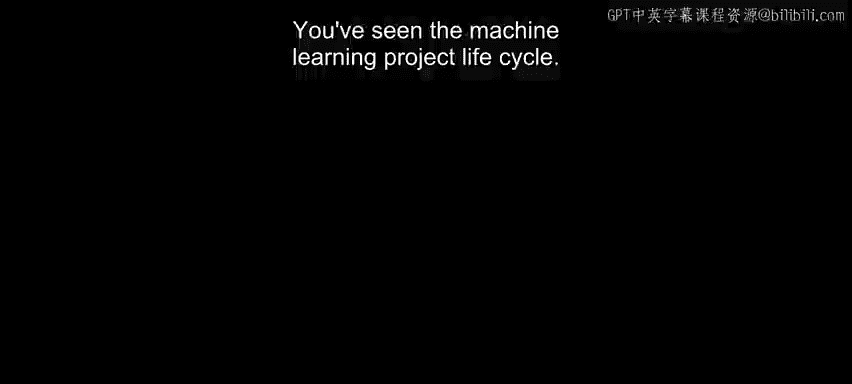
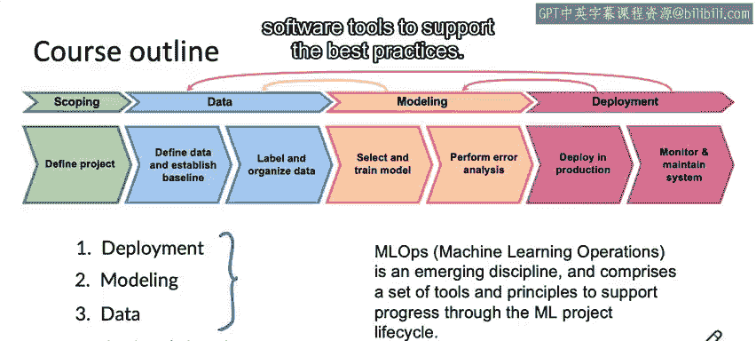

#  005：课程大纲 📚

在本节课中，我们将简要介绍吴恩达《机器学习工程师的生产实践（MLOps）》课程的整体结构与学习路径。我们将从最终目标——部署开始，逆向学习建模、数据管理及项目规划等核心环节，并了解MLOps工具与原则如何系统化地支持整个机器学习项目生命周期。

## 课程学习路径 🔄

上一节我们介绍了机器学习项目生命周期，本节中我们来看看本课程的具体安排。

尽管项目生命周期通常从左至右进行，但为了更高效地学习，本课程将从最终目标——部署开始，逆向回溯至建模、数据管理及项目规划。

以下是本课程的核心模块安排：

*   **第一周（本周后续内容）**：学习**部署**的核心概念。
*   **第二周**：学习**建模**。除了常规的模型训练知识，还将介绍如何系统化地采用以数据为中心的方法来更高效地提升模型性能。
*   **第三周**：学习**数据**管理。包括如何定义数据、建立性能基线，以及如何系统化地标注和组织数据，而非在Jupyter Notebook中盲目尝试。
*   **可选部分**：在第三周，我们还将提供一个关于**项目规划**的可选章节，分享定义高效机器学习项目的实用技巧。

## 贯穿课程的MLOps 🛠️

在整个课程中，您还将学习**MLOps（机器学习运维）**。这是一个新兴的学科，包含一系列支持机器学习项目生命周期推进的工具与原则，尤其关注部署、建模和数据这三个核心步骤。

例如，在Landing AI，我们曾手动执行许多步骤，虽然可行但效率较低。在构建了名为LandingLens的计算机视觉MLOps平台后，所有这些步骤都变得快捷许多。

MLOps的核心思想是：为项目规划、数据管理、建模和部署提供系统化的方法论，并利用软件工具来支持最佳实践。

## 总结与展望 🎯

本节课中我们一起学习了本课程“从目标出发，逆向学习”的整体框架。您已经了解到，部署系统是当今机器学习领域最重要且最具价值的技能之一。

接下来，让我们进入下一个视频，深入探讨部署机器学习系统所需的核心知识与重要理念。