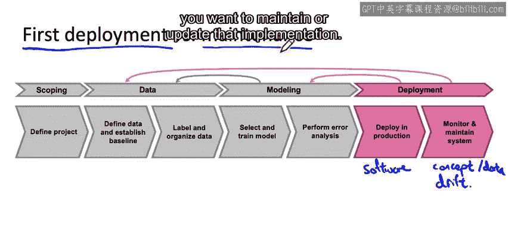

#  006：机器学习部署关键挑战 🚀

在本节课中，我们将探讨将机器学习模型部署到生产环境时面临的主要挑战。我们将这些挑战分为两大类：机器学习/统计问题，以及软件工程问题。理解这些挑战是确保系统成功部署的关键。

---

## 1. 机器学习与统计挑战 📊

上一节我们介绍了部署模型时可能遇到的挑战类别。本节中，我们来看看第一类挑战：机器学习或统计问题。其中最常见的挑战之一是概念漂移和数据漂移。

### 1.1 概念漂移与数据漂移

概念漂移和数据漂移指的是在系统部署后，数据发生变化的情况。例如，在制造业中，你可能在特定光照条件下训练了一个检测智能手机划痕的算法，但工厂的光照条件后来发生了变化。这就是数据分布变化的一个例子。

让我们通过语音识别的第二个例子来详细说明。在构建语音识别系统时，我通常会使用一些购买或授权的数据，这些数据包括输入X（音频）和输出Y（转录文本）。此外，还可能包括用户与应用程序交互的历史数据及其转录文本。当然，这些用户数据应在获得明确许可并确保隐私安全的前提下收集。

在类似的数据集上训练好语音识别系统后，你会在测试集上评估它。但由于语音数据会随时间变化，我有时会收集一个包含最近几个月数据的深度集或保留验证集以及测试集，以确保系统在相对较新的数据上也能正常工作。

系统部署后，问题在于数据是否会再次变化。运行几周或几个月后，数据可能已经改变。例如，语言本身可能发生变化，或者人们开始使用配备不同麦克风的新型智能手机，导致音频听起来不同。这些变化可能导致语音识别系统的性能下降。因此，识别数据如何变化以及是否需要因此更新学习算法至关重要。

数据变化有时是渐进的。例如，英语语言确实在变化，但新词汇的引入速度相对较慢。有时，数据变化则非常突然，系统会受到冲击。例如，当COVID-19大流行来袭时，许多信用卡欺诈系统开始失效，因为个人的购买模式突然改变。许多原本很少在线购物的人突然开始大量在线购物，人们使用信用卡的方式发生了剧变。这实际上导致了许多反欺诈系统出现问题。数据的这种突然转变意味着许多机器学习团队在COVID-19初期需要匆忙收集新数据并重新训练系统，以适应全新的数据分布。

有时，描述这些数据变化的术语使用并不完全一致。但术语“数据漂移”有时用于描述输入分布的变化。例如，如果一位新的政治家或名人突然变得众所周知，被提及的次数比以前多得多。而术语“概念漂移”指的是期望的从X到Y的映射关系发生变化。例如，在COVID-19之前，对于特定用户，许多令人惊讶的在线购买可能标记该账户存在欺诈风险。但在COVID-19开始后，同样的购买行为可能不再引起警报，表明信用卡可能被盗。

概念漂移的另一个例子是，假设X是房屋大小，Y是房屋价格（因为你试图估算房价）。由于通货膨胀或市场变化，房屋可能随时间变得更贵，那么相同大小的房屋最终会有更高的价格，这就是概念漂移。也许房屋大小没有变化，但给定房屋的价格发生了变化。而数据漂移则可能是人们开始建造更大或更小的房屋，即房屋大小的输入分布实际上随时间发生了变化。

因此，当你部署机器学习系统时，最重要的任务之一通常是确保能够检测和管理任何变化，包括概念漂移（即给定X时Y的定义发生变化）和数据漂移（即X的分布发生变化，即使从X到Y的映射关系没有改变）。

---

## 2. 软件工程挑战 💻

除了管理数据变化，成功部署系统需要应对的第二组问题是软件工程问题。

当你实现一个预测服务，其职责是接收查询X并输出预测Y时，关于如何实现这段软件，你有很多设计选择。以下是一个问题清单，可能有助于你为管理软件工程问题做出适当的决策。

### 2.1 关键设计决策清单

以下是你在设计预测服务时需要考虑的一系列关键问题：

*   **实时预测 vs. 批量预测**：你的应用需要实时预测，还是批量预测即可？例如，构建语音识别系统时，用户说话后需要在半秒内得到响应，显然需要实时预测。相反，我曾为医院构建系统，处理电子健康记录，运行夜间批处理流程以查看是否能发现与患者相关的信息。在这种系统中，每晚仅对一批患者记录运行一次即可。因此，是需要编写能在几百毫秒内响应的实时软件，还是可以编写仅在夜间进行大量计算的软件，这将影响你的软件实现方式。
*   **运行环境：云端、边缘还是浏览器**：你的预测服务是在云端运行，在边缘运行，还是在网络浏览器中运行？如今，许多语音识别系统在云端运行，因为云端的计算资源可以实现更准确的语音识别。但也有一些语音系统在边缘运行，例如汽车内的许多语音系统。还有一些移动语音识别系统即使在没有互联网连接（Wi-Fi关闭）时也能工作，这些就是在边缘运行的语音系统例子。当我在工厂部署视觉检测系统时，几乎总是在边缘运行，因为有时工厂与互联网其他部分之间的连接不可避免地会中断，而你不能承受每次互联网连接中断（虽然很少发生，但有时确实会发生）就关闭工厂。随着现代网络浏览器的发展，在浏览器内部署学习算法的工具也越来越好。
*   **计算资源限制**：构建预测服务时，考虑你拥有多少计算资源也很有用。有很多次，我在非常强大的GPU上训练了一个神经网络，结果发现我无法为部署负担同样强大的GPU组，最终不得不采取其他措施来压缩或降低模型复杂度。因此，如果你知道预测服务有多少CPU或GPU资源，可能还有多少内存资源，那将有助于你选择正确的软件架构。
*   **延迟与吞吐量**：根据你的应用，特别是如果是实时应用，延迟和吞吐量（例如以每秒查询数QPS衡量）将是其他需要达成的软件工程指标。在语音识别中，希望在半秒或500毫秒内向用户返回答案并不少见。在这500毫秒的预算中，你可能只能分配大约300毫秒给语音识别本身。这就给你的系统带来了延迟要求。吞吐量指的是在给定计算资源（可能给定一定数量的云服务器）的情况下，你需要处理多少每秒查询数。例如，如果你构建的系统需要处理每秒100个查询，那么确保规划你的系统以满足QPS要求将非常有用。
*   **日志记录**：构建系统时，尽可能多地记录数据以供分析和审查，以及为未来重新训练学习算法提供更多数据，可能非常有用。
*   **安全与隐私**：我发现对于不同的应用，所需的安全和隐私级别可能非常不同。例如，当我处理电子健康记录、患者记录时，对安全和隐私的要求显然非常高，因为患者记录是高度敏感的信息。根据你的应用，你可能需要设计适当的安全和隐私级别，这取决于数据的敏感性，有时也基于监管要求。

因此，如果你在设计软件时参考这个清单，可能会帮助你在实现预测服务时做出适当的软件工程选择。

---

## 3. 总结与展望 🎯

本节课中我们一起学习了部署系统所需的两大类任务：编写软件以使系统能够在生产环境中运行，以及监控系统性能并持续维护系统所需的工作，尤其是在面对概念漂移和数据漂移时。

构建机器学习系统时，你会发现首次部署的实践与更新或维护已部署系统时的实践有很大不同。有些工程师可能认为部署机器学习模型就是到达了终点线。但不幸的是，我认为首次部署可能只意味着你大约完成了一半的工作，而另一半工作恰恰在首次部署之后才开始。因为即使在部署之后，仍然有很多工作要做，例如反馈数据、更新模型以在不断变化的数据面前持续维护模型。

在相关视频中，我们提到了首次部署（例如，如果你的产品从未有过语音识别系统，但你训练了一个并首次部署）与已经运行了一段时间的学习算法并希望维护或更新该实现之间的差异。

总结本视频，你看到了一些机器学习或统计相关的问题，如概念漂移和数据漂移，以及一些软件工程相关的问题，例如是否需要批量或实时预测服务器，以及需要考虑的计算和内存要求。

事实证明，当你部署机器学习模型时，存在许多常见的设计模式，即跨许多不同行业的许多应用中使用的常见部署模式。在下一个视频中，你将看到一些最常见的部署模式，以便为你的应用选择合适的一种。让我们继续下一个视频。