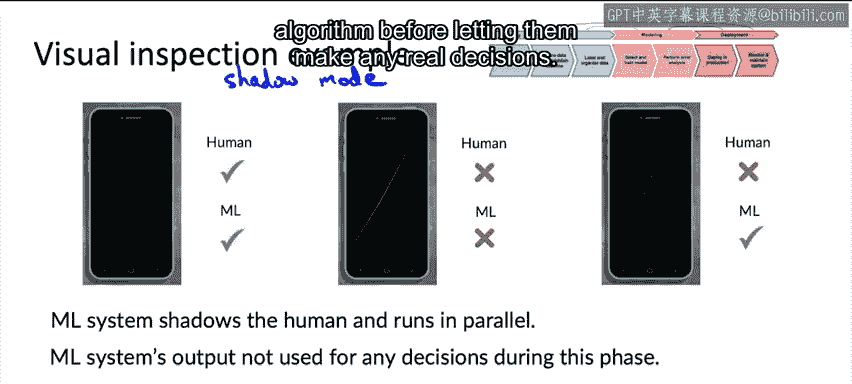
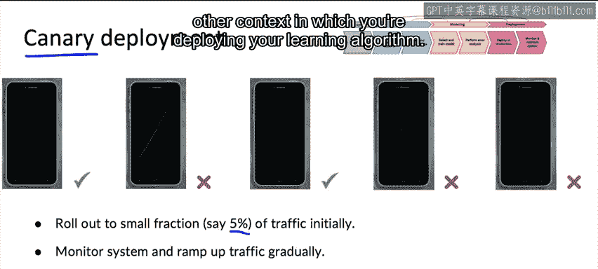
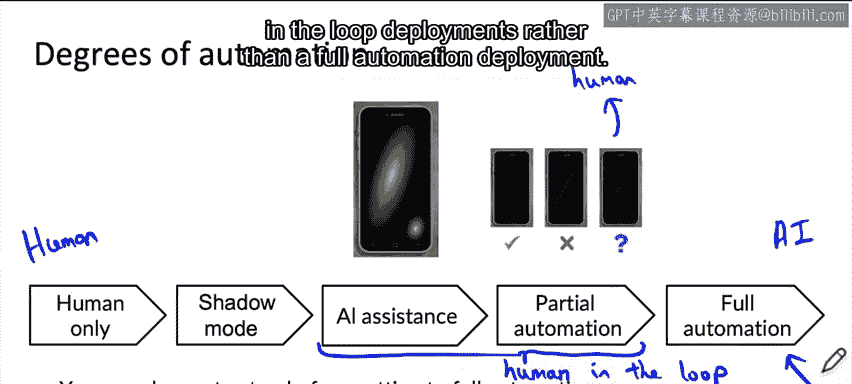

#  007：机器学习部署模式 🚀

在本节课中，我们将学习机器学习模型部署的几种常见模式。我们将探讨如何根据不同的应用场景选择合适的部署策略，并理解从“影子模式”到“全自动化”的自动化程度光谱。这些模式的核心目标是安全、可控地将模型引入生产环境。

---

上一节我们介绍了部署的基本概念，本节中我们来看看几种具体的部署模式。

## 部署用例类型

部署系统时，根据不同的使用场景，存在几种常见的用例类型。

以下是三种主要的部署用例：

1.  **推出新产品或新功能**：例如，首次提供语音识别服务。
2.  **自动化或辅助人工任务**：例如，在工厂中，原本由人工检查智能手机划痕，现在希望用学习算法来辅助或自动化该任务。
3.  **替换现有机器学习系统**：用（希望是）更好的新版本替换旧的机器学习系统实现。

在这些用例中，有两个反复出现的主题：**渐进式推广**和**回滚机制**。渐进式推广意味着，与其将大量流量导向一个可能未经充分验证的算法，不如先发送少量流量进行监控，然后逐步增加流量比例。回滚机制则意味着，如果算法因某种原因无法工作，可以回退到之前的系统。

---

上一节我们了解了部署的常见场景，本节中我们来看看具体的部署模式。

## 部署模式详解

### 影子模式部署

当一项任务最初由人工完成时，一种常见的部署模式是使用**影子模式部署**。

这意味着，在初始阶段，机器学习算法将“影子”人工检查员，与其并行运行。在此阶段，学习算法的输出不用于工厂的任何决策。我们暂时完全依赖人工判断。

影子模式部署的目的是收集数据，以评估学习算法的性能及其与人工判断的对比。通过抽样输出，可以验证学习算法的预测是否准确，从而决定未来是否允许学习算法做出一些实际决策。

当你已经有一个能做出良好决策的系统（无论是人工检查员还是旧版学习算法）时，使用影子模式部署可以让你在允许算法做出任何实际决策之前，有效地验证其性能。

### 金丝雀部署

当你准备让学习算法开始做出实际决策时，一种常见的部署模式是使用**金丝雀部署**。

在金丝雀部署中，你最初只向一小部分流量（可能是5%甚至更少）推出新算法，并让其做出实际决策。通过仅在少量流量上运行，即使算法犯错，也只会影响一小部分流量。这为你提供了更多监控系统的机会，并且只有在对其性能有更大信心时，才逐步增加其接收的流量比例。

“金丝雀部署”一词源自英语习语“煤矿中的金丝雀”，指的是矿工曾用金丝雀来探测瓦斯泄漏。金丝雀部署希望让你在问题产生过大后果之前及早发现。

### 蓝绿部署

有时使用的另一种部署模式是**蓝绿部署**。

在蓝绿部署的术语中，旧版本的软件被称为**蓝**版本，而新实现的学习算法被称为**绿**版本。在蓝绿部署中，路由器将图像发送到旧的蓝版本并让其做出决策。当你想切换到新版本时，你会让路由器停止向旧版本发送图像，并突然切换到新版本。

蓝绿部署的实现方式是：你有一个旧的预测服务（蓝版本）在运行，然后启动一个新的预测服务（绿版本），并让路由器突然将流量从旧服务切换到新服务。

蓝绿部署的优势在于，如果出现问题，可以轻松实现回滚。你可以非常快速地让路由器重新配置，将流量发送回旧的蓝版本（假设你一直让蓝版本的预测服务保持运行）。在典型的蓝绿部署实现中，人们会考虑同时切换100%的流量，但你当然也可以使用更渐进的版本，慢慢切换流量。

---

上一节我们介绍了具体的部署模式，本节中我们来看看如何根据自动化程度来设计部署系统。

## 自动化程度光谱

思考如何部署系统最有用的框架之一，不是将部署视为“0或1”（要么部署，要么不部署），而是设计一个系统，思考**什么是合适的自动化程度**。

例如，在智能手机视觉检查中：
*   **最左端**：无自动化，纯人工系统。
*   **影子模式**：系统在影子模式下运行，算法输出预测但不实际用于工厂。
*   **AI辅助**：给定智能手机图片，人工检查员做决定，但AI系统可以通过用户界面高亮显示可能有划痕的区域，以帮助吸引检查员的注意力。
*   **部分自动化**：如果学习算法确信手机没问题或有缺陷，就遵循算法的决定；如果学习算法不确定（即预测置信度不高），则将其发送给人工判断。
*   **最右端**：全自动化，学习算法做出每一个决定。

因此，存在一个从左端（仅使用人工决策）到右端（仅使用AI系统决策）的光谱。许多部署应用将从左端开始，逐渐向右移动。你不必一定要达到全自动化，可以根据系统性能和应用需求，选择停止在AI辅助或部分自动化阶段。

在这个光谱上，AI辅助和部分自动化都是**人在回路**部署的例子。

对于消费者互联网应用（如网络搜索引擎或在线语音识别系统），许多企业必须使用全自动化，因为不可能在每次有人进行网络搜索或产品搜索时，都让后端人员参与工作。然而，在消费者软件互联网之外（例如工厂检查），实际上有许多应用的最佳设计点可能是“人在回路”部署，而非全自动化部署。

---

本节课中我们一起学习了机器学习模型的几种关键部署模式：影子模式、金丝雀部署和蓝绿部署。我们还探讨了如何根据应用需求，在从“人在回路”到“全自动化”的自动化程度光谱上选择最合适的点。这些策略的核心在于实现安全、可控和渐进的模型上线。

在讨论这些概念时，我们多次提到了监控对于及早发现问题并加以解决的重要性。在下一个视频中，让我们深入探讨如何监控系统的细节。