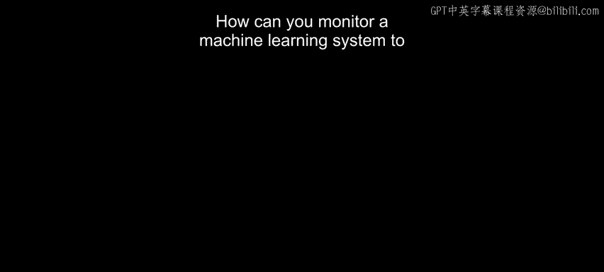
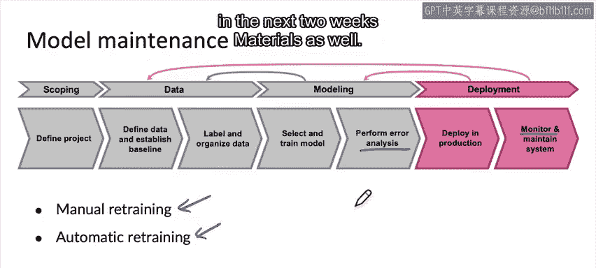

#  008：机器学习系统监控 📊

在本节课中，我们将学习如何监控已部署的机器学习系统，以确保其性能符合预期。我们将探讨监控的最佳实践，包括如何选择监控指标、设置警报阈值，以及如何通过迭代优化监控策略。

---

## 概述

监控机器学习系统是确保其长期稳定运行的关键环节。通过有效的监控，我们可以及时发现性能下降、数据分布变化或软件问题，从而采取相应措施进行维护或修复。

---

## 监控的核心方法

最常见的监控方法是使用仪表盘来跟踪系统随时间的变化情况。根据具体应用，仪表盘可以监控不同的指标。

以下是监控仪表盘可能关注的几种指标类型：

*   **服务器负载**：监控计算资源的占用情况。
*   **非空输出比例**：例如，在语音识别系统中，监控系统输出“无”（即认为用户没有说话）的比例。如果该比例发生剧烈变化，可能表明系统出现问题。
*   **缺失输入值比例**：对于结构化数据任务，监控输入数据中缺失值的比例变化，这通常意味着数据源发生了变化。

---

## 如何设计监控指标

上一节我们介绍了常见的监控指标，本节中我们来看看如何系统地设计监控方案。

我的建议是，与你的团队一起坐下来进行头脑风暴，列出所有可能出错的情况以及你希望知晓的问题。针对每一个潜在问题，构思一些能够检测到该问题的统计数据或指标。

例如：
*   如果你担心用户流量激增导致服务过载，那么**服务器负载**就是一个可以跟踪的指标。
*   在设计监控仪表盘的初期，从较多的指标开始监控是可以接受的。随后，可以逐渐淘汰那些在实践中发现不太有用的指标。

---

## 监控指标分类示例

以下是各类项目中常用监控指标的一些例子。

### 软件指标

这些指标帮助你监控预测服务或其他相关软件实现的健康状态。

*   内存使用率
*   计算延迟
*   吞吐量
*   服务器负载

许多MLOps工具已经内置了对这些软件指标的跟踪功能。

### 算法性能指标

除了软件指标，我们通常还需要监控学习算法的统计性能或健康状况。这主要分为两类：

#### 1. 输入指标
这类指标用于衡量输入数据分布是否发生了变化。

*   **平均输入长度**：例如，语音识别系统中音频片段的平均时长（秒）。
*   **平均输入音量**：监控音频的平均响度。
*   **缺失值数量或百分比**：处理结构化数据时的常用指标。
*   **平均图像亮度**：例如，在制造业视觉检测中，监控图像的平均亮度，以防光照条件变化影响算法。

#### 2. 输出指标
这类指标帮助你理解学习算法的输出是否正常。

*   **空字符串输出频率**：语音识别系统返回“无”（认为用户未说话）的频率。
*   **连续快速搜索频率**：在语音搜索应用中，用户连续进行两次内容基本相同的快速搜索，可能意味着第一次识别错误。
*   **用户切换至键入的频率**：用户先尝试语音系统，然后转而使用键盘输入，这可能表明用户因识别效果不佳而感到沮丧。
*   **点击率**：在网页搜索等应用中，使用CTR等宏观指标确保整体系统健康。

由于输入和输出指标具有高度的应用特异性，大多数MLOps工具都需要专门配置才能跟踪这些指标。

---

## 部署是一个迭代过程

机器学习建模是一个高度迭代的过程，部署同样如此。

当你完成首次部署并建立了一套监控仪表盘时，这只是迭代过程的开始。运行中的系统使你能够获取真实的用户数据和流量。通过观察学习算法在真实数据和流量上的表现，你可以进行性能分析，进而更新部署并持续监控系统。

根据我的经验，通常需要多次尝试才能收敛到一组正确的监控指标。有时，你部署系统时设定了一套初始指标，运行几周后才发现之前未考虑到的问题，这时就需要增加新的监控指标。或者，某些指标在几周内几乎不变，显得无用，就可以将其移除，以便将注意力集中在其他地方。

---

## 设置警报阈值

确定了要监控的指标集后，常见的做法是设置警报阈值。

例如：
*   如果服务器负载超过 `0.91`，则触发警报，通知团队检查问题并可能启动更多服务器。
*   如果非空输出比例超出特定阈值，则触发警报。
*   如果缺失值比例超出设定的阈值，则触发警报。

你可以随时间调整这些指标和阈值，以确保它们能向你标记出最相关的问题情况。

---

## 发现问题后的行动

如果学习算法出现问题，需要采取相应行动：

*   **软件问题**（如服务器负载过高）：可能需要更改软件实现。
*   **性能问题**（与学习算法准确性相关）：可能需要更新模型。

因此，许多机器学习模型需要随着时间的推移进行一些维护或重新训练，就像几乎所有软件都需要一定程度的维护一样。

当模型需要更新时，你可以：
1.  **手动训练**：由工程师重新训练模型，对新模型进行错误分析，确保其性能良好后再部署。
2.  **自动重训练**：建立一个系统进行自动重训练。目前，对于许多应用，手动重训练远比自动重训练常见，因为开发者通常不愿意让学习算法完全自动地决定何时重训练并推送新模型到生产环境。不过，在一些应用（尤其是消费级互联网软件）中，确实存在自动重训练。

我们将在后续课程中更详细地讨论重训练以及在将新模型推送到生产环境前如何验证其性能。

---

## 总结

本节课中，我们一起学习了如何监控机器学习系统的性能，以便在需要维护或修复时能够及时收到警报并采取适当措施。我们讨论了如何监控单个机器学习模型的性能，并了解了部署和监控本身也是一个需要迭代优化的过程。

监控的核心价值在于，只有通过监控，你才能发现可能存在的问题，从而促使你进行更深入的错误分析，或获取更多数据来更新模型，以维持或提升系统的性能。

在接下来的视频中，我们将探讨一个更有用的概念：对于更复杂的系统（不是单一模型，而是更复杂的机器学习流水线），如何监控其整体性能。