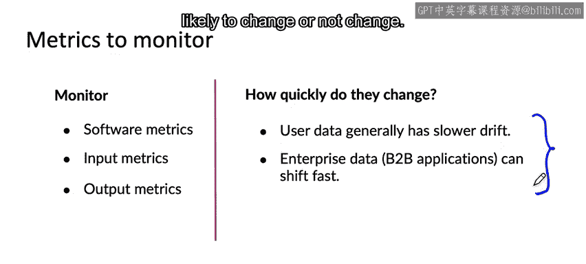

#  009：流水线监控 📊


在本节课中，我们将要学习机器学习流水线的概念，以及如何为复杂的多步骤系统构建监控体系。我们将通过语音识别和用户画像两个具体例子，理解流水线中组件间的相互影响，并探讨监控不同阶段数据变化的方法。

---

## 什么是机器学习流水线？ 🔄

许多人工智能系统并非仅运行一个单一的预测服务模型，而是涉及多个步骤组成的流水线。

上一节我们介绍了单一模型的监控，本节中我们来看看当多个模型或组件串联工作时，情况会如何变化。

---

## 语音识别流水线示例 🎤

让我们继续以语音识别为例。一个典型的移动端语音识别系统并非直接将音频输入并输出文本。

其实现是一个更复杂的流水线：
1.  音频首先被送入一个**语音活动检测**模块。
2.  只有当该模块检测到有人说话时，才会将处理后的音频片段传递给**语音识别**系统以生成文本。

使用VAD模块的原因是，如果语音识别服务在云端运行，我们希望通过手机只上传有人说话的那部分音频，以节省带宽。

这是一个典型的机器学习流水线，包含两个由学习算法构成的步骤。第一个步骤决定是否有人说话，第二个步骤生成文本转录。

**核心影响**：当两个模块协同工作时，第一个模块的任何变化都可能影响第二个模块的性能。例如，如果新手机麦克风导致VAD模块裁剪音频的方式改变（如开头或结尾静音部分变长或变短），那么语音识别系统的输入就会随之改变，可能导致其性能下降。

---

## 用户画像与推荐系统流水线示例 👤

让我们看一个涉及用户画像的例子。

系统可能使用用户的点击流数据来构建用户画像，以捕捉用户的关键特征。例如，我曾构建过试图估计用户是否拥有汽车的用户画像，因为这有助于我们决定是否向该用户推荐汽车保险。

构建用户画像的典型方式是使用一个学习算法来预测“用户是否拥有汽车”等属性。这个包含一长串预测属性的用户画像，随后会被输入到一个推荐系统（另一个学习算法）中，用于生成产品推荐。

**核心影响**：如果点击流数据发生变化（输入分布漂移），我们预测用户是否拥有汽车的能力可能会随时间减弱。这可能导致用户画像中“未知”标签的比例上升。

```python
# 概念示意：用户画像属性变化可能影响推荐系统输入
user_profile['owns_car'] = 'unknown'  # 此属性从 'yes'/'no' 变为 'unknown'
recommendation_input = user_profile  # 推荐系统的输入因此改变
```

由于用户画像的输出改变，推荐系统的输入也随之改变，这可能会影响产品推荐的质量。在机器学习流水线中，这种级联效应可能非常复杂，难以追踪。

---

## 如何监控流水线？ 🛠️

构建这些可能包含机器学习或非机器学习组件的复杂流水线时，我发现构思用于监控的指标非常有用。这些指标应能检测包括概念漂移或数据漂移在内的变化，并覆盖流水线的多个阶段。

以下是需要监控的指标类型：
*   **软件指标**：针对流水线中的每个组件或整个流水线。
*   **输入/输出指标**：针对流水线中的每个组件。

通过构思与流水线各个组件相关的指标，可以帮助你发现问题。例如：
*   语音活动检测系统输出的音频片段随时间变长或变短。
*   用户画像系统突然对“用户是否拥有汽车”这一属性产生更多“未知”结果。

这能提醒你数据发生的变化，这些变化可能需要你采取行动来维护模型。你在上一节视频中学到的原则——**构思所有可能出错的地方（包括流水线中单个组件可能出的问题），并设计指标来追踪它们**——仍然适用，只是现在你需要关注流水线中的多个组件。

---

## 数据变化的速度有多快？ ⏱️

数据变化的速度高度依赖于具体问题。

*   **变化缓慢的例子**：人脸识别系统。人们的相貌通常变化不快（发型、服饰会随潮流变化，相机分辨率会提升），但总体上变化不大。
*   **变化迅速的例外**：如果手机工厂采用了一批新材料，所有手机的外观可能突然改变。

**一般而言**：
*   **用户数据**：如果你面向海量消费者，用户行为通常变化相对缓慢。因为很少有力量能让数百万用户同时突然改变行为（当然也有例外，如新冠疫情或新电影上映引发的搜索趋势）。
*   **企业数据**：则可能变化得非常快。例如，一家公司决定改变其业务流程，或者工厂采用新的生产工艺，都可能导致整个数据集迅速发生转变。

这两点只是概括，两种情况下都有例外。但这可以为你提供一个思考框架，来评估你的数据可能变化的速度。

---



## 总结 📝

本节课中我们一起学习了：
1.  **机器学习流水线**由多个步骤组成，组件间存在相互依赖。
2.  通过**语音识别**和**用户画像**两个例子，我们看到了流水线中一个组件的变化如何影响下游组件的性能。
3.  监控此类系统需要构思覆盖**软件指标**、**组件输入/输出指标**在内的多方面指标，以检测数据漂移和概念漂移。
4.  数据变化的速度因应用场景而异，**用户数据**通常变化较慢，而**企业数据**可能因业务决策而快速转变。

恭喜你完成第一周视频的学习！建议你查看练习题以巩固这些概念，也可以尝试本周的可选编程练习，在你自己电脑上部署一个机器学习模型。我期待在下一周的课程中与你再见，我们将更深入地探讨机器学习项目全周期中的建模部分。