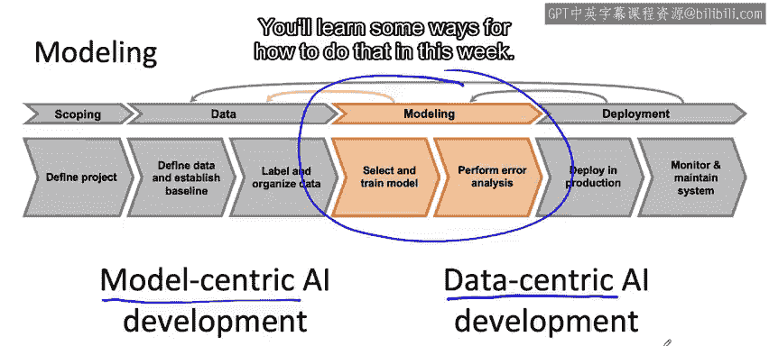

#  010：建模概述 🧠

在本节课中，我们将学习如何构建一个值得投入生产部署的机器学习模型。我们将探讨模型构建的最佳实践，并理解在实际项目中可能遇到的关键挑战。通过掌握这些知识，你将能够更高效地改进模型，使其满足实际应用的需求。

---

## 模型构建的关键挑战 ⚠️

上一节我们介绍了课程的整体目标，本节中我们来看看在构建机器学习模型时，许多团队会面临哪些关键挑战。理解这些挑战有助于你提前识别并更高效地调整项目。

我的一个朋友Adam Cos开玩笑说，他听我给机器学习团队提建议时，感觉我的建议在不同项目间相当一致，以至于他几乎可以用一连串的“如果-那么-否则”语句来替代我。我也发现，当几位资深机器学习工程师审视同一个项目时，他们给出的建议也惊人地一致。本周你将学习的是，构建一个可用于生产的机器学习模型会遇到哪些关键挑战。

例如，如何处理数据量少的数据集？或者，如果在测试集上表现良好，但出于某些原因，这仍然无法满足实际应用的需求，该怎么办？我希望通过本周的学习，你将能够非常高效地知道如何改进你的机器学习模型，以解决最重要的问题，从而使其为部署做好准备。

---

## 本周重点：建模与改进策略 🎯

现在，让我们深入本周的内容。我们的重点将放在完整机器学习项目周期的建模部分。你将学习一些关于如何选择和训练模型、如何进行错误分析以及如何利用分析结果来驱动模型改进的建议。

你会多次听到我提到一个主题：**以模型为中心的AI开发** 与 **以数据为中心的AI开发**。AI的发展历程中，人们非常强调如何选择正确的模型，例如如何选择正确的神经网络架构。

我发现，对于实际项目，采取更以数据为中心的方法可能更有用。在这种方法中，你不仅关注改进神经网络架构，还确保为算法提供高质量的数据。这最终能让你更高效地使系统表现良好。

然而，我参与以数据为中心的AI开发的方式，并不是简单地尝试收集越来越多的数据（这可能非常耗时），而是使用工具来帮助我以最高效的方式改进数据。在本周的学习中，你将了解一些实现这一目标的方法。

---

## 总结 📝

本节课中我们一起学习了构建生产级机器学习模型的概述。我们明确了本周的学习重点是建模环节，并介绍了以模型为中心和以数据为中心的两种开发理念。理解常见的建模挑战，并掌握通过数据质量提升来驱动模型改进的策略，是构建成功生产系统的关键。接下来，我们将进入具体的实践环节。