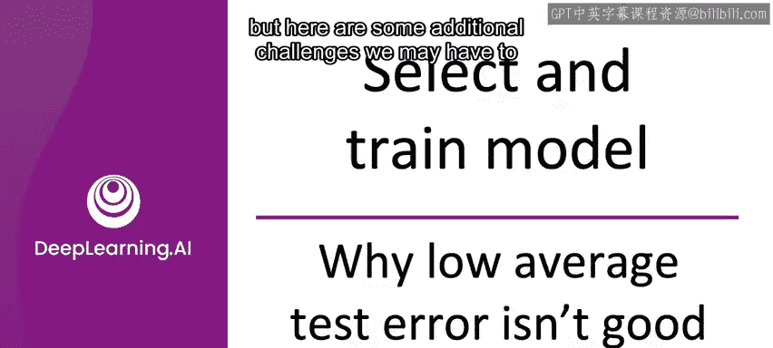

#  012：为什么低平均错误率还不够好 🎯


在本节课中，我们将要学习一个在机器学习项目部署中至关重要的概念：仅仅在测试集上取得低的平均错误率，有时并不足以让一个系统成功投入生产。我们将探讨几种常见但容易被平均指标掩盖的问题场景。

上一节我们介绍了概念漂移和数据漂移，本节中我们来看看除了平均测试集性能之外，还需要关注哪些方面才能确保项目的成功。

## 平均测试误差的局限性



一个机器学习系统可能在测试集上拥有较低的平均错误率，但如果它在一些**不成比例地重要**的样本上表现不佳，该系统仍然无法被接受并部署到生产环境中。

让我用一个网络搜索的例子来说明。


网络搜索查询主要分为两类：
*   **信息型或事务型查询**：例如“苹果派食谱”、“激光电影”、“无线数据套餐”。用户希望了解信息或完成交易。对于这类查询，搜索引擎需要返回最相关的结果，但用户可能可以容忍最佳结果被排在第二或第三位。
*   **导航型查询**：例如“Stanford”、“Reddit”、“YouTube”。用户有非常明确的意图，希望直接访问特定网站。对于这类查询，如果搜索引擎没有将目标网站（如 `stanford.edu`）排在第一位，用户会非常不满。一个无法正确处理导航型查询的搜索引擎会迅速失去用户的信任。

在这个上下文中，导航型查询就是一组**不成比例地重要**的样本。如果你的学习算法提升了网络搜索的平均测试准确率，但却搞砸了少数几个导航型查询，这可能就无法被部署。

挑战在于，**平均测试集准确率倾向于平等地对待所有样本**，而在网络搜索中，某些查询的重要性远高于其他。

一种可能的解决方案是尝试给这些重要样本更高的权重。这适用于某些应用，但根据我的经验，仅仅改变不同样本的权重并不总能解决全部问题。

## 关键数据切片的性能

与上述问题密切相关的是**关键数据切片**的性能问题。

假设你构建了一个用于贷款审批的机器学习算法，以决定谁可能偿还贷款。对于这样的系统，你必须确保它不会根据种族、性别、地点、语言或其他受保护属性，不公平地歧视贷款申请人。许多国家的法律或法规也要求金融系统和贷款审批流程不得基于这些**受保护属性**进行歧视。

因此，即使一个贷款审批的学习算法取得了很高的平均测试准确率，如果它表现出不可接受的偏见或歧视水平，那么它对于生产部署来说也是不可接受的。

虽然AI社区对个体公平性进行了大量讨论（这是正确且重要的），但“公平性”或关键切片性能的问题也出现在其他场景中。

假设你运营一个在线购物网站，聚合并销售来自许多不同制造商和零售商品牌的产品。你可能希望确保你的系统公平地对待所有主要的用户、零售商和产品类别。

例如，即使一个机器学习系统拥有很高的平均测试准确率（也许它平均能推荐更好的产品），但如果它对某一特定种族的所有用户都给出完全不相关的推荐，这可能是不可接受的。

或者，如果它总是推送大零售商的产品而忽略小品牌，这不仅可能损害业务（导致失去所有小零售商），构建一个只推荐大品牌产品、忽视小企业的推荐系统也会显得不公平。

再比如，一个产品推荐器给出了高度相关的推荐，但出于某种原因从不推荐电子产品，那么销售电子产品的零售商很可能会非常不满。这对于平台上的零售商或你业务的长期健康都是不利的，即使平均测试准确率显示，由于不推荐电子产品，你出于某种原因向用户展示了稍微更相关的结果。

本周晚些时候，你将学习如何对数据的关键切片进行分析，以确保发现并解决这类潜在问题。

## 稀有类别与倾斜的数据分布

接下来是**稀有类别**的问题，特别是**倾斜的数据分布**。

在医疗诊断中，许多患者没有某种疾病的情况并不少见。因此，如果你有一个99%是阴性样本（因为99%的人口没有某种疾病）、1%是阳性样本的数据集，那么你可以通过写一个程序来获得非常好的测试准确率：

```python
print(0)  # 总是预测为阴性
```

你不需要学习算法，只需这一行代码，就能在你的数据集上获得99%的准确率。但显然，`print(0)` 对于疾病诊断来说并不是一个有用的算法。

顺便说一下，这确实在我身上发生过一次。我的团队训练了一个巨大的神经网络，发现它达到了99%的平均准确率，结果发现它是通过一直预测“0”来实现的。我们基本上训练了一个和 `print(0)` 做同样事情的巨型神经网络。当然，当我们发现这个问题后，就回去修复了它。希望这不会发生在你身上。

与倾斜数据分布（通常讨论阳性和阴性）密切相关的问题是**稀有类别的准确率**。

我曾与朋友 Praav Rajpurkar 等人合作进行胸部X光诊断，我们使用深度学习来识别不同的病症。对于一些相对常见的病症（如医学上的“胸腔积液”），我们拥有约10,000张图像，因此能够实现较高的性能水平。而对于罕见得多的病症“疝气”，我们只有大约100张图像，因此性能要差得多。

从医学角度来看，如果一个诊断系统忽略了明显的疝气病例（即患者X光片清晰显示患有疝气），而学习算法漏诊了，那将是有问题的。但由于这是一个相对稀有的类别，算法的整体平均测试集准确率并不算太差。事实上，算法本可以完全忽略所有疝气病例，这对它的平均测试集准确率影响有限，因为疝气病例很罕见，算法几乎可以忽略它而不太影响平均测试准确率。

如果平均测试准确率平等地对待测试集中的每一个样本，就会出现这种情况。

## 超越平均测试准确率

我曾在太多公司听到过几乎完全相同的对话。对话是这样的：
*   机器学习工程师说：“我在测试集上表现很好。这个能用。我们用它吧。”
*   产品负责人或业务负责人说：“但这在我的应用中行不通。”
*   机器学习工程师回答：“但我在测试集上表现很好。”

我的建议是，如果你发现自己身处这样的对话中，**不要采取防御姿态**。

我们作为一个社区，已经构建了许多在测试集上表现出色的工具，这值得庆祝。我认为这很棒，但我们常常需要超越这一点，因为对于许多生产应用来说，仅仅在测试集上表现出色是不够的。


当我构建一个机器学习系统时，我认为我的工作不仅仅是**在测试集上表现出色**，而是要**构建一个能解决实际业务或应用需求的机器学习系统**。我希望你也能采取类似的观点。


本周晚些时候，我们将介绍一些技术（通常涉及误差分析，可能是在数据切片上的误差分析），这些技术将帮助你发现这些需要超越平均测试准确率的问题，并为你提供工具来应对这些更广泛的挑战。

---

**本节课中我们一起学习了**：在机器学习生产实践中，仅追求低的平均测试错误率是远远不够的。我们必须关注系统在**不成比例地重要的样本**（如导航型查询）、**关键数据切片**（如受保护属性群体、重要业务类别）以及**稀有类别**上的性能。平均指标可能会掩盖这些关键问题。成功的机器学习工程师的职责是构建真正满足业务需求的系统，而不仅仅是优化测试集分数。