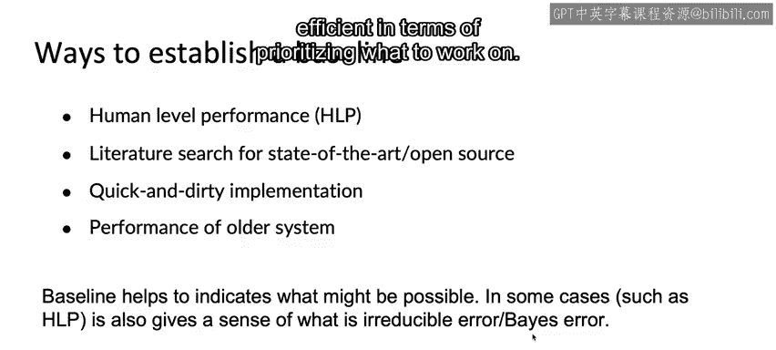

#  013：建立基准 📊

在本节课中，我们将要学习启动机器学习项目时一个至关重要的初始步骤：**建立性能基准**。我们将探讨为什么基准如此重要，以及如何针对不同类型的数据（非结构化与结构化数据）有效地建立基准。

---

## 为何需要建立基准？🎯

开始一个机器学习项目时，最有用的第一步通常是建立一个性能基准。通常，只有在建立了基准性能水平之后，你才能拥有有效改进该基准的工具。

让我们深入探讨快速建立基准的一些最佳实践。

---

## 一个语音识别的例子 🎤

假设你已确定数据中存在四种主要的语音类别：
*   **清晰语音**：说话时背景噪音很小。
*   **含汽车噪音的语音**：如同在车内使用语音识别系统。
*   **含人声背景噪音的语音**：如同在户外，背景中有其他人说话。
*   **低带宽连接下的语音**：如同在使用信号很差的手机通话。

如果你的模型在这四类语音上的准确率分别是 94%、89%、87%、70%，你可能会想：“它在低带宽音频上表现更差，所以我们应该集中精力改进这个。”

但在仓促下结论之前，为所有这四类语音建立一个性能基准水平会很有用。你可以通过请人工转录员标注数据并测量他们的准确率来实现。

以下是这四类语音的**人类水平性能**：
*   清晰语音：95% 准确率
*   含汽车噪音的语音：93% 准确率
*   含人声背景噪音的语音：89% 准确率
*   低带宽连接下的语音：70% 准确率

通过对比，我们发现：
*   在清晰语音上，将性能提升至人类水平有 **1%** 的改进空间。
*   在含汽车噪音的语音上，有 **4%** 的改进空间。
*   在含人声背景噪音的语音上，有 **2%** 的改进空间。
*   在低带宽语音上，改进空间为 **0%**。

因此，在没有人类水平性能作为参考时，我们可能认为改进低带宽音频最有希望。但通过此分析，我们意识到低带宽音频本身质量就很差，甚至连人类都无法听清，在这方面努力可能收效甚微。相反，将注意力集中在改进含汽车噪音的语音识别上可能更有成效。

在这个例子中，使用**人类水平性能**（有时缩写为 **HLP**）为你提供了一个比较点或基准，帮助你决定将努力集中在含汽车噪音的数据上，而非低带宽数据上。

---

## 非结构化数据 vs. 结构化数据 🗂️

事实证明，建立基准的最佳实践根据你处理的是**非结构化数据**还是**结构化数据**而有很大不同。

**非结构化数据**指的是如图像（猫的图片）、音频（如语音识别例子）或自然语言（如餐厅评论文本）这类数据集。非结构化数据往往是人类非常擅长解读的数据类型。因为人类非常擅长处理非结构化数据任务，所以测量**人类水平性能**通常是建立基准的好方法。

**结构化数据**则是指你可能拥有的大型数据库或巨型电子表格。例如，如果你运营一个电商网站，记录用户何时以何价格购买了何物的数据就存储在一个大型数据库中。这类存储在电子表格或更健壮的数据库中的数据就是结构化数据的例子。由于人类并不擅长通过查看此类数据来做出预测，**人类水平性能**通常对结构化数据应用来说是一个不太有用的基准。

我发现，机器学习开发的最佳实践根据你处理的是非结构化数据问题还是结构化数据问题而有很大不同。牢记这一区别，让我们看看为这两种类型的问题建立基准的一些方法。

---

## 如何建立基准？🔧

上一节我们介绍了人类水平性能作为基准，特别是针对非结构化数据问题。以下是建立基准的其他几种方法：

另一种建立基准的方法是进行文献搜索，寻找**最先进的技术**，或查看开源结果，了解他人在同类问题上报告能达到什么水平。例如，如果你正在构建一个语音识别系统，而其他人报告了在与你数据相似的数据上达到的某种准确率，那么这可能为你提供了一个起点。

使用开源代码时，你也可以考虑构建一个**快速而粗糙的实现**。这不仅仅是一个占位系统，而是一个能让你初步了解可能达到何种性能的快速实现。

最后，如果你已经有一个机器学习系统在运行，那么**旧系统的性能**也可以帮助你建立一个基准，作为你努力改进的目标。

---

## 基准系统的作用 💡

一个基准系统或基准性能水平有助于指示什么是**可能达到的**。

在某些情况下，例如使用人类水平性能（尤其是针对非结构化数据问题）时，这个基准还可以让你了解什么是**不可减少的误差**或**基础误差**。换句话说，对于这个问题，任何人可能达到的最佳性能是什么。这就像帮助我们认识到，也许低带宽音频质量太差，不可能获得超过70%的准确率（如我们之前的例子所示）。

通过帮助我们大致了解什么是可能达到的，基准可以让我们在确定工作优先级时更加高效。

---

## 一个重要的提醒 ⚠️

有时，我见过一些业务团队在机器学习团队甚至还没有机会建立一个粗略的基准之前，就要求他们保证学习算法能达到80%、90%或99%的准确率。这不幸地将机器学习团队置于一个非常困难的境地。

如果你处于这种境地，我建议你考虑进行沟通，要求在给出关于机器学习系统最终能达到多准确的更坚定预测之前，争取时间建立一个粗略的基准性能水平。你可以告诉他们，这样做是为了更好地为长期成功奠定基础。

---

## 总结 📝

本节课中，我们一起学习了建立基准在机器学习项目中的核心重要性。我们了解到：
1.  基准是衡量进步和确定工作重点的起点。
2.  **人类水平性能**是评估非结构化数据任务的一个强大基准。
3.  对于结构化数据，需要依赖其他基准，如**文献中的最佳结果**、**快速原型**或**旧系统性能**。
4.  基准帮助我们设定现实的期望，识别改进潜力最大的领域，并避免在不切实际的目标上浪费精力。

现在我们已经讨论了基准的重要性，在接下来的视频中，我将分享一些关于如何快速启动机器学习项目的额外技巧。