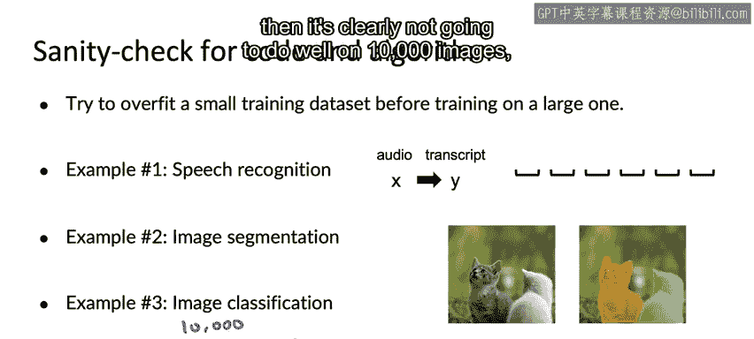

#  014：机器学习项目启动指南 🚀

在本节课中，我们将学习如何高效地启动一个机器学习项目。课程内容涵盖从初始模型选择到快速验证的多个实用技巧，旨在帮助你快速建立项目基线并进入迭代循环。

---

## 1. 初始模型选择：文献调研与开源实现

上一节我们介绍了机器学习是一个迭代过程。本节中我们来看看如何迈出第一步：选择一个初始模型。

我启动机器学习项目时，几乎总是从快速的文献调研开始，以了解当前的技术可能性。你可以查阅在线课程、博客和开源项目。

我的建议是：如果你的目标是构建一个实用的生产系统，而非进行学术研究，那么不必执着于寻找最新、最前沿的算法。相反，花半天或几天时间阅读博客文章，选择一个合理的方案，以便快速启动。如果能找到开源实现，将帮助你更高效地建立基线。

对于许多实际应用，一个**合理的算法**加上**优质的数据**，其表现往往优于一个**顶尖算法**加上**普通的数据**。因此，不要纠结于上周某个会议上刚发表的最前沿算法。选择一个合理的方案，找到一个好的开源实现，并快速启动。因为能够快速完成迭代循环的第一步，可以使你更高效地进行多次迭代，从而更快地达到理想的性能。

---

## 2. 部署约束的考量时机

一个常见的问题是：在选择模型时，是否需要考虑部署约束（如计算资源限制）？

我的回答是：**是的，你应该考虑部署约束**，但前提是基线已经建立，并且你相对确信这个项目可行，且目标就是构建和部署系统。

然而，如果你尚未建立基线，或者还不确定这个项目是否值得长期投入和部署，那么答案可能是**否定的，或者不一定**。在项目的这个阶段，首要目标是建立基线并确定项目的可行性。此时，忽略部署约束，直接找一个开源实现来尝试，看看能达到什么效果，即使这个实现计算量巨大以至于你明知无法部署，也是可以的。

当然，在这个阶段考虑部署约束也无妨，但更高效的做法可能是先专注于建立基线。

---

## 3. 运行前的快速健全性检查

在首次尝试学习算法，尤其是在所有数据上运行之前，我强烈建议你对代码和算法进行一些快速的健全性检查。

以下是几种有效的检查方法：

*   **在小数据集上过拟合**：在花费数小时甚至数天时间在大数据集上训练算法之前，我通常会尝试在一个非常小的训练集上过拟合模型。
*   **拟合单个样本**：特别是当输出很复杂时，确保算法至少能拟合一个训练样本。例如，我曾开发一个语音识别系统，输入是音频，输出是文本。当我在仅包含一个音频片段的训练集上训练时，系统输出了一连串空格。这表明系统甚至无法准确转录一个样本，那么花大量时间在巨型训练集上训练就没有意义。
*   **图像分割示例**：如果你的目标是输入图片并分割出其中的猫，那么在花费数小时训练数百或数千张图像之前，一个值得做的健全性检查是：输入一张图片，看看系统是否能至少过拟合这一个训练样本。
*   **小规模图像分类**：对于图像分类问题，即使你的训练集有1万、10万甚至100万张图片，也值得先用一个很小的子集（例如10或100张图片）快速训练你的算法。因为你可以快速完成这个步骤。如果你的算法在100张图片上都表现不佳，那么它在1万张图片上显然也不会好。

这些检查的优势在于，你可以在几分钟甚至几秒钟内，在一个或少数几个样本上训练你的算法，从而更快地发现代码中的错误。

---

## 4. 后续步骤：误差分析与性能审计

现在，在你训练了第一个机器学习模型之后，最重要的事情之一就是如何进行误差分析，以帮助你决定如何改进算法的性能。

让我们进入下一个视频，深入探讨误差分析和性能审计。

---

## 总结

本节课中，我们一起学习了启动机器学习项目的关键步骤：
1.  通过快速文献调研和利用开源实现来**选择合理的初始模型**，以快速建立基线。
2.  根据项目阶段（建立基线 vs. 准备部署）来**决定是否优先考虑部署约束**。
3.  在投入大量计算资源前，通过**在小数据集上过拟合、拟合单个样本**等方法进行**快速健全性检查**，以高效发现并修复问题。

掌握这些启动技巧，能帮助你更顺畅地进入“构建模型 -> 误差分析 -> 改进”的迭代循环，从而更高效地推进项目。