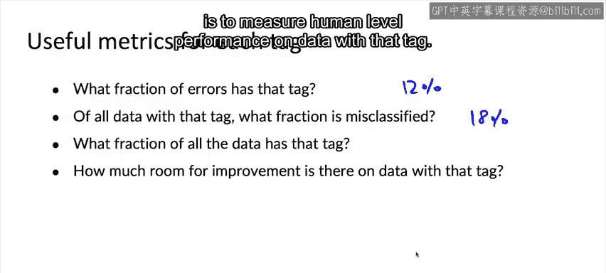

#  015：错误分析示例 🧐

在本节课中，我们将学习错误分析的核心流程。错误分析是机器学习开发过程中的关键环节，它能高效地指引我们如何改进算法性能。我们将通过一个语音识别的具体例子，来展示如何进行系统性的错误分析。

---

首次训练一个学习算法时，几乎可以保证它不会一次就成功运行。因此，我认为机器学习开发过程的核心是错误分析。如果执行得当，错误分析可以告诉你，为了提升学习算法的性能，最有效的时间利用方式是什么。

让我们从一个例子开始。我将通过一个语音识别的错误分析示例来逐步讲解。当我进行错误分析时，这基本上就是我自己在电子表格中会做的事情，目的是弄清楚语音系统的错误所在。

你可能会从开发集中听一百个被错误标记的样本。假设第一个样本的真实标签是“stir fried letters recipe”，但你的学习算法预测为“stir fed letters recipe”。如果你对数据集中主要的数据类型有一些假设，例如你认为有些数据包含汽车噪音，有些包含人声噪音，那么你可以建立一个电子表格。我确实会在电子表格中创建如下几列。

当你听这个样本时，如果背景中有汽车噪音，你可以在电子表格中打勾或做其他标记，以表明这个样本有汽车噪音。

然后你听第二个样本，可能“sweetened coffee”被错误转录为“Swedish coffee”，也许这个样本的背景中有人声噪音。

再一个样本，“sailaway song”被误转录为“Seaway song”，这个样本同样有人声噪音。另一个样本，“less‘s catch up”被转录为“lesss catchch up”，这个样本可能同时有汽车噪音和人声噪音。

请注意，顶部的这些标签不必是互斥的。在错误分析过程中，当你听音频片段时，可能会产生新的标签想法。假设这第四个样本的连接带宽非常低。反思你发现的错误，你可能会想起相当多的音频片段都存在低带宽连接的问题。此时，你可能会决定在电子表格中添加一个新列，标记为“低带宽”，并打上勾，甚至可能回头检查其他样本是否也有低带宽连接。

尽管我在幻灯片中演示了这个例子，但当我亲自进行错误分析时，有时会直接打开像Google Sheets、Excel或Mac上的Numbers这样的电子表格程序，像这样在表格中操作。这个过程帮助你理解哪些标签所代表的数据类型可能是更多错误的来源，从而值得投入更多精力和关注。

到目前为止，错误分析通常是通过手动过程完成的，例如在Jupyter笔记本中或在电子表格中跟踪错误。我有时仍然这样做，如果你也这样做，那没问题。但也有新兴的MLOps工具让开发者更容易进行这个过程。例如，当我的团队Landing AI处理计算机视觉应用时，整个团队现在都使用Landing Lens，这比使用电子表格要容易得多。

你听我说过，训练模型是一个迭代过程，部署模型也是一个迭代过程。那么，错误分析同样是一个迭代过程，这或许并不令人意外。一个典型的过程是：你可能会用一组初始标签（如汽车噪音、人声噪音）来检查和标记一些样本。基于检查这组初始样本的结果，你可能会回来提出一些新标签。有了新标签，你可以回头检查和标记更多的样本。

让我再举几个这类标签可能是什么的例子。以视觉检测为例，比如检测智能手机的缺陷。一些标签可以是特定的类别标签，例如“这个设备有划痕吗？”或“有凹痕吗？”等等。所以，如果其中一些标签与特定的类别标签Y相关联，这是可以的。另一些标签可能是图像属性，例如“这张手机照片模糊吗？”、“背景是暗的还是亮的？”、“图片中有不需要的反光吗？”。标签也可能来自其他形式的元数据，例如“手机型号是什么？”、“是哪个工厂？”、“是哪个生产线捕获的这张特定图像？”。

这种提出标签、标记更多数据、再提出新标签的过程，其目标是尝试找出几个可以有效地改进算法的数据类别。就像我们最早的语音例子中，决定处理背景有汽车噪音的语音。

让我再举一个例子。对于一个在线电商网站的产品推荐，你可能会查看系统向用户推荐了哪些产品，并找出明显错误或不相关的推荐。然后尝试找出是否存在特定的用户群体，例如“我们是否真的不擅长向年轻女性或年长男性推荐产品？”，或者是否存在特定的产品特征或类别，其推荐效果特别差。通过创造性地头脑风暴和应用这些标签，你希望能为值得努力改进算法性能的数据类别想出一些点子。

当你浏览这些不同的标签时，以下是一些值得关注的有用数字：

以下是计算这些关键指标的方法：

1.  **带有该标签的错误所占比例**。例如，如果你听了100个音频片段，发现其中12%被标记为“汽车噪音”标签，那么这让你了解到处理汽车噪音问题的重要性。它也告诉你，即使你解决了所有汽车噪音问题，性能可能也只提升12%，这实际上并不算多。
2.  **带有该标签的所有数据中，被错误分类的比例**。到目前为止，我们只讨论了标记错误分类的样本。为了提高时间效率，你可能将注意力集中在标记错误分类的样本上。但如果有一个标签可以同时应用于正确标记和错误标记的样本，那么你可以问：带有该标签的所有数据中，有多少比例被错误分类了？例如，如果你发现所有带有汽车噪音的数据中，有18%被错误转录，那么这告诉你，带有此类标签的数据的性能只有某个准确度水平，并让你了解这些带有汽车噪音的样本到底有多难处理。
3.  **所有数据中带有该标签的比例**。这告诉你，相对于整个数据集，带有该标签的样本有多重要。例如，你的整个数据集中有多少比例有汽车噪音？
4.  **在该标签数据上，还有多少改进空间**。你已经见过的一个分析例子是，测量人类在该标签数据上的表现水平。

因此，通过头脑风暴不同的标签，你可以将数据分割成不同的类别，然后利用上述问题来尝试决定优先处理哪些方面。

在下一个视频中，让我们更深入地探讨一个进行此类分析的例子。