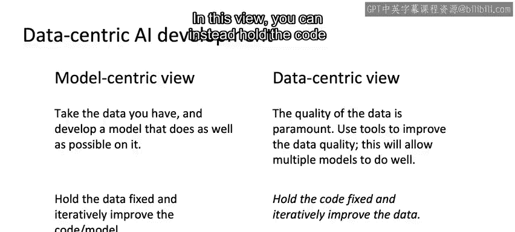

#  019：面向数据的AI开发 📊

在本节课中，我们将学习如何通过面向数据的AI开发方法来提升学习算法的性能。我们将重点探讨模型中心化与数据中心化两种开发视角的区别，并理解为何在众多实际应用中，提升数据质量是改善模型性能的关键。

假设通过误差分析，你决定专注于提升学习算法在带有特定类别标签数据上的性能，例如提升在含有汽车背景噪音的语音数据上的表现。接下来，我们来看看如何采用面向数据的方法来达成这一目标。

你之前可能听我讨论过模型中心化与数据中心化的AI开发。这里，我将更详细地阐述模型中心化AI开发的含义。

## 模型中心化视角 🔬

在模型中心化的AI开发视角下，开发者会基于已有的数据，投入大量精力去开发一个在该数据上表现尽可能好的模型。由于大量AI学术研究是由研究人员下载基准数据集并试图在该基准上取得好成绩所驱动的，因此大多数AI学术研究都是模型中心化的。在这种视角下，基准数据是一个固定量。

因此，在模型中心化开发中，**你会将数据固定，然后迭代地改进代码或模型**。

开发更好的模型仍然扮演着重要的角色。然而，对于许多应用而言，存在另一种我认为更有用的AI开发视角。

## 数据中心化视角 🗃️

这种视角是从模型中心化向数据中心化进行一定程度的转变。在此视角下，**我们认为数据的质量至关重要**。你可以使用误差分析或数据增强等工具来系统地提升数据质量。对于许多应用，我发现如果你的数据足够好，会有多个模型都能表现良好。

因此，在这种视角下，**你可以转而将代码固定，并迭代地改进数据**。

模型中心化开发和数据中心化开发各有其作用。如果你在机器学习的大部分经验中习惯于模型中心化思维，我强烈建议你也考虑采用数据中心化视角。

当你试图提升学习算法的性能时，试着问自己：**如何才能让你的数据变得更好？**

提升数据质量最重要的方法之一是数据增强。因此，让我们进入下一个视频，开始探讨数据增强。

---

本节课中，我们一起学习了模型中心化与数据中心化AI开发的核心区别。我们了解到，模型中心化方法侧重于在固定数据集上优化模型，而数据中心化方法则强调通过提升数据质量（例如利用误差分析、数据增强）来驱动性能改进。对于实际应用，后者往往能带来更显著和稳健的效果提升。