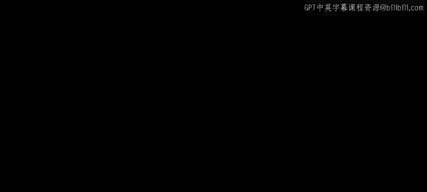
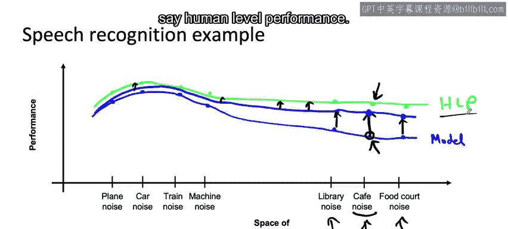

#  020：📈 数据增强的图示理解

在本节课中，我们将学习一个用于理解数据增强及其如何提升学习算法性能的**概念性图示**。这个“橡皮筋”或“橡皮膜”的比喻，将帮助我们直观地规划如何通过数据增强或数据收集来系统地提升模型表现。

---

## 🧠 核心概念图示

有一张概念图，对于思考数据增强及其如何帮助提升学习算法的性能非常有用。

以语音识别为例，语音输入中可能存在多种不同类型的噪声，例如汽车噪声、飞机噪声、火车噪声、机器噪声，或者咖啡馆噪声、图书馆噪声（通常不那么吵）、美食广场噪声等。

也许这些机械类噪声彼此更相似，而这些以人声交谈为主的噪声彼此也更相似。接下来分享的这张图，便是我在规划通过数据增强或实际数据收集来获取更多数据时，心中所想的画面。

在这张图中，纵轴代表性能，例如准确率。横轴则是一个概念性的、思想实验性质的轴，代表**可能的输入空间**。

例如，带有汽车噪声、飞机噪声、火车噪声的语音彼此相似，机器噪声则稍远一些（我设想的是洗衣机或很吵的空调的声音）。然后，你可能有带咖啡馆噪声、图书馆噪声或美食广场噪声的语音，这些彼此之间可能比与机械噪声更相似。

你的系统在这些不同类型的输入上会有不同水平的性能。假设在飞机噪声、汽车噪声、火车噪声、机器噪声数据上性能如此，而在图书馆噪声、咖啡馆噪声、美食广场噪声数据上表现更差。

因此，我可以将其想象成一条曲线，或者一个一维的橡皮筋，又或者一张橡皮膜，它展示了你的语音系统性能如何随输入类型变化。

人类在这些不同类型数据上会有另一个性能水平。也许人类在飞机噪声、汽车噪声上稍好一些，而在图书馆噪声、咖啡馆噪声和美食广场噪声上，则比你的算法好得多。因此，人类水平性能是另一条曲线。

让我用蓝色标出当前模型的性能。那么，这个**差距就代表了改进的机会**。

---

## 🔄 数据增强的作用

现在，如果你使用数据增强，或者不是数据增强，而是实际去很多咖啡馆收集更多带有咖啡馆背景噪声的数据，会发生什么？

你所做的，就是抓住蓝色橡皮膜上的这个点，并想象把它向上拉。这就是当你收集或通过某种方式获得更多带有咖啡馆噪声的数据，并将其加入训练集时所做的事：你正在提升算法在带有咖啡馆噪声的输入上的性能。

这往往会将橡皮膜在**相邻区域**也向上拉。因此，如果对咖啡馆噪声的性能上升，很可能邻近点的性能也会上升。而远处点的性能可能上升不多，也可能上升不少。

事实证明，对于非结构化数据问题，拉起橡皮膜的一部分不太可能导致另一部分大幅下降。相反，拉起一个点会导致邻近点被显著拉起，而远处的点可能被拉起一点，如果运气好，也许不止一点。

---

## 🎯 规划性能提升路径

当我规划如何改进学习算法的性能，以及希望将其提升到何处时，我会在那些地方获取更多数据，从而明确地拉起橡皮膜的那些部分，使它们更接近人类水平性能。

当你拉起橡皮膜的一部分时，**最大差距的位置可能会转移到其他地方**。误差分析将告诉你这个新的最大差距位于何处，这可能值得你投入精力去收集更多数据，从而尝试一次拉起一个部分。

事实证明，这是一种相当高效的方法，可以决定接下来应该拉起蓝色橡皮膜的哪个部分，以尝试让性能更接近（例如）人类水平性能。

---

## 📝 总结与展望

我希望这个关于橡皮筋或橡皮膜，以及反复拉起其上某一点的类比，能帮助你预测收集与特定类别或标签相关的更多数据所带来的效果。

那么，如何获取更多这类数据呢？在下一个视频中，我们将看看如何执行数据增强以及这样做的一些最佳实践。