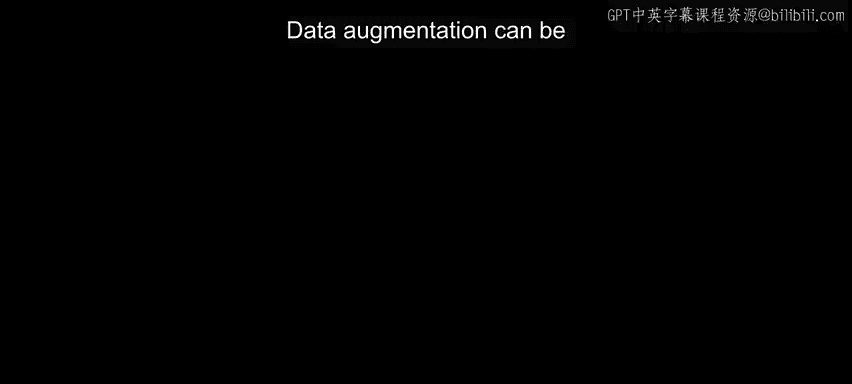
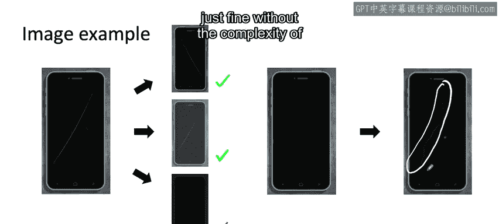
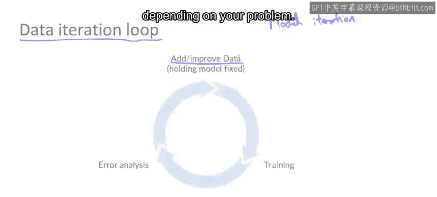

#  021：📈 第20课 数据增强

在本节课中，我们将要学习数据增强技术。这是一种为机器学习模型高效获取更多训练数据的有效方法，尤其适用于图像、音频、文本等非结构化数据问题。我们将探讨如何设计数据增强方案，并了解一些最佳实践。

---

## 🎯 数据增强的核心目标与框架

数据增强可以非常高效地获取更多数据，特别是对于图像、音频或文本等非结构化数据问题。

但在执行数据增强时，你需要做出许多选择，例如参数设置以及如何设计数据增强方案。让我们深入探讨，了解一些最佳实践。

上一节我们介绍了数据增强的基本概念，本节中我们来看看如何系统地应用它。

数据增强的目标是创建能让你的学习算法从中学习的样本。作为一个实践框架，我鼓励你思考如何创建那些算法目前表现不佳但看起来真实的样本。因为如果算法在这些样本上已经表现良好，那么它能学到的东西就有限了。

但你希望这些样本仍然是人类或某些基线模型能够处理好的。否则，生成算法表现不佳的样本的一个简单方法就是创建噪音大到任何人都听不清内容的音频，但这没有帮助。你希望样本足够有挑战性，但又不至于难到任何人类或算法都无法处理。这就是为什么在使用数据增强生成新样本时，我试图生成满足这两个标准的样本。

---

## 🔊 音频数据增强实例：语音识别

以语音识别为例。给定一段音频片段，例如“AI is the new electricity.”😊。

如果你加入咖啡馆的背景噪音，它听起来会是这样。将这两个音频波形直接相加，你就可以创建一个听起来像这样的合成样本：“AI is the new electricity.”。

这听起来就像有人在嘈杂的咖啡馆里说“AI is the new electricity.”。这是一种数据增强形式，可以让你高效地创建大量听起来像是在咖啡馆收集的数据。

或者，如果你将同一段“AI is the new electricity.”音频与背景音乐相加，那么它听起来就像有人在开着收音机的背景下说话：“AI is the new electricity.”。

现在，在执行数据增强时，你需要做出一些决定。你应该使用什么类型的背景噪音？背景噪音相对于语音应该有多大？

让我们系统地看看如何做出这些决定。

---

## ✅ 数据增强有效性检查清单

有些人进行数据增强的方法是：生成一个增强数据集，然后训练学习算法，看看算法在开发集上是否表现更好，接着调整数据增强参数，再次训练学习算法，如此循环。这种方法效率很低，因为每次更改数据增强参数，你都需要重新训练神经网络或学习算法，这可能耗时很长。

相反，我发现使用以下原则可以让你在不实际花费数小时甚至数天时间训练学习算法来验证性能提升的情况下，就能初步判断你使用数据增强生成的新数据是否有用。

具体来说，当你生成新数据时，可以遵循以下检查清单：

以下是生成新数据时可以参考的检查步骤：

1.  **它听起来/看起来真实吗？** 你希望你的音频听起来像你期望算法处理的那种真实音频。
2.  **X到Y的映射清晰吗？** 换句话说，人类还能识别出说了什么吗？这是为了验证标准2。
3.  **算法目前在这新数据上表现不佳吗？** 这有助于你验证标准1。

如果你能生成满足所有这些标准的数据，那么当你将这些数据放入训练集并重新训练算法时，成功提升算法性能的几率就会更高。

---

## 🖼️ 图像数据增强实例：划痕检测

让我们再看一个这次使用图像的例子。假设你只有一小部分带有划痕的智能手机图像。

以下是你可以使用数据增强的方法：你可以水平翻转图像，这会产生一个相当真实的图像（手机按钮现在在另一侧），但这可能是一个有用的样本来添加到你的训练集中。

或者，你可以实施对比度变化，比如实际上调亮图像，使划痕更明显一些。或者你可以尝试使图像变暗。

但在下面这个例子中，图像现在太暗了，即使我作为一个人也无法真正分辨那里是否有划痕。因此，虽然顶部的这两个例子符合我们之前的检查清单（人类仍然可以很好地检测到划痕），但这个例子太暗了，会失败那个检查。所以我会尝试选择一个能生成更多像顶部那样的例子，而不是像底部那样的例子的数据增强方案。

事实上，遵循我们希望图像看起来真实、人类能处理好、并且希望算法处理不好的原则，你也可以使用更复杂的技术，例如拍摄一张没有划痕的手机照片，然后使用Photoshop人工绘制一条划痕。

这种直接使用Photoshop的技术，也可以是生成更多样本的有效方法，因为这里的划痕例子（取决于视频压缩和你观看视频的图像对比度，你可能看到也可能看不到），但有了这条划痕，这看起来像一条相当真实的划痕，我作为一个人可以识别出这条划痕，所以如果学习算法现在没有正确检测到它，这将是一个很好的例子来添加。

我也使用过更先进的技术，如生成对抗网络来自动合成类似这样的划痕，尽管我发现像这样的技术有时可能有些“杀鸡用牛刀”，这意味着有更简单的技术实现起来快得多，效果也很好，无需构建GAN来合成划痕的复杂性。

---

## 🔄 数据迭代循环

你可能听说过“模型迭代”这个术语，它指的是迭代地训练模型，使用我们的分析，然后决定如何改进模型。

采取以数据为中心的AI开发方法，有时使用“数据迭代循环”更有用。在这个循环中，你反复获取数据和模型，训练你的学习算法，进行错误分析，并在此过程中专注于如何添加数据或提高数据质量。对于许多实际应用，采取这种数据迭代循环方法，配合稳健的超参数搜索（这也很重要），能更快地提升学习算法的性能，具体取决于你的问题。

---

## 📝 总结与下节预告

本节课中我们一起学习了数据增强技术。

当你处理非结构化数据问题时，数据增强——如果你能创建看起来真实、人类能很好处理但算法处理起来有困难的新数据——这可能是提高学习算法性能的有效方法。

因此，如果你通过错误分析发现你的学习算法在带有咖啡馆噪音的语音上表现不佳，那么通过数据增强生成更多带有咖啡馆噪音的数据，可能是提高学习算法性能的有效方法。

现在，当你向系统添加数据时，一个我经常被问到的问题是：添加数据会损害学习算法的性能吗？

通常对于非结构化数据性能，答案是否定的，但有一些注意事项。让我们在下一个视频中更深入地探讨这个问题。