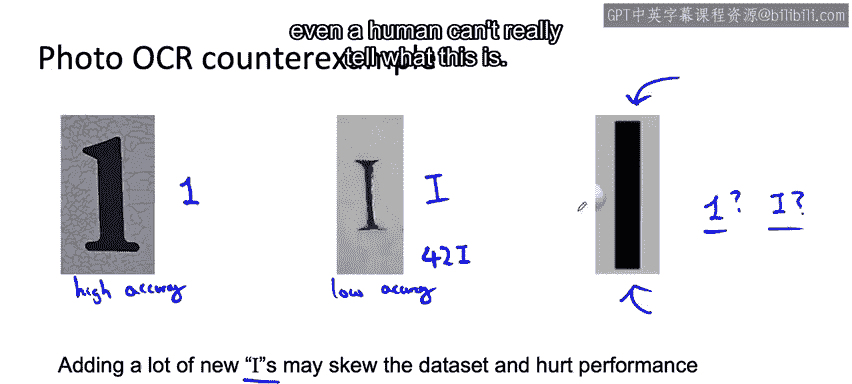

#  022：21_增加数据会伤害模型吗？🤔

在本节课中，我们将探讨一个在机器学习实践中常见的问题：通过数据增强或收集更多特定类型的数据来改变训练集分布，是否会损害模型的性能？我们将深入分析其背后的原理，并了解在何种情况下这种做法是安全的，以及在极少数情况下可能存在的风险。

---

## 概述：数据分布变化的影响

在许多机器学习问题中，训练集、开发集和测试集的初始分布通常是相似的。

但是，如果你使用了数据增强，你就是在向训练集的特定部分添加数据，例如添加大量带有咖啡馆背景噪音的数据。

这样一来，你的训练集可能就与开发集和测试集来自非常不同的分布。

这通常会损害你的学习算法性能吗？答案通常是“不会”，但在处理非结构化数据问题时有一些注意事项。让我们更深入地看看这究竟意味着什么。

---

## 非结构化数据问题的核心原则

如果你正在处理一个非结构化数据问题，并且你的模型足够大（例如一个容量很大、偏差较低的神经网络），同时从输入X到输出Y的映射关系是清晰的（我的意思是，仅给定输入X，人类就能做出准确的预测），那么事实证明：

**添加准确标记的数据很少会损害模型的准确性。**

这是一个重要的观察结果，因为通过数据增强或收集更多特定类型的数据来增加数据，确实会改变你的输入数据分布，即X的概率。

---

### 模型容量是关键

假设在你的问题开始时，20%的数据带有咖啡馆噪音。但通过数据增强，你添加了大量咖啡馆噪音数据，现在50%的数据都带有背景咖啡馆噪音。

事实证明，只要你的模型足够大，它就不会妨碍它在咖啡馆噪音数据以及非咖啡馆噪音数据上都表现出色。

相反，如果你的模型很小，那么以这种方式改变输入数据分布可能会导致它花费过多资源来建模咖啡馆噪音场景，这可能会损害其在非咖啡馆噪音数据上的性能。但如果你的模型足够大，这就不是一个问题。

---

### 映射关系模糊的罕见情况

可能出现的第二个问题是，如果从X到Y的映射关系不清晰，意味着给定X，Y的真实标签非常模糊。

这在语音识别中并不常见，但让我用一个计算机视觉的例子来说明。这种情况非常罕见，因此在大多数实际问题中我并不担心，但让我们看看为什么理解这一点很重要。

多年前我参与开发的一个系统，使用谷歌街景图像来读取门牌号，以便在谷歌地图中更准确地定位建筑物和地址。

以下是该系统需要处理的任务示例：

*   **输入图片1：** 识别这个数字。显然，这是一个“1”。
*   **输入图片2：** 识别这个字符。这是一个字母“I”。你在街景图像中不会看到很多“I”，但有些建筑物上可能会有，例如一个写着“导航到门牌号 42 I”的指示牌。但门牌号中很少包含字母“I”。

现在，如果你发现你的算法在识别“1”时准确率很高，但在识别“I”时准确率很低，你可能会做的一件事就是在训练集中添加更多“I”的示例。

问题在于（这是一个罕见的问题），有些图像是真正模糊的：这到底是一个“1”，还是一个“I”？如果你在训练集中添加大量新的“I”，特别是像这样模糊的例子，那么可能会使数据偏向于有更多的“I”，从而损害性能。

因为我们知道门牌号上“1”的数量远多于“I”，如果学习算法看到这样一张图片，更安全的猜测是这是一个“1”，而不是一个“I”。但如果数据增强使数据偏向于有更多的“I”而不是“1”，那么它可能会导致算法在这样一个模糊的例子中做出糟糕的猜测。

因此，这是一个罕见的例子，说明增加更多数据可能会损害性能。这个“1”与“I”的例子与前面提到的第二个要点（映射清晰）相矛盾，因为对于某些图像，仅给定右边这样的图像，即使人类也无法真正分辨它是什么。

---

## 重要说明与过渡

需要明确的是，我们刚刚一起讨论的这个例子是一个非常罕见的、近乎极端的情况。对于数据增强或添加更多数据会损害学习算法性能的情况来说，这是相当不寻常的，只要你的模型足够大（也许你的神经网络足够大，能够从多样化的数据源中学习）。

但我希望，理解这种假设上可能造成损害的罕见情况，能让你更放心地使用数据增强或收集更多数据来提高算法的性能，即使这会导致你的训练集分布与开发集和测试集分布变得不同。

---

## 总结

本节课中，我们一起学习了关于增加数据是否会影响模型性能的核心观点。关键在于：

1.  **对于非结构化数据问题**，如果模型容量足够大且输入到输出的映射关系清晰，通过数据增强改变训练集分布通常**不会**损害模型性能，反而能提升泛化能力。
2.  只有在**模型容量不足**，或遇到**输入输出映射极其模糊**的极端罕见情况下，增加特定类型的数据才可能带来风险。

理解这些原则，可以帮助我们更自信地运用数据增强策略来改进模型。

---

到目前为止，我们的讨论都集中在非结构化数据问题上。那么结构化数据问题呢？事实证明，对于结构化数据，有一套不同的有用技术。让我们在下一个视频中探讨一下。