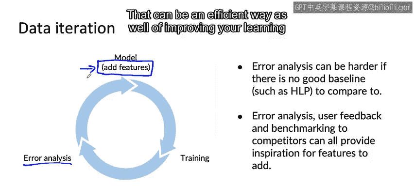

#  023：22_增加特征 🧩

在本节课中，我们将要学习如何通过**增加特征**来改进机器学习模型，特别是在处理结构化数据问题时。我们将探讨为何在难以获取新数据样本时，添加新特征是一种更有效的性能提升策略。

---

## 概述

对于许多结构化数据问题，创建全新的训练样本通常很困难。然而，我们可以采取另一种策略：**利用现有的训练样本，并思考是否可以为其添加更多有用的特征**。本节将通过一个餐厅推荐的实例，详细阐述这一过程。

---

## 餐厅推荐实例分析

上一节我们讨论了数据增强的局限性，本节中我们来看看一个具体的应用场景。假设你正在开发一个餐厅推荐应用，其目标是为可能感兴趣的用户推荐餐厅。

一种常见的方法是，为每个用户和每家餐厅定义一组特征，然后将这些特征输入到一个学习算法（例如神经网络）中。该算法的任务是预测“向该用户推荐此餐厅是否合适”。

### 问题识别

在这个真实的案例中，错误分析显示系统存在一个明显问题：**它频繁地向素食者推荐只有肉类选项的餐厅**。这些用户根据历史点餐记录可以明确判定为素食者，但系统仍可能因为某家新餐厅热门而推荐它，即使该餐厅没有好的素食选择。这导致了糟糕的用户体验。

### 解决方案：增加特征

我们无法凭空合成新的用户或餐厅样本，因为应用的用户池和餐厅数量相对固定。因此，与其尝试使用数据增强来创建全新的训练样本，不如思考**为现有样本增加特征**。

以下是针对此问题可以考虑增加的特征：

*   **用户侧特征**：增加一个特征，用于指示该用户是否为素食者。这不一定非得是二值特征（0或1），也可以是软特征，例如“历史点餐中素食所占的百分比”或其他衡量其素食倾向的指标。
    *   **公式/代码示例**：`user_feature['vegetarian_ratio'] = vegetarian_orders / total_orders`
*   **餐厅侧特征**：增加一个特征，用于指示该餐厅是否提供（或提供优质的）素食选项。这可以基于菜单信息得出。

通过错误分析识别出这类问题后，增加相应的特征就成为修复问题、提升算法性能的有效途径。

---

## 特征来源与生成方式

这些新增的特征可以通过多种方式获取或生成：

*   **手动编码**：根据具体应用，可以由人工根据规则进行标注（例如，人工阅读菜单并判断是否为素食餐厅）。
*   **算法生成**：也可以由另一个学习算法自动生成。例如，训练一个算法来阅读菜单并自动将菜品分类为“素食”或“非素食”。

---

## 更多应用场景

在其他外卖应用的例子中，我们发现有些用户只点茶和咖啡，而有些用户只点披萨。如果产品团队希望改善这些用户的体验，机器学习团队可以问：**我们能否增加一些特征来识别这些特定偏好的用户？** 通过丰富用户特征，可以帮助学习算法为他们做出更精准的餐厅推荐。

---

## 协同过滤 vs. 基于内容的过滤

过去几年，产品推荐领域有一个趋势：从**协同过滤**方法转向**基于内容的过滤**方法。

*   **协同过滤**：这种方法主要关注用户之间的相似性。它试图找出与目标用户相似的其他用户，然后推荐这些相似用户喜欢的东西。其公式可简化为：`推荐项 = 相似用户喜欢的项`。
*   **基于内容的过滤**：这种方法更关注用户本身和物品（如餐厅）的属性。它会分析用户的特征和餐厅的描述（如菜单、类型等信息），直接判断该餐厅是否与用户匹配。

基于内容过滤的优势在于，即使面对一个全新的、几乎无人评价过的餐厅或产品（即“冷启动问题”），通过分析其内容描述而非依赖他人的评价，也能更快地做出合理的推荐。要实现这一点，**确保为你想要推荐的事物捕获良好的特征**至关重要。

---

## 结构化数据问题的迭代流程

对于结构化数据问题，一个典型的数据迭代流程可能如下所示：

1.  从一个初始模型开始。
2.  训练该模型。
3.  进行错误分析。

在结构化数据问题上进行错误分析可能更具挑战性，因为通常缺乏一个明确的基准（例如人类水平性能）进行比较。让人工来推荐餐厅本身就很困难。

尽管如此，错误分析、用户反馈以及与竞争对手的基准测试，都能帮助你发现改进的思路。通过这些方法，如果你能识别出某个希望改进的特定数据类别或标签，就可以回过头去**选择并增加一些特征**。

---

## 特征工程在现代深度学习中的角色

我知道在深度学习兴起之前，人们对其寄予的厚望之一就是**不再需要手动设计特征**。我认为，对于非结构化数据问题（如图像、音频、文本），这一点在很大程度上已经实现。我不再为图像手动设计特征，而是让学习算法自动学习。

然而，即使现代深度学习已经普及，**如果你的数据集规模不够庞大**，那么基于错误分析来设计特征，对于当今许多应用而言仍然非常有用。数据集越大，纯端到端的深度学习算法才越可能独立工作良好。

但对于绝大多数公司（有时甚至包括最大的科技公司），在某些应用场景下，**设计特征——尤其是针对结构化数据问题——仍然是驱动性能提升的重要手段**。也许对于非结构化数据我们不再需要过多手动设计特征，因为学习算法在这方面已经非常出色。但对于结构化数据，深入研究和优化特征仍然是合理且有效的做法。

---

## 总结

本节课中我们一起学习了：

1.  **核心策略**：在处理结构化数据且难以获取新样本时，**为现有数据增加特征**是提升模型性能的有效方法。
2.  **实施步骤**：通过**错误分析**识别模型的具体缺陷（如向素食者推荐肉食餐厅），进而设计并添加能解决该问题的特征（如用户素食倾向、餐厅素食选项）。
3.  **方法对比**：了解了**协同过滤**与**基于内容的过滤**在推荐系统中的区别，后者更依赖良好的物品特征来应对“冷启动问题”。
4.  **现代意义**：认识到即使在深度学习时代，对于**数据量有限的结构化数据问题**，基于错误分析的特征工程仍然是提升性能的关键驱动力。

通过本节课，希望你掌握了如何通过增加特征这一具体、可操作的步骤，来迭代和改进你的机器学习模型。