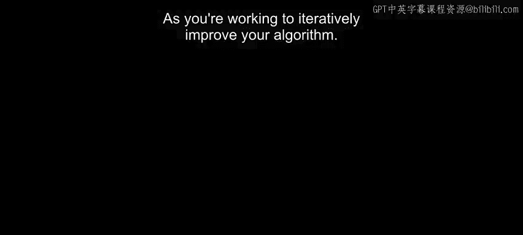
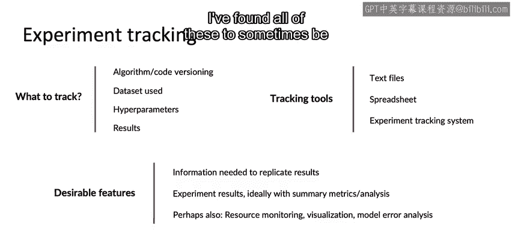

#  024：实验跟踪 📊

在本节课中，我们将学习如何通过有效的实验跟踪来系统性地改进机器学习算法。随着实验数量的增加，记录每一次尝试的细节变得至关重要。本节将介绍实验跟踪的最佳实践、需要记录的关键信息以及可用的工具。

---

## 实验跟踪的重要性

当你致力于迭代改进算法时，确保拥有稳健的实验跟踪系统能帮助你更高效地工作。随着实验数量增加到几十、几百甚至更多，很容易忘记已经运行过哪些实验。一个跟踪系统能帮助你在数据、模型或超参数的选择上做出更明智的决策，从而系统地提升算法性能。

## 需要跟踪的关键信息

当你跟踪已运行的实验（即已训练的模型）时，我建议你记录以下几类信息。以下是需要记录的核心内容：

1.  **算法与代码版本**：记录你使用的算法和代码版本。保留这些记录能让你更容易地回溯和复现可能在两周前运行、细节已记不清的实验。
2.  **使用的数据**：记录训练模型时使用的具体数据集。
3.  **超参数**：记录模型训练时使用的所有超参数设置。
4.  **实验结果**：将结果保存在某个地方。这至少应包括高层次指标，如准确率、F1分数或其他相关指标。如果可能，保存一份训练好的模型副本会很有用。

## 实验跟踪工具

那么，如何跟踪这些信息呢？你可以考虑使用以下一些跟踪工具。很多个人，有时甚至是小型团队，最初会从文本文件开始。当我独自进行实验时，可能会用一个文本文件，为每个实验写几行文字来记录我所做的事情。这种方法扩展性不好，但对于小型实验可能可行。

许多团队随后会从文本文件迁移到电子表格，尤其是在团队协作时。电子表格的不同列可以用来跟踪你想为不同实验记录的不同信息。电子表格的扩展性实际上要好得多，特别是团队成员都可以查看的共享电子表格。

但超过一定规模后，一些团队也会考虑迁移到更正式的实验跟踪系统。实验跟踪系统领域仍在快速发展，因此可用的工具越来越多。一些例子包括：
*   Weights & Biases
*   Comet.ml
*   MLflow
*   SageMaker Studio
*   Landing AI（我担任CEO的公司）也有自己的实验跟踪工具，专注于计算机视觉和制造应用。

## 选择工具时的考量因素

当我尝试使用一个跟踪工具时，无论是文本文件、电子表格还是更大型的系统，我会关注以下几点：

1.  **可复现性**：它是否提供了复现结果所需的全部信息？在可复现性方面，需要注意的一点是：如果你的学习算法从互联网上获取数据，由于网络数据可能发生变化，这会降低可复现性，除非你在系统实现时非常小心。
2.  **结果分析**：能帮助你快速理解特定训练运行的实验结果的工具，最好能提供有用的汇总指标，甚至可能进行一些深入分析。这能帮助你更快地查看最近的实验，甚至回顾旧实验并记起当时的情况。
3.  **其他功能**：一些其他可以考虑的功能包括资源监控（使用了多少CPU或GPU内存资源）、帮助可视化训练模型的工具，甚至能帮助进行更深入错误分析的工具。我发现所有这些功能有时都是实验跟踪框架中有用的特性。

## 核心建议与总结

不过，与其过分纠结于具体使用哪个实验跟踪框架，我希望你从本视频中带走的首要建议是：**务必建立某种系统**，哪怕只是一个文本文件或一个电子表格。通过跟踪你的实验，并尽可能方便地包含更多信息，因为日后当你试图回顾、记起你是如何生成某个模型时，拥有这些信息将对帮助你复现自己的结果非常有用。

在本节课中，我们一起学习了实验跟踪在机器学习工作流中的重要性，明确了需要记录的四大类关键信息（代码、数据、超参数、结果），并概览了从简单文本文件到专业平台的各种跟踪工具及其选择考量。最重要的是，建立并坚持使用一个跟踪系统，是高效、可复现地改进模型的基础。