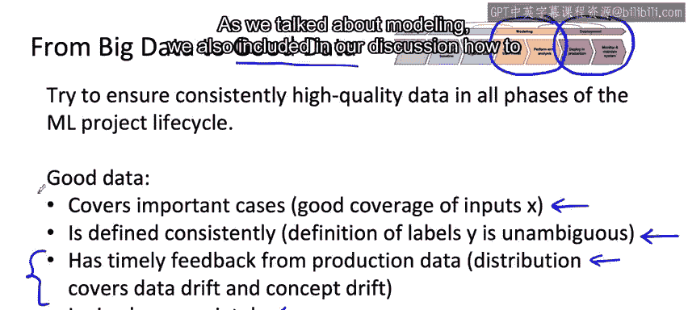

#  025：从大数据到好数据 📊

在本节课中，我们将学习如何从追求“大数据”转向关注“好数据”，并理解“好数据”在机器学习项目生命周期中的核心作用。我们将探讨“好数据”应具备的关键特性，以及如何通过系统化的方法确保数据质量，从而构建高性能、可靠的机器学习系统。

---

在上一节中，我们讨论了以数据为中心的AI开发方法。本节中，我们来看看一个重要的思维转变：从“大数据”到“好数据”。

许多现代AI技术成长于拥有海量用户的大型消费互联网公司。这类公司拥有数十亿用户，因此积累了海量数据。如果你拥有这样的“大数据”，它无疑能极大地提升你的模型性能。

然而，对于许多其他行业而言，并不存在数十亿的数据点。我认为，对于这些应用场景，关注“好数据”可能比追求“大数据”更为重要。我发现，如果你能在机器学习项目生命周期的所有阶段，确保数据始终保持高质量，这是保证机器学习部署高性能和可靠性的关键。

那么，什么是“好数据”呢？我认为“好数据”涵盖了以下几个重要的“C”：

以下是“好数据”应具备的几个关键特性：

1.  **良好的覆盖范围**：你的数据应能良好地覆盖不同的输入 **X**。例如，如果你发现缺少带有咖啡馆噪音的语音数据，**数据增强**技术可以帮助你获取更多、更多样化的输入 **X**，从而改善覆盖范围。我们在本周的材料中花了相当多的时间讨论这一点。
2.  **一致的定义**：“好数据”也意味着标签 **Y** 的定义是**一致且明确**的。我们尚未深入讨论这一点，但下周我们会进行更详细的探讨。
3.  **及时的反馈**：“好数据”需要来自生产数据的及时反馈。我们实际上在上周讨论部署部分时已经谈到了这一点，即通过监控系统来跟踪概念漂移和数据漂移。
4.  **合理的规模**：最后，你确实需要一个**合理规模**的数据集。

---

为了总结，在机器学习项目生命周期中：

*   上周我们讨论了在**部署阶段**，如何确保获得及时的反馈。
*   本周我们讨论了**建模**，并在讨论中包含了如何确保对重要场景有良好的覆盖。
*   下周，当我们深入探讨**数据定义**时，我们将花更多时间讨论如何确保你的数据定义是一致的。

我希望，通过上周、本周和下周传达的理念，你将掌握所需的工具，能够在机器学习项目生命周期的所有阶段，为你的学习算法提供“好数据”。

---

本节课中我们一起学习了“好数据”的概念及其四大关键特性：良好的覆盖范围、一致的定义、及时的反馈和合理的规模。理解并实践这些原则，是构建稳健、高效机器学习系统的基石。

恭喜你完成本周关于建模的视频学习！我期待在下周与你更深入地探讨机器学习项目全周期中的数据部分。下周我们还将有一个关于确定机器学习项目范围的简短可选章节。期待下周与你再见！