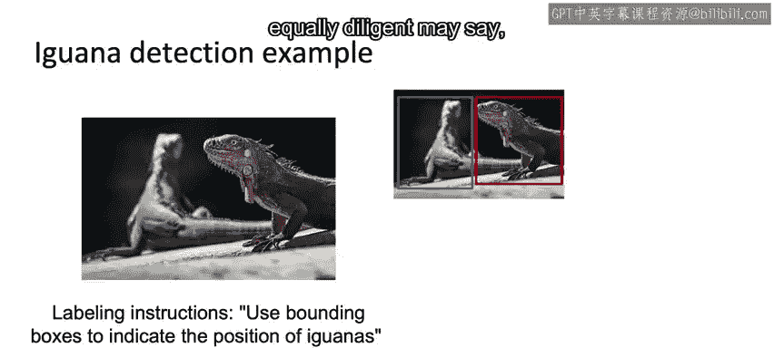
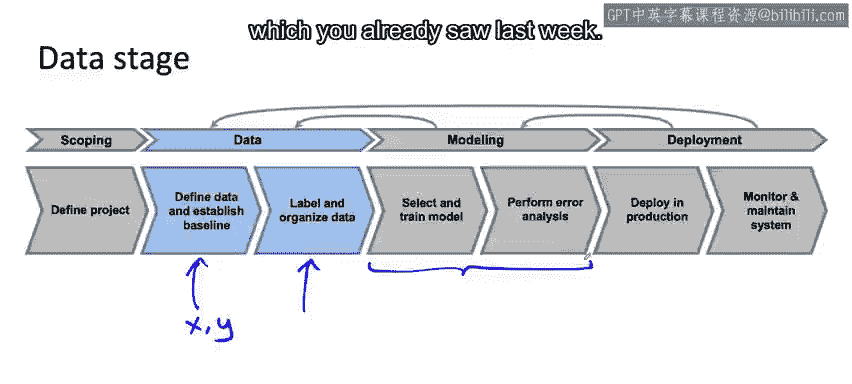

#  026：数据定义为何困难 🎯

## 概述

在本节课中，我们将要学习为什么在机器学习项目中，明确定义数据（即输入X和输出Y）是一项具有挑战性的任务。我们将通过具体的例子，探讨数据标注不一致如何影响模型性能，并理解清晰定义数据的重要性。

---

## 数据定义为何困难？🤔

欢迎回来，你现在已经进入了本课程的第三周，也是最后一周。完成本周内容后，你将结束这个专业课程的第一门课。

本周我们将深入探讨数据。你如何获取数据，为成功的模型训练做好准备？

但首先，为什么定义要使用什么数据本身就很困难？让我们来看一个例子。

我将使用检测鬣蜥的例子。我的一位朋友凯伦非常喜欢鬣蜥，所以我周围有很多鬣蜥的图片。假设你进入森林，收集了数百张这样的图片，并将这些图片发送给标注员，并附上指令：“请使用边界框来指示鬣蜥的位置。”

一位标注员可能会像这样标注，并说“一只鬣蜥，两只鬣蜥”。这位标注员做得很好。

第二位同样勤奋、同样努力的标注员可能会说：“看，左边的鬣蜥有一条尾巴一直延伸到图片的右侧。”因此，第二位标注员可能会说“一只鬣蜥，两只鬣蜥”。这位标注员也做得很好。

第三位标注员可能会说：“好吧，我将浏览所有数百张图片并标注它们，我将使用边界框来指示鬣蜥的位置，并像这样画一个边界框。”

三位勤奋努力的标注员可能会想出这三种非常不同的标注鬣蜥的方式。也许其中任何一种方式实际上都可以接受。我个人更倾向于前两种，而不是第三种。但是，如果这些标注约定中的任何一种都能让你的学习算法学会一个相当不错的鬣蜥检测器，那也没问题。

真正有问题的是，如果你的标注员中，三分之一使用第一种约定，三分之一使用第二种，三分之一使用第三种约定。因为那样你的标签就会不一致，这会让学习算法感到困惑。

鬣蜥的例子很有趣，你在许多实际的计算机视觉问题中也会看到这种影响。

让我们使用手机缺陷检测的例子。如果你要求标注员使用边界框来指示重大缺陷。

也许一位标注员会看着图片说：“哦，很明显，划痕是最重大的缺陷。让我在上面画一个边界框。”

第二位标注员可能会看着这部手机说：“实际上有两个重大缺陷。有一个大划痕，然后那里还有一个小痕迹。那叫做凹坑，就像有人用尖锐的螺丝刀戳了手机一样。”我认为第二位标注员可能做得更好。

然后，第三位标注员可能会看着这个说：“好吧，这里有一个边界框，显示了这些缺陷的位置。”

在这三个标签中，可能中间的那个效果最好。但这是一个非常典型的例子，说明了即使标注指令只有轻微的模糊性，你也会从标注过程中得到不一致的标签。

如果你能始终如一地使用一种约定（也许是中间那种）来标注数据，你的学习算法会表现得更好。

本周我们将要做的是，深入探讨机器学习项目全周期中数据阶段的最佳实践。

具体来说，我们将讨论如何：
*   定义什么是数据，什么应该是X，什么应该是Y。
*   建立一个基线。

做好这些工作将为你很好地标注和组织数据奠定基础，从而在你进入建模阶段时为你提供一个良好的数据集。

正如你上周所看到的，许多机器学习研究者和工程师最初都是从网上下载数据来试验模型的，也就是使用别人准备好的数据。这本身没有任何问题。

但对于许多实际应用来说，你准备数据的方式将对机器学习项目的成功产生巨大影响。

---

## 总结

本节课中，我们一起学习了数据定义在机器学习项目中的核心挑战。我们通过鬣蜥检测和手机缺陷检测的例子，看到了**标注不一致**如何导致模型困惑。关键在于，团队需要就**X（输入）** 和 **Y（输出/标签）** 的定义达成清晰、一致的共识，并建立可靠的**基线**。清晰的数据定义是构建高质量数据集、进而训练出高性能模型的基石。

在下一个视频中，我们将查看更多数据可能模糊不清的例子，这将为我们本周后续学习一些提高数据质量的技术做好准备。让我们继续观看下一个视频。