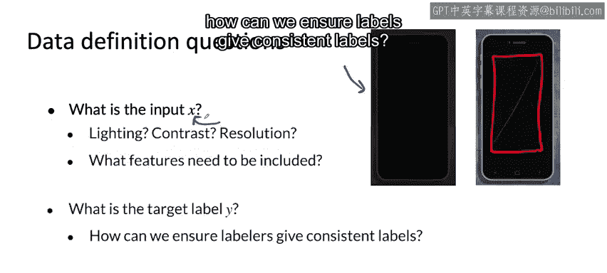

#  027：更多标签歧义示例 🧩

在本节课中，我们将学习机器学习项目中常见的标签歧义问题。通过分析图像、语音和结构化数据的具体案例，我们将理解为什么数据标注会不一致，以及这种不一致性如何影响模型性能。最后，我们将探讨如何通过定义清晰的输入和输出来系统性地解决这些问题。

---

在上一节视频中，我们看到了图像的正确边界框标注可能存在歧义。

本节中，我们来看看更多标签歧义的示例。

我们在课程第一周简要提及过语音识别，这里有一个相关例子。

给定这段音频片段。听起来像是有人站在繁忙的路边询问最近的加油站，然后一辆车驶过。那么他们在车驶过后是否还说了些什么？这并不确定。

因此，一种转录方式可能是“nearest gas station”。在某些地区，人们会用两个M来拼写“station”，这将是另一种拼写方式。我们也可以用省略号（…）代替逗号，这又是一种歧义。

或者，考虑到音频在最后一个词后有噪音。“Ands guest station”。他们是否说了“off the nearest gas station”？实际上并不确定。

那么，你会像这样转录吗？因此，转录这段音频存在多种方式。

使用一个M还是两个M，用逗号还是省略号，是否在末尾标注“unintelligible”（无法识别）。

能够标准化一种约定将有助于你的语音识别算法。

---

我们也来看一个结构化数据的例子。在许多大公司中，一个常见的应用是用户ID合并。这是指当你拥有多个你认为对应同一个人的数据记录，并希望将这些用户数据记录合并时的情况。

例如，假设你运营一个提供在线职位列表的网站。这可能是你从一位注册用户那里获得的一条数据记录，包含电子邮件、名、姓和地址。现在，假设你的公司收购了第二家公司，该公司运营一个移动应用程序，允许人们登录并互相聊天、获取关于简历的建议。

如果你运营在线职位列表业务，这看起来具有协同效应。也许你合并或收购了第二家运营移动应用程序的公司。该应用程序让人们可以就简历进行聊天。从这个移动应用程序中，你拥有一个不同的用户数据库。

那么，给定这条数据记录和另一条数据记录，你认为这两个是同一个人吗？

解决用户ID合并问题的一种方法是使用监督学习算法。该算法接收两个用户数据记录作为输入，并尝试输出1或0，基于它是否认为这两个记录实际上是同一个真实的人。

如果你有办法获取真实数据记录，例如，如果少数用户愿意明确地关联两个账户，那么这可以成为训练算法的一组良好的标注示例。

但如果你没有这样一组真实数据，许多公司所做的就是请求人工标注，有时是产品管理团队，手动查看一些经过筛选的记录对（这些记录对可能具有相似的名字或邮政编码），然后仅凭人工判断来确定这两条记录是否看起来是同一个人。

因为这两条记录是否真的是同一个人确实存在歧义，他们可能是，也可能不是。不同的人会不一致地标注这些记录。

如果有办法让他们更一致地标注数据（你将在后面看到一些如何做到这一点的例子），即使真实情况是模糊的，这也能帮助你提升学习算法的性能。用户ID合并在许多公司中是一个非常常见的功能。

请允许我提醒你，请务必以尊重用户数据及其隐私的方式进行此操作，并且仅在你使用数据的方式符合用户已授予的权限范围内进行。用户隐私确实非常重要。

---

结构化数据的其他几个例子。

如果你尝试使用学习算法来查看像这样的用户账户，并预测它是否是机器人或垃圾账户。有时这可能是模糊的。

或者，如果你查看一次在线购买，判断这是否是一次欺诈交易。是否有人窃取了账户并使用被盗账户与你的网站互动或进行购买？有时这也存在歧义。

或者，如果你查看某人与你网站的互动，并想知道他们此刻是否正在寻找新工作。基于某人在招聘网站或简历聊天应用上的行为，你有时可以猜测他们是否在找工作，但很难确定。因此，这也存在一些歧义。

面对这些可能非常重要且有价值的预测任务时，真实情况可能是模糊的。

因此，如果你请人们对这些任务的真实标签做出最佳猜测，那么提供能带来更一致、噪声更少、随机性更低的标签的标注说明，将提升你的学习算法的性能。

---

因此，在为你的学习算法定义数据时，以下是一些重要问题。

首先，什么是输入X？例如，如果你试图检测智能手机上的缺陷，对于你拍摄的图片，光线是否足够好？相机对比度是否足够好？相机分辨率是否足够好？

所以，如果你发现有一批像这样暗到连人都很难看清情况的图片，正确的做法可能不是直接拿这个输入X去标注。正确的做法可能是去工厂，礼貌地请求改善照明条件。因为只有图像质量更好，标注员才能更容易地看到像这样的划痕并进行标注。

因此，有时如果你的传感器、成像解决方案或录音解决方案不够好，你能做的最好的事情就是认识到：如果连人都无法通过查看输入来判断发生了什么，那么提升传感器质量或提升输入X的质量，可能是确保你的学习算法获得合理性能的重要第一步。

对于结构化数据问题，定义要包含哪些特征会对学习算法的性能产生巨大影响。例如，对于用户ID合并，如果你有办法获取用户的位置（即使是粗略的GPS位置），并且在获得用户许可的情况下使用，这可能是判断两个用户账户是否真正属于同一个人的非常有用的线索。当然，请务必仅在获得用户许可以这种方式使用其数据的情况下进行此类操作。

---

除了定义输入X，你还必须弄清楚目标标签Y应该是什么。正如你从前面的例子中看到的，一个关键问题是：我们如何确保标注员给出一致的标签？

在上一个视频和本视频中，你看到了标签存在歧义的各种问题，或者在有些情况下，输入X的信息量不足（如图像太暗）。让我们将这些数据问题纳入一个更系统的框架中，以便我们能以更系统化的方式设计解决方案。让我们进入下一个视频来一探究竟。

---

本节课中，我们一起学习了机器学习项目中标签歧义的多种表现形式，包括图像边界框、语音转录和结构化数据（如用户ID合并、欺诈检测）中的案例。我们认识到，清晰定义输入数据的质量（如光照、传感器）和输出标签的标注规范，对于减少歧义、获得一致标注至关重要，这是构建高性能模型的基础。下一节，我们将系统性地探讨解决这些数据问题的方法。