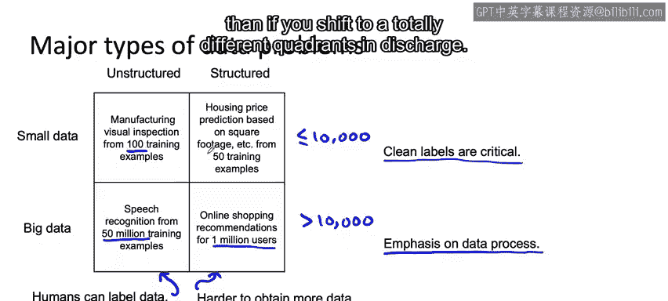

#  028：27_主要的数据问题类型 🧠

在本节课中，我们将学习一个用于思考不同类型机器学习项目的实用框架。我们将看到，为一种类型项目组织数据的最佳实践，可能与另一种完全不同类型项目的最佳实践大相径庭。

## 概述：一个实用的项目分类框架

为了清晰地理解不同机器学习项目的特点，我们可以使用一个二维网格进行分类。这个框架有助于我们预测哪些数据实践和机器学习思想可以从一个项目推广到另一个项目。

## 数据类型的两个维度

上一节我们介绍了分类框架的概念，本节中我们来看看构成这个框架的两个核心维度。

### 维度一：结构化与非结构化数据

第一个维度是数据的形式：你的机器学习问题是使用**非结构化数据**还是**结构化数据**。

*   **非结构化数据**：如图像、音频和文本。人类擅长处理这类数据。
*   **结构化数据**：如数据库记录。人类处理这类数据的效率相对较低。

我发现，处理这两类数据的最佳实践非常不同。

### 维度二：数据集的规模

第二个维度是数据集的规模：你拥有的是**相对较小的数据集**还是**非常大的数据集**。

这里没有精确的大小定义，但我将使用一个稍显任意的阈值：**10,000个样本**。

*   **小数据集**：通常指样本数少于10,000的数据集。这个规模小到足以让个人或小团队高效地检查每一个样本。
*   **大数据集**：通常指样本数超过10,000的数据集。这个规模使得手动检查每个样本变得非常耗时。

选择10,000作为阈值的原因是，超过这个规模后，亲自检查每一个样本会变得相当困难。

## 四种项目类型示例

以下是四种不同类型机器学习项目的例子：

*   **非结构化数据 & 小数据集**：使用仅100个有划痕手机图像样本来训练一个制造视觉检测系统。
*   **结构化数据 & 小数据集**：基于房屋面积等特征，使用仅50个训练样本来预测房价。
*   **非结构化数据 & 大数据集**：使用5000万个训练样本来进行语音识别。
*   **结构化数据 & 大数据集**：拥有100万用户的数据库，尝试进行在线购物产品推荐。

## 不同象限的最佳实践差异

了解了四种基本类型后，我们来看看处理它们时，最佳实践有何关键区别。

### 非结构化 vs. 结构化数据

对于许多非结构化数据问题，人类可以帮助你标注数据。此外，**数据增强**技术（如合成新图像、新音频或新文本）可以提供帮助。

*   **制造视觉检测**：可以使用数据增强生成更多智能手机图片。
*   **语音识别**：数据增强可以帮助合成带有不同背景噪音的音频片段。

相比之下，对于结构化数据问题，通常更难获取更多数据，也更难使用数据增强。例如，如果某个地区最近只售出了50套房屋，很难合成不存在的“新房屋”。同样，拥有100万用户的数据库，也很难合成不存在的“新用户”。此外，让人工标注结构化数据通常也更困难（尽管并非不可能）。

### 小数据集 vs. 大数据集

当你的数据规模不同时，工作的侧重点也会发生显著变化。

**对于小数据集：**
干净的标签至关重要。如果只有100个训练样本，哪怕只有一个样本被错误标注，也意味着数据集的1%出现了错误。由于数据集小到足以让你或一个小团队高效地检查，花时间确保每个样本都按照一致的标注标准被清晰、一致地标注，通常是值得的。

**对于大数据集：**
干净的标签仍然非常有帮助，但让一个小型机器学习团队手动检查每个样本可能很困难甚至不可能。因此，工作重点应放在**数据流程**上，即你如何收集、安装、存储数据，以及你为大型众包标注团队编写的标注指令。一旦你执行了某个数据流程（例如让大型标注团队标注了大量音频片段），再回头更改决定并重新标注所有内容也会困难得多。

## 各象限策略总结

以下是针对不同象限的策略总结：

**对于非结构化数据问题：**
你可能拥有大量未标注的样本 `X`。有时，你可以通过获取这些未标注数据 `X` 并让人工标注更多数据来获得更多数据。数据增强也可能有帮助。

**对于结构化数据问题：**
通常更难获得更多数据，因为你能收集数据的来源（如用户、房屋）是有限的。人工标注平均而言也更困难，因为即使对于人类标注者，确定某些结构化数据的正确标签也可能存在更多模糊性。

**对于小数据集：**
干净的标签至关重要。数据集可能小到足以让你手动检查整个数据集并修复任何不一致的标签。此外，标注团队可能不大，如果发现标签不一致，可以很容易地让相关人员协商并统一标注标准。

**对于大数据集：**
重点必须放在数据流程上。如果你有100名甚至更多的标注员，很难让所有人聚在一起讨论并敲定流程。因此，你可能需要依靠一个较小的团队来建立一致的标签定义，然后与所有标注员分享该定义，并要求他们执行相同的流程。

## 一个重要的思考与建议

我发现这种将问题分类为非结构化/结构化、小数据/大数据的方法，不仅有助于预测数据实践的可推广性，也有助于预测其他机器学习思想的可推广性。

因此，一个建议是：如果你正在处理这四个象限中某一类的问题，那么平均而言，来自在同一象限工作过的人的建议，可能比来自在不同象限工作过的人的建议更有用。

在招聘机器学习工程师时我也发现，在与我试图解决的问题相同象限工作过的人，通常能更快地适应在该象限内处理其他问题，因为在一个象限内，其工作直觉和决策比切换到图表中完全不同的象限更为相似。

我有时听到人们给出诸如“如果你在构建计算机视觉系统，至少要获取10个标注样本”的建议。我认为给出这种建议的人是善意的，但我发现这种建议并非对所有问题都有用。机器学习非常多样化，很难找到这种“一刀切”的建议。我见过用100个样本构建的计算机视觉问题，也见过用1亿个样本构建的分类系统。

因此，如果你正在为机器学习项目寻求建议，请尝试找到在你正试图解决的问题的同一象限工作过的人。😊

## 总结与下节预告

本节课中，我们一起学习了根据数据是结构化/非结构化、数据集规模是大/小来对机器学习项目进行分类的框架，并探讨了不同类别项目在最佳实践上的核心差异。

我们讨论了一种机器学习问题的分类方法。在下一个视频中，我想与大家深入探讨其中一个方面：为什么对于小数据问题，拥有干净的数据尤为重要。让我们在下一个视频中看看为什么这是真的。