#  029：小数据集与标签一致性 📊

在本节课中，我们将要学习在小数据集场景下，保持标签的**干净**与**一致**为何至关重要。我们将通过具体例子，理解标签一致性如何帮助学习算法建立更可靠的模型，并探讨即使在拥有大数据集时，如何处理其中的“小数据”挑战。

---

## 概述：小数据集的挑战

在小数据集问题中，拥有干净且一致的标签尤为重要。当数据量有限时，标签中的噪声或不一致性会极大地影响模型学习正确函数映射的能力。

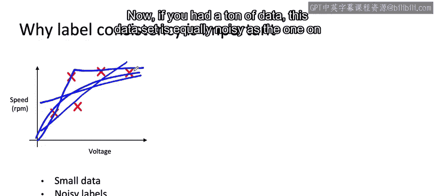

上一节我们介绍了数据质量的重要性，本节中我们来看看在小数据集场景下，标签一致性如何成为决定模型成败的关键。

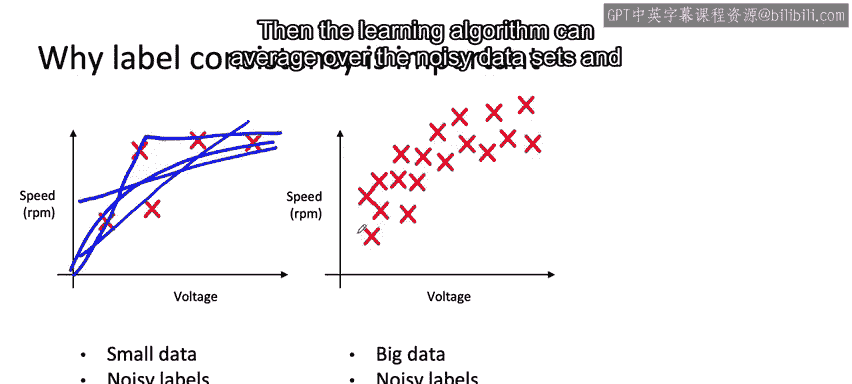

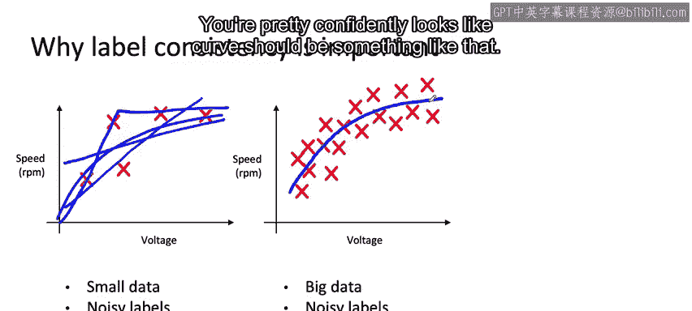

---

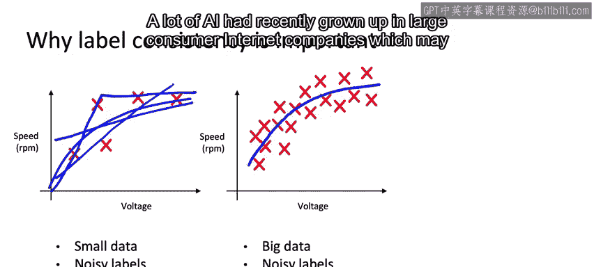

## 从直升机控制说起 🚁

让我们从一个例子开始。我曾使用机器学习来控制直升机飞行。其中一个任务是：输入施加在直升机旋翼电机上的电压，预测旋翼的转速（RPM）。这类问题也常见于其他电机控制场景。

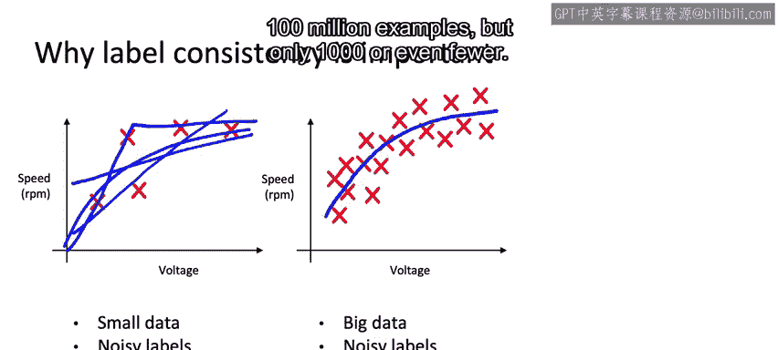

假设我们只有五个数据点，这是一个非常小的数据集。由于输出标签 `y`（转速）存在噪声，我们很难确定应该使用何种函数来映射电压到转速。

**可能的函数关系：**
*   可能是一条直线。
*   可能先上升后变平。
*   可能是一条曲线。

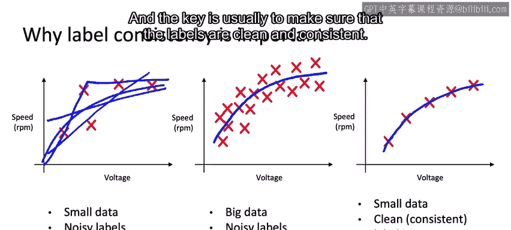

当数据集很小且标签有噪声时，我们很难有信心地拟合出一个函数。

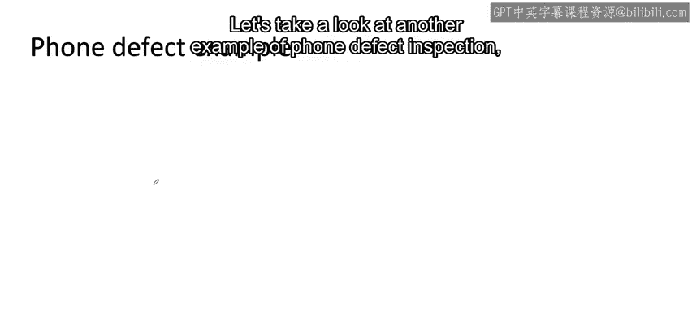

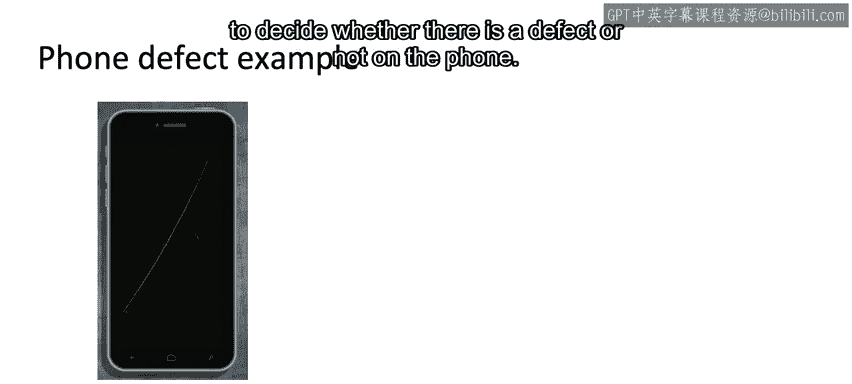

---

## 大数据集的优势

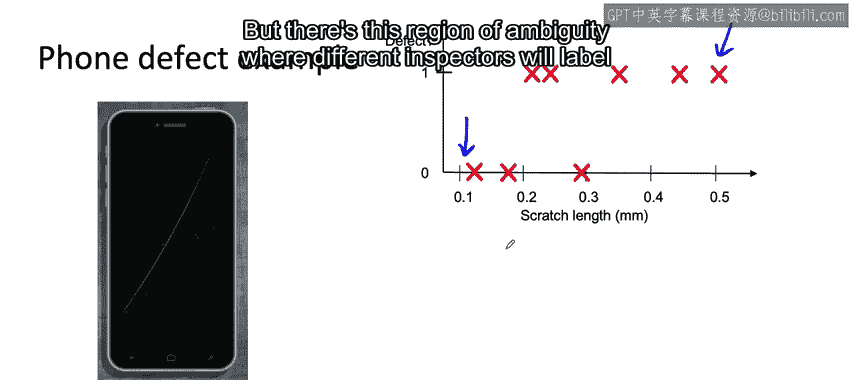

如果我们拥有海量数据，情况则完全不同。即使数据噪声水平与左边的小数据集相同，但数据量巨大，学习算法可以通过对噪声数据取平均来拟合出一个函数。此时，我们可以相当自信地认为函数曲线应该是某种形状。

许多AI技术成长于拥有海量用户（如数亿或数十亿）的大型互联网公司，因此处理大数据集的方法得到了充分发展。然而，如何应对小数据集的实践方法，对于那些没有一亿个样本，而只有一千甚至更少样本的问题，强调得还不够。

---

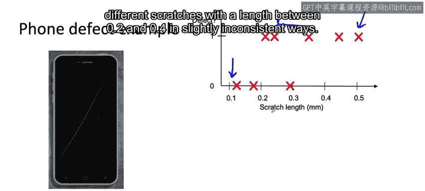

## 小数据集的关键：干净一致的标签

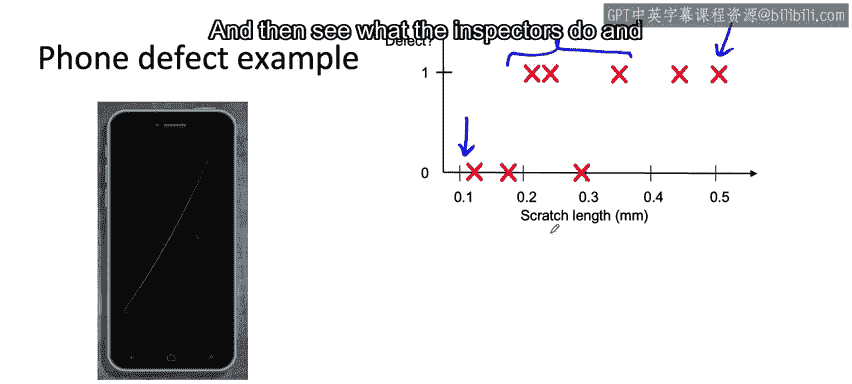

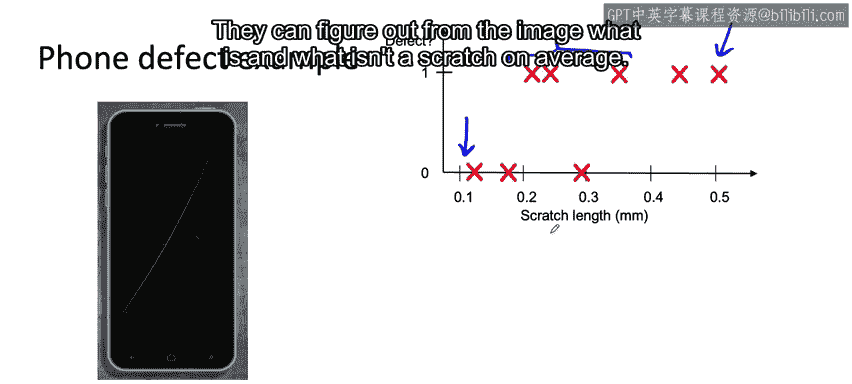

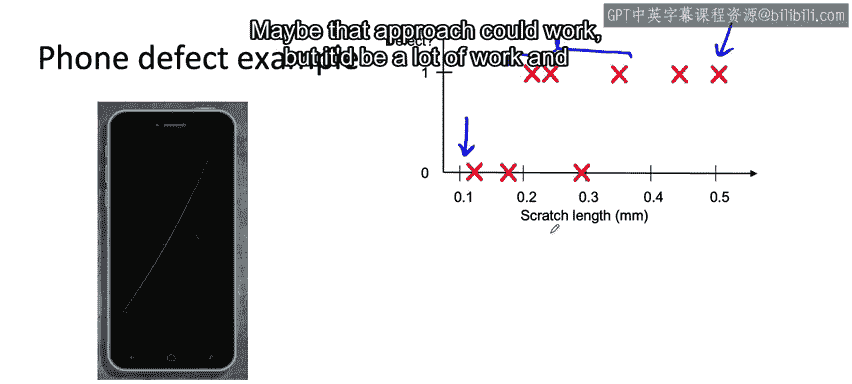

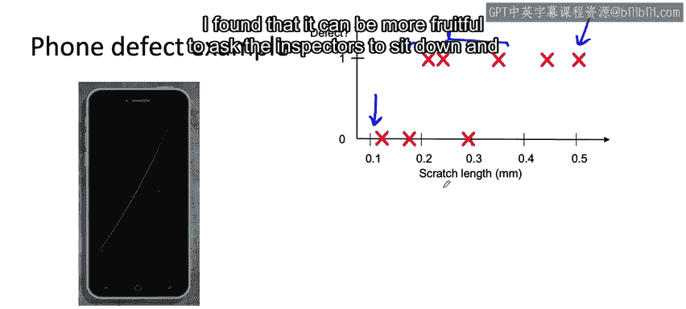

对我来说，更有趣的情况是：如果我们仍然只有五个数据点（与左侧例子相同），但标签是**干净且一致**的。在这种情况下，即使只有五个例子，我们也能相当自信地拟合出一个函数，并建立一个相当好的模型来根据输入电压预测速度。

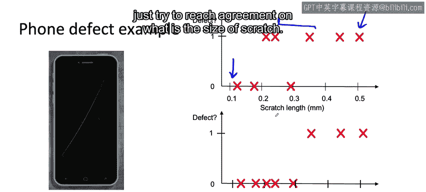

我曾用仅仅30张图像训练计算机视觉系统，并且效果很好。关键通常在于确保标签是干净和一致的。

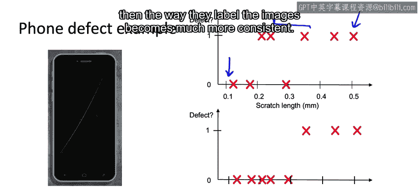

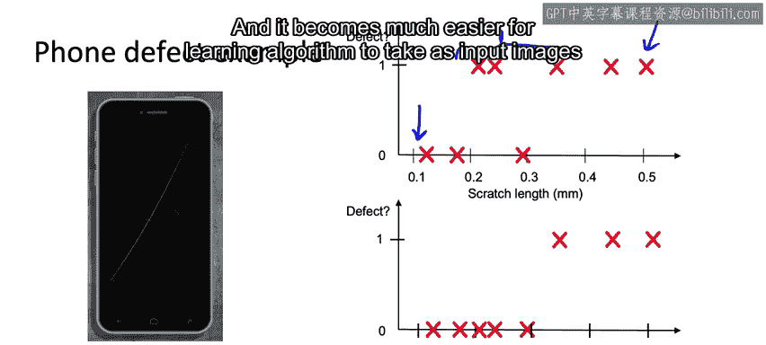

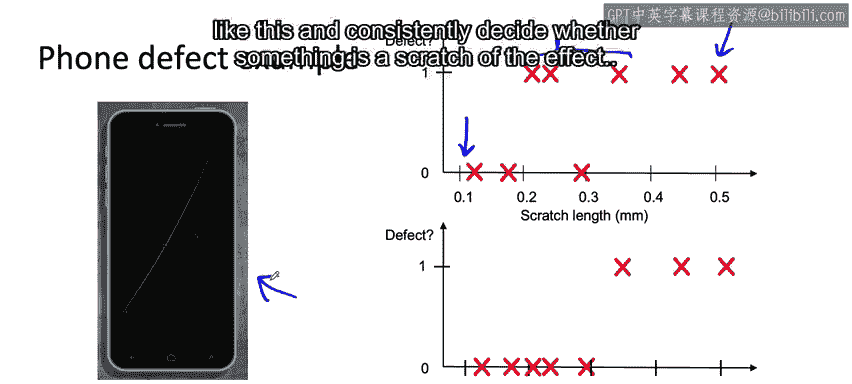

---

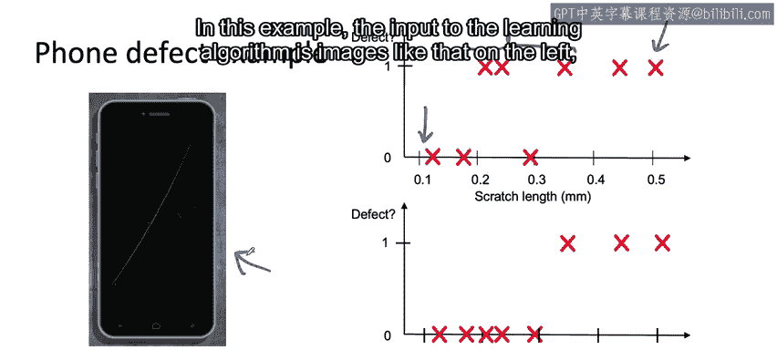

## 手机缺陷检测示例 📱

让我们看另一个手机缺陷检测的例子。任务是输入如下图片，判断手机上是否存在缺陷。

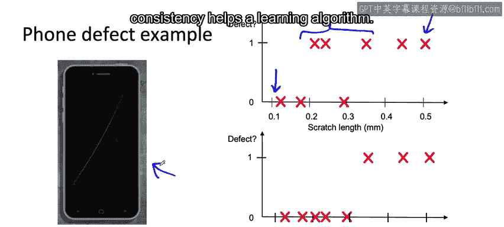

如果标注说明最初不清晰，那么标注员对图像的标注就会不一致。例如，一个巨大的划痕，所有人都同意是缺陷；一个微小的瑕疵，检查员会忽略它。但在一个模糊区域（例如划痕长度在0.2到0.4毫米之间），不同的检查员可能会以略微不一致的方式标注。

一种解决方案是尝试获取更多手机或划痕的图片，观察检查员如何判断，最终训练一个神经网络来从图像中平均判断什么是划痕。这种方法可能有效，但需要大量工作来收集图像。

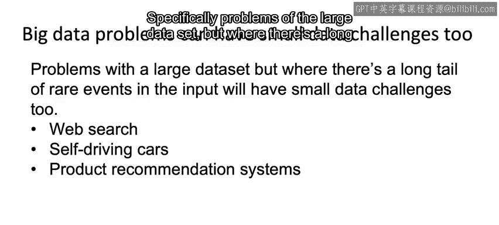

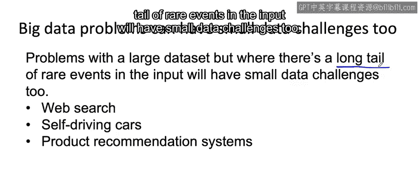

我发现，更有效的方法是让检查员坐下来，就“多大尺寸的划痕需要被标注为缺陷”达成一致。例如，如果标注员能同意，从“小瑕疵”转变为“缺陷”的临界点是长度为**0.3毫米**，那么他们对图像的标注就会变得一致得多。这使得学习算法更容易以这些图像作为输入，并一致地判断某物是否是划痕或缺陷。

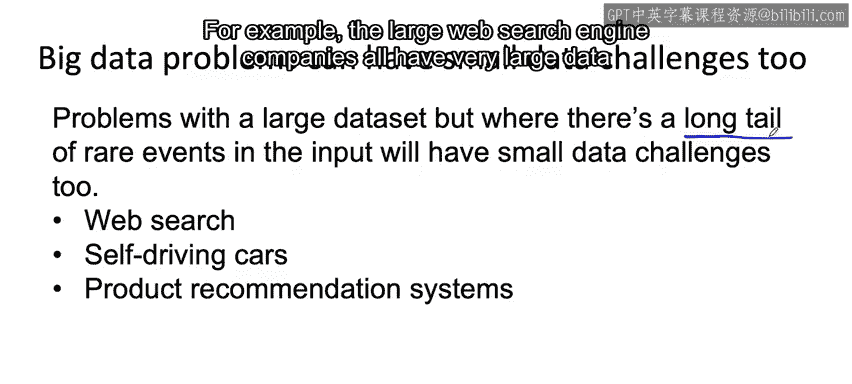

需要明确的是，在这个例子中，学习算法的输入是左侧那样的图像，而不是右侧那样的划痕长度。关键在于，如果你能让检查员就“什么是划痕”达成一致，并将任务定义为“为长度超过0.3毫米的缺陷绘制边界框”，那么这将使你的图像标注更加一致，即使你的数据集不大，也能让你的学习算法达到更高的准确度。

---

## 大数据集中的“小数据”挑战

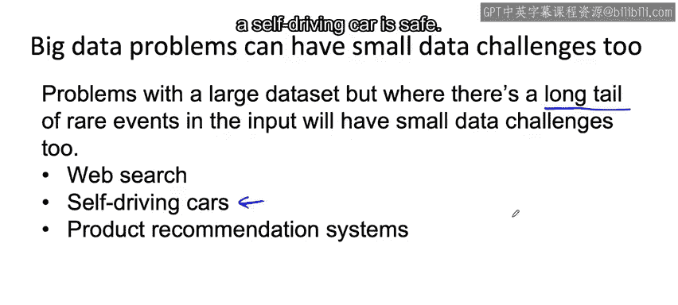

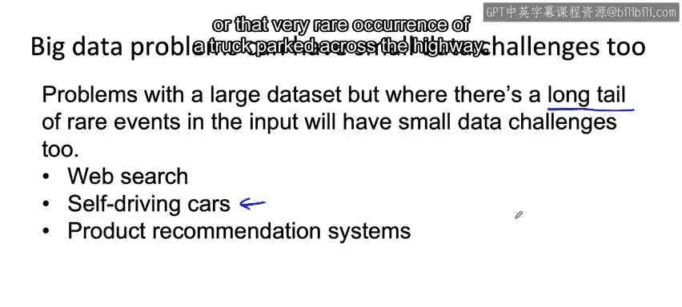

你已经看到了几个标签一致性如何帮助学习算法的例子。我想用一个更深入的思考来结束这个视频：**大数据问题也可能面临小数据挑战**。

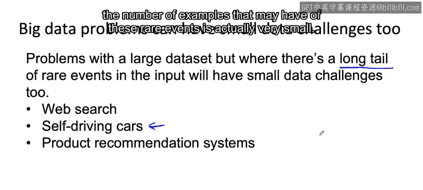

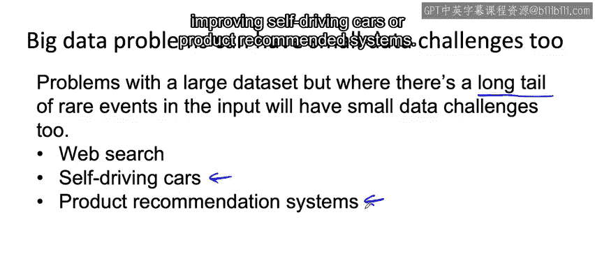

具体来说，有些问题虽然拥有大数据集，但其中存在一个**罕见事件的长尾分布**，那么这些罕见事件的输入数据同样会面临小数据挑战。

以下是几个例子：

*   **网络搜索引擎**：大型网络搜索引擎公司拥有海量的搜索查询数据集，但许多搜索查询实际上非常罕见。因此，针对这些罕见查询的点击流数据量实际上很小。
*   **自动驾驶汽车**：自动驾驶汽车公司往往拥有从数十万或数百万小时驾驶中收集的庞大数据集。但存在一些对确保自动驾驶汽车安全至关重要的罕见情况，例如“小孩跑上高速公路”或“卡车横停在高速公路上”。即使自动驾驶汽车有非常大的数据集，它拥有的这些罕见事件的例子数量实际上也非常少。因此，确保这些罕见事件如何被**检测和标注**的标签一致性，对于提升自动驾驶汽车或产品推荐系统的性能仍然非常有帮助。
*   **产品推荐系统**：如果你有一个包含数十万或数百万甚至更多商品的在线目录，那么你将会有很多商品，其销售量非常小。因此，你拥有的关于用户与这些长尾商品互动的数据量实际上也很小。如果有一种方法（虽然不容易）能确保这些数据是干净和一致的，那么这将有助于你的学习算法决定是否推荐这些每个商品数据量都很少的长尾商品。

---

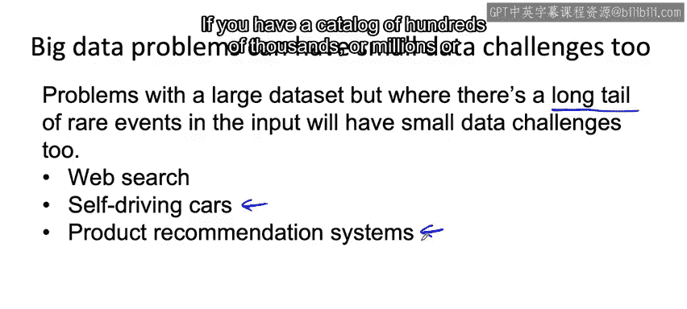

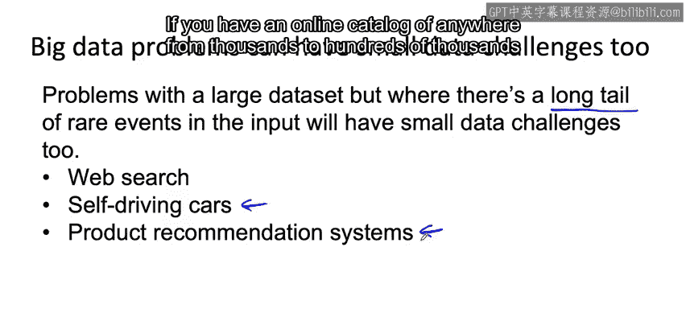

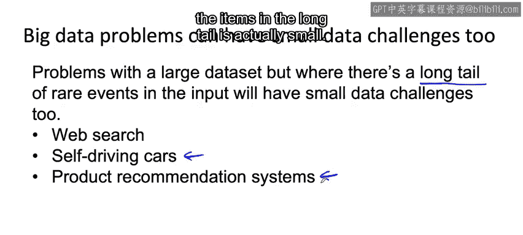

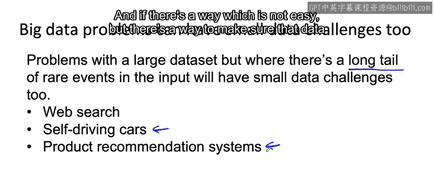

## 总结与预告

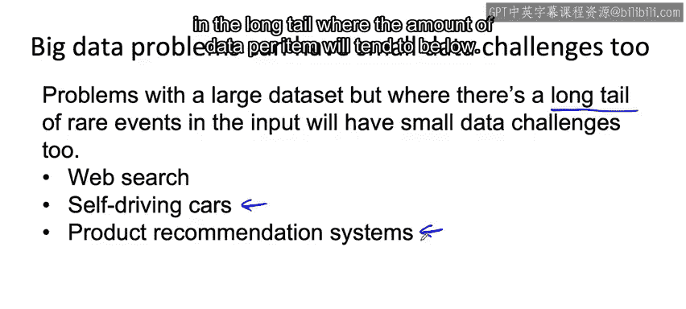

所以，当你拥有**小数据**时，标签一致性至关重要。即使你拥有**大数据**，标签一致性也可能非常重要。只是平均而言，在较小的数据集上实现标签一致性比在非常大的数据集上更容易。

在下一节视频中，我们将探讨一些具体的想法和最佳实践，以提高你数据集的标签一致性。让我们继续学习下一课。