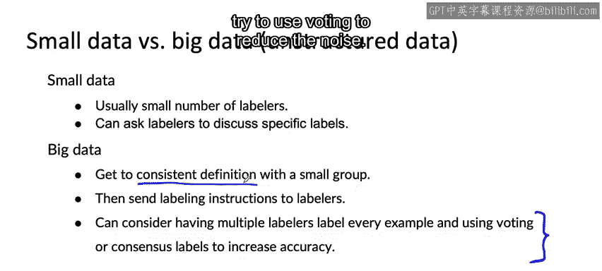

#  030：提高标签一致性 📝

在本节课中，我们将学习如何提高数据标签的一致性。标签质量是机器学习项目成功的关键，不一致的标签会严重影响模型性能。我们将探讨一个系统性的流程和几种实用技巧，帮助你获得更高质量的训练数据。

## 概述

标签不一致是数据标注过程中的常见问题。本节将介绍一个通用流程，通过让标注者讨论、标准化定义、合并类别或创建新类别等方法，来系统地提高标签的一致性。

## 提高标签一致性的通用流程

如果你担心标签不一致，可以遵循以下流程。

以下是具体步骤：

1.  **找出不一致的示例**：选取一些样本，让多位标注者为同一个样本打标签。
2.  **检查自我一致性**：在某些情况下，可以让同一位标注者标注一个样本，等待一段时间（例如让他们休息一下），然后回来重新标注同一个样本，检查他们自身是否保持一致。
3.  **讨论分歧**：当发现存在分歧时，让负责标注的人员（可能是机器学习工程师、领域专家或专职标注员）一起讨论，就标签更一致的定义达成共识。
4.  **记录共识**：将达成的一致意见和定义记录下来。
5.  **更新标注指南**：这个新的定义可以成为更新后的标注指南，用于标注新数据或重新标注旧数据。
6.  **评估输入信息**：在讨论中，如果标注者反馈输入信息 `X` 不足（例如图片太暗无法判断），则应考虑改进输入 `X`（例如改善拍摄光照条件）。
7.  **迭代优化**：这是一个迭代过程。在改进操作或标注指南后，让团队标注更多数据。如果仍然存在分歧，则重复上述流程。

上一节我们介绍了提高标签一致性的通用流程，本节中我们来看看一些具体的应用实例和技巧。

## 提高一致性的具体技巧

以下是几种在实践中常用的技巧。

*   **标准化标签定义**：这是最常见的结果之一。例如，对于之前视频中的音频片段，标注者可以标准化一个统一的标注惯例（如统一标注为“nearest”），从而使数据更一致。
*   **合并难以区分的类别**：如果标注指南要求区分“深划痕”和“浅划痕”，但两者的界限模糊，导致标注极不一致，而业务上又不需要严格区分，那么合并这两个类别为一个单一的“划痕”类，可以消除不一致性。公式可以表示为：
    `合并后类别 = 类别A ∪ 类别B`
*   **创建“不确定”类别**：对于边界模糊的样本，强制标注可能导致不一致。此时，可以创建一个新的“边界”或“不确定”类别。例如，在判断手机划痕是否为缺陷时，可以设立三个标签：“明确无缺陷”、“明确有缺陷”和“边界情况”。这承认了某些样本的模糊性，反而能提高其他样本标注的一致性。
*   **处理模糊输入**：以语音识别为例，如果一段音频确实难以听清（如“nearest”），强迫标注者猜测会导致不一致。更好的做法是创建一个“无法识别”的标签，让所有标注者都将此类样本标为“无法识别”，从而提高整体一致性。

## 处理不同规模数据集的建议

根据数据集规模的不同，提高标签一致性的策略也应有所调整。

*   **小数据集**：通常标注者数量较少。发现不一致时，可以直接请标注者坐下来，针对具体的图像或音频片段进行讨论，以达成一致。
*   **大数据集**：更常见的做法是，先由一个小组达成一致的定义和标注指南，然后将这些指南分发给更大的标注团队去执行。

## 关于“投票”机制的说明

一种常用但可能被过度使用的技术是让多位标注者标注每个样本，然后通过投票（有时称为“共识标注”）来决定最终标签，以提高准确性。

虽然这种投票机制有效，但在当今机器学习领域可能被过度使用了。我见过很多团队的做法是，在标注指南本身不一致的情况下，试图通过大量标注者和投票来使其变得一致。

在诉诸投票（我有时也会用，但更多是作为最后手段）之前，我通常会首先尝试获得更一致的标签定义，努力从源头上减少单个标注者选择的噪声，而不是先获取大量带噪声的数据，再试图用投票来减少噪声。

## 总结

本节课中我们一起学习了如何系统性地提高数据标签的一致性。我们介绍了一个包含发现分歧、讨论共识、迭代优化的通用流程，并探讨了标准化定义、合并类别、创建不确定类别等具体技巧。同时，我们也了解了针对不同规模数据集的策略，并对“投票”机制的使用给出了建议。提高标签一致性是获取高质量训练数据、构建可靠机器学习模型的重要基础步骤。

---

关于提高标签质量，一个经常被提及的问题是：一项任务的“人类水平表现”是什么？我发现“人类水平表现”是一个重要但有时被误解的概念。让我们在下一个视频中更深入地探讨这个问题。