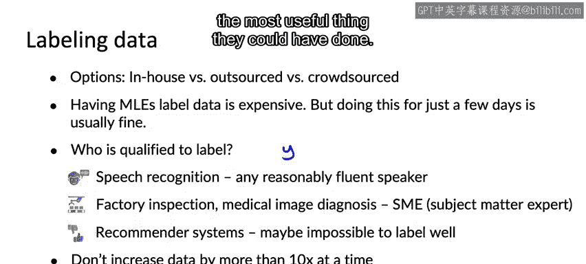

#  033：获取数据 📊

在本节课中，我们将要学习如何为机器学习项目获取数据。我们将探讨获取数据的最佳实践，包括如何平衡数据收集时间、如何盘点数据来源、如何选择数据标注方式，以及如何决定数据集的增长规模。

你已经了解了如何定义数据、如何定义输出 `y` 和输入 `X`。那么，如何为你的任务实际获取数据呢？让我们来看看一些最佳实践。

## 数据收集的时间投入 ⏱️

一个关键问题是，你应该在获取数据上花费多长时间？机器学习是一个高度迭代的过程，你需要选择模型、超参数，拥有数据集，然后进行训练或分析，并多次循环这个过程才能得到一个好模型。

假设训练你的第一个模型需要几天时间，进行第一次误差分析也需要几天。在这种情况下，我建议你不要花30天去收集数据，因为这会让你延迟整整一个月才能进入这个迭代循环。相反，我建议你尽快进入这个迭代循环。

如果训练模型和误差分析可能只需要几天，我建议你问自己：如果只给自己两天时间收集数据，是否能帮助你更快地进入这个循环？也许两天太短，但我见过太多团队在训练初始模型之前花了太长时间收集初始数据集。实际上，我很少遇到一个团队，我会对他们说：“嘿，你们真的应该花更多时间收集数据。”

在你训练了初始模型并进行误差分析之后，有足够的时间可以回去收集更多数据。对于我领导的许多项目，当我告诉团队“我们最多花七天收集数据，我们能做什么？”时，我发现以这种方式提出问题通常会带来更有创意的方法，这些方法仍然100%尊重隐私使用并遵守任何监管考虑，但能以更灵活的方式快速获取大量数据，让你更快地进入迭代循环，使项目进展更快。

这个准则的一个例外是，如果你以前处理过这个问题，并且从经验中知道至少需要一定的训练集规模，那么前期投入更多精力收集那么多数据可能是可以的。因为我从事过语音识别工作，我对需要多少数据来完成某些事情有很好的感觉，我知道如果数据少于一定小时数，尝试训练某些模型是不值得的。

但很多时候，如果你在处理一个全新的问题，并且不确定需要多少数据，通常很难从文献中判断。如果你不确定到底需要多少数据，那么最好快速收集少量数据来训练模型，然后使用误差分析来判断是否值得去收集更多数据。

## 盘点数据来源 📋

在获取所需数据方面，我经常执行的另一个步骤是盘点可能的数据来源。让我们继续以语音识别为例。

如果你要集思广益列出数据来源，这可能是你想出的清单：
*   可能已经拥有100小时的转录语音数据。因为你已经拥有它，所以成本为零。
*   你可能能够使用众包平台并付钱让人们朗读文本。你提供一段文本，让他们大声朗读，这样就创建了文本数据，因为你已经有了转录稿，他们正在朗读你拥有的一段文本。
*   你可能决定获取尚未标记的音频，并付费进行转录。事实证明，按小时计算，这比付钱让人们朗读文本更昂贵，但这会产生听起来更自然的音频，因为人们不是在朗读。对于100小时的数据，获得高质量的转录可能需要花费6000美元。
*   你可能会发现一些商业组织可以通过类似这样的练习向你出售数据。

通过这样的练习，你可以集思广益，思考你可能使用的不同类型的数据及其相关成本。我发现这个表格中缺少一个非常重要的列，那就是时间成本。执行项目以获取这些不同类型的数据需要多长时间？

对于自有数据，你可以立即获得。对于众包朗读，你可能需要实现一堆软件，找到合适的众包平台，进行软件集成，因此你可能会估计有两周的工程工作量。付费标记数据更简单，但仍然需要组织和管理工作。而购买数据可能涉及采购订单流程，可能会快得多。

我发现有些团队不会经历这样的盘点过程，而只是随机选择一个想法。也许决定使用众包朗读来收集数据。但如果你能坐下来，写下所有不同的数据来源，并仔细考虑权衡，包括成本和时间，那么这通常可以帮助你做出更好的决策，决定使用哪些数据来源。

因此，如果你时间特别紧迫，基于此分析，你可能会决定使用自有数据，也许购买一些数据，并使用这些数据，而不是中间两个选项，以便更快地启动。

## 数据标注方式的选择 🏷️

除了可以获取的数据量、财务成本和时间成本之外，其他重要因素还包括数据质量。例如，你可能会决定付费标记实际上比让人们听起来像在朗读能提供更自然的音频。同样重要的是隐私和监管约束。

如果你决定获取数据标记，以下是一些你可能需要考虑的选项。获取数据标记的三种最常见方式是：
*   **内部标记**：让你自己的团队标记数据。
*   **外包**：你可能找到一些专门标记数据的公司，让他们为你做。
*   **众包**：你可能使用众包平台，让一大群人共同标记数据。

外包与众包的区别在于，根据你拥有的数据类型，可能有专门的公司可以非常高效地帮助你获得标记。

这些选项之间的一些权衡包括：
*   让机器学习工程师标记数据通常很昂贵，但我发现，为了让项目快速启动，让机器学习工程师做几天通常是可以的。事实上，这有助于建立机器学习工程师对数据的直觉。当我从事一个新项目时，如果这有助于我建立对项目的直觉，我通常不介意自己花几个小时或一两天标记数据。但超过某个点后，你可能不希望作为机器学习工程师把所有时间都花在标记数据上，你可能希望转向更具扩展性的标记流程。
*   根据你的应用，可能也有不同的群体或亚群体更有资格提供标记。例如，如果你从事语音识别工作，那么几乎任何相当流利的说话者都可以听音频并转录。因此，由于说某种语言的人数众多，语音识别拥有非常大的潜在劳动力池。对于更专业的应用，如工厂检查或医学图像诊断，街上的普通人可能无法查看医学X光图像并从中诊断，或者查看智能手机并确定什么是缺陷、什么不是缺陷。因此，像这样更专业的任务通常需要SME（主题专家）才能提供准确的标记。
*   最后，有些应用很难让任何人给出好的标记。以产品推荐为例。可能有些产品推荐系统给你的推荐比你最好的朋友甚至你的另一半给你的更好。对于这种情况，你可能只能依赖用户的购买数据作为标记，而不是让人类来标记。

当你从事一个应用时，弄清楚你正在处理的应用属于哪一类，并确定合适类型的人或人群来帮助你标记，将是确保你的标记高质量的重要一步。

## 数据集规模的扩大策略 📈

最后一个建议。假设你有一千个样本，并且你决定需要一个更大的数据集。你应该把你的数据集扩大多少？我给很多团队的一个建议是，一次不要将数据增加超过10倍。

所以，如果你有一千个样本，并且你已经在一千个样本上训练了你的模型，也许值得投入尝试将你的数据集增加到3000个样本，或者最多10000个样本。但我首先会进行10倍或少于10倍的增加，训练另一个模型，进行误差分析，然后才确定是否值得大幅增加数据量。因为一旦你的数据量增加了10倍，很多事情都会改变，真的很难预测会发生什么。

将数据量增加10%或50%或仅仅2倍也是可以的，所以这只是你可能投入增加数据量的上限。希望这个准则能帮助团队避免过度投资于大量数据，结果却发现收集大量数据并不是他们能做的最有用的事情。

我希望本视频中的技巧能帮助你在收集数据时更有效率。

## 总结 ✨

本节课中我们一起学习了获取数据的核心策略。我们讨论了应尽快进入“训练-分析”的迭代循环，避免在初期过度收集数据。我们介绍了盘点数据来源的方法，需要综合考虑成本、时间和数据质量。我们分析了内部标记、外包和众包三种数据标注方式的适用场景与权衡。最后，我们学习了数据集扩大的策略，建议一次增长不超过10倍，并通过误差分析指导后续的数据收集工作。掌握这些方法，将帮助你更高效、更明智地为机器学习项目获取所需的数据。

现在，当你收集数据时，你可能会遇到的一个需求是构建数据管道，因为你的数据不是一次性全部到来的，而是需要经过多个预处理步骤。让我们进入下一个视频，看看构建数据管道的一些最佳实践。