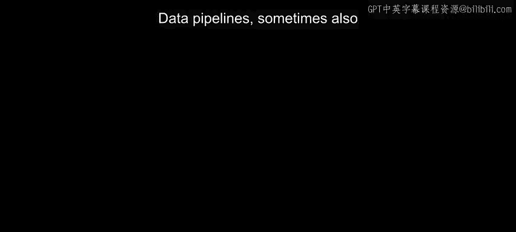
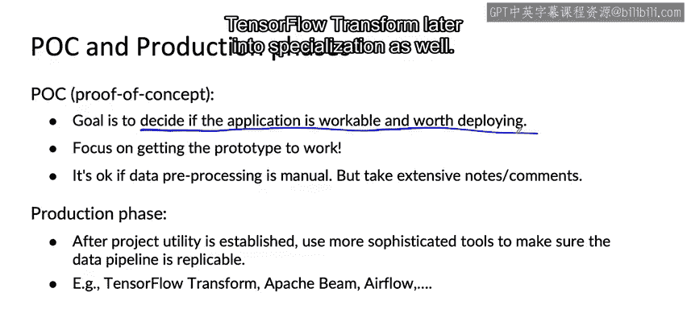

#  034：数据管道 🛠️

在本节课中，我们将要学习数据管道的基本概念、其重要性，以及在机器学习项目不同阶段如何管理数据管道的可复现性。

---

## 数据管道概述

数据管道，有时也称为数据级联，指的是数据在到达最终输出之前需要经过多个处理步骤。管理这类数据管道有一些最佳实践。

## 数据管道示例

上一节我们介绍了数据管道的概念，本节中我们来看看一个具体的例子。

假设给定一些用户信息，你需要预测该用户当前是否正在寻找工作。如果用户正在找工作，你可能希望向他们展示招聘广告或其他特别有用的信息。

给定原始数据（例如顶部的数据），在数据被输入到学习算法进行预测之前，通常需要进行某种预处理或数据清洗。数据清洗可能包括垃圾信息清理（例如移除垃圾账户）以及用户ID合并（我们在之前的视频中讨论过）。

为了这个例子，假设垃圾信息清理和用户ID合并仅通过脚本完成。脚本是明确的指令序列，告诉你的代码何时应将账户视为垃圾账户，以及何时应合并两个用户ID。当然，这些系统也可以使用机器学习算法构建，这会使它们的管理稍微复杂一些。

## 数据清洗脚本与可复现性问题

当你使用脚本进行数据清洗时，会遇到的一个问题是在生产部署中的可复现性。

假设在系统开发期间，输入数据通过预处理脚本进行处理，预处理后的数据被输入到机器学习算法中。经过一段时间的工作，你的学习算法在测试集上表现良好。

在开发阶段，你可能已经发现预处理脚本可能相当混乱。可能是你临时拼凑了一些东西来处理数据，将文件通过邮件发送给团队中的另一个成员，让他们用Python或其他脚本语言执行一些指令来处理数据，然后再让他们将处理后的数据通过邮件发回给你。

当你将这个系统投入生产时，新的数据需要经过一组类似的脚本进行处理，因为这些数据将被输入到同一个机器学习算法中。而你的机器学习算法在这些数据上的运行结果将体现在你的产品中。

因此，关键问题是：如果你的预处理是通过分散在一堆不同人员的电脑和笔记本电脑上的一系列脚本完成的，你如何复制这些脚本，以确保输入到机器学习算法的数据分布对于开发数据和对于生产数据是相同的？

## 项目不同阶段的投资策略

我发现，为确保预处理脚本高度可复现而应投入的工作量，可能在一定程度上取决于项目所处的阶段。

我知道，现在可能流行说你所做的一切都应该是100%可复现的，我可能会因为没有严格遵循这一原则而受到一些批评。但我发现很多项目确实会经历一个概念验证阶段，然后是一个生产阶段。

在概念验证阶段，主要目标是决定该应用是否可行，是否值得构建和部署。我给大多数团队的建议是，在概念验证阶段，专注于让原型工作起来。如果一些数据预处理是手动的，这是可以接受的。如果项目成功，你以后需要复制所有这些预处理，所以我的建议是：做详细的笔记，写大量的注释，以提高以后能够复制所有这些预处理的可能性。但在这个阶段，也不应该为了确保可复现性而陷入大量的流程中，因为重点确实是决定该应用是否可行，是否值得进入下一阶段。

一旦你决定这个项目值得投入生产，那么你就知道能够复制任何预处理脚本将变得非常重要。因此，在这个阶段，我会使用更复杂的工具来确保整个数据管道是可复现的。这时，一些可能稍显重量级但非常有价值的工具，如TensorFlow Transform、Apache Beam、Airflow等，就变得非常重要。事实上，你将在本专项课程后面学到更多关于TensorFlow Transform的知识。

## 总结

本节课中我们一起学习了数据管道及其可复现性。你了解了数据管道的基本概念，并通过一个预测用户求职意向的例子看到了数据清洗和预处理步骤。我们讨论了使用脚本进行预处理时可能遇到的可复现性挑战，特别是在从开发过渡到生产环境时。最后，我们探讨了在项目不同阶段（概念验证阶段和生产阶段）应如何调整对数据管道可复现性的投资策略，并介绍了一些用于确保可复现性的工具。

---

事实证明，许多应用的数据管道比我们在本视频中看到的要复杂得多。对于这些场景，你还必须考虑需要哪些元数据，或许还需要跟踪和处理数据的来源和谱系。让我们继续下一个视频来探讨这些主题。