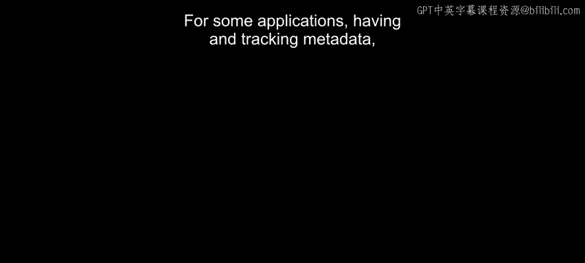
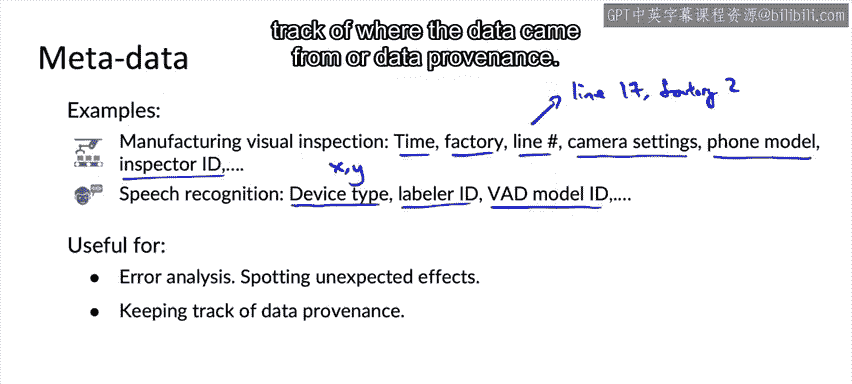

#  035：元数据、数据溯源与血统 📊

在本节课中，我们将学习元数据、数据溯源与数据血统的概念。这些概念对于构建和维护复杂、可维护的机器学习系统至关重要。我们将通过一个具体的例子来理解它们，并探讨如何利用元数据来辅助错误分析和系统改进。

---

## 数据管道的复杂性

上一节我们讨论了数据处理的基本流程。本节中，我们来看看一个更复杂的商业数据管道示例。

假设我们正在构建一个系统，用于预测用户在当前时刻是否正在寻找工作。这个系统可能涉及多个步骤和数据源。

以下是构建该预测模型可能涉及的数据处理步骤：

1.  **反垃圾邮件处理**：从原始用户数据开始，首先需要过滤垃圾邮件账户。
    *   你从外部供应商处获得一份**垃圾邮件数据**，其中包含已知的垃圾邮件账户列表和特征，例如一份已知被垃圾邮件发送者使用的**IP地址黑名单**。
    *   你实现一个机器学习算法（一段代码），并在垃圾邮件数据集上训练它，从而得到一个**反垃圾邮件模型**。
    *   将你的用户数据输入这个反垃圾邮件模型，得到**去垃圾邮件后的用户数据**。

2.  **用户ID合并**：接下来，你可能需要合并属于同一个人的多个账户。
    *   你有一些**ID合并数据**，这是标注数据，告诉你哪些账户对实际上对应同一个人。
    *   你训练另一个机器学习模型，得到一个**学习到的ID合并模型**，用于判断何时将两个账户合并为一个用户ID。
    *   将这个ID合并模型应用于去垃圾邮件后的用户数据，得到**清理后的用户数据**。

3.  **最终预测**：最后，基于清理后的用户数据（希望其中包含用户是否正在找工作的标签），训练另一个机器学习模型，得到一个**预测用户是否找工作的模型**。这个模型随后可用于对其他用户或整个用户数据库进行预测。

这种复杂程度的数据管道在大型商业系统中并不少见，甚至存在比这复杂得多的数据级联。

---

## 数据溯源与血统的挑战

构建了这样一个复杂系统后，一个挑战随之而来：如果运行数月后，你发现上游数据出了问题怎么办？

例如，你发现所使用的IP地址黑名单中存在错误。具体来说，有些IP地址被错误地列入了黑名单。这可能是因为供应商误将公司或大学校园内出于安全原因共享的IP地址判定为垃圾邮件源。

问题在于：如果你更新了你的垃圾邮件数据，这将会改变你的反垃圾邮件模型，进而影响后续的ID合并模型和最终预测模型。你该如何追溯并修复这个问题？特别是当每个子系统由不同的工程师开发，相关文件分散在团队成员的笔记本电脑上时。

为了确保系统的可维护性，尤其是在上游数据需要更改时，跟踪**数据溯源**和**血统**会非常有帮助。

*   **数据溯源**指的是数据的来源。例如，你从谁那里购买了垃圾邮件IP地址列表。
*   **数据血统**指的是到达管道末端所需的一系列步骤序列。

至少，详尽的文档可以帮助你重建数据溯源和血统。但要构建健壮、可维护的生产级系统（而非概念验证阶段），有更成熟的工具可以帮助你跟踪发生的一切，从而让你能够更改系统的某一部分，并相对容易地复现数据管道的其余部分。

坦率地说，在当前的机器学习领域，用于跟踪数据溯源和血统的工具仍不成熟。我发现详尽的文档可以提供帮助，一些正式的工具如 **TensorFlow Transform** 也有所助益。但作为一个技术社区，我们尚未完全解决这类问题。

---

## 元数据的强大作用

为了让管理数据管道、进行错误分析和推动机器学习开发变得更轻松，我想分享一个秘诀：**广泛使用元数据**。

元数据是关于数据的数据。例如，在制造业视觉检测中，数据是手机图片和对应的缺陷标签。

但如果你拥有以下元数据，情况就不同了：
*   这张手机图片是何时拍摄的？
*   图片来自哪个工厂？哪条生产线？
*   相机设置是什么（如曝光时间、光圈）？
*   你正在检测的手机编号是多少？
*   提供此标签的检测员ID是什么？

这些是关于你的数据集 `X` 和 `Y` 的数据示例。这类元数据可能非常有用。

因为如果你在机器学习开发过程中发现，由于某种奇怪的原因，**工厂2的第17号生产线**产生的图像错误率异常高，那么这些元数据就能让你回溯，去探究工厂2第17号线到底有什么问题。

但如果你一开始就没有存储工厂和生产线编号这些元数据，那么在错误分析阶段就很难发现这一点。我多次遇到这样的情况：有时甚至只是碰巧存储了正确的元数据，却在一个月后发现，这些元数据帮助产生了推动项目前进的关键洞察。

我的建议是：如果你有存储元数据的框架或MLOps工具集，那肯定会让事情变得更简单。但即使没有，就像你很少会后悔为代码添加注释一样，我认为你也很少会后悔存储那些日后可能变得有用的元数据。同样，如果你没有及时存储元数据，之后再想回头收集和组织这些数据会困难得多。

再举一个语音识别的例子：
*   如果你有来自不同品牌智能手机录制的音频。
*   或者你有不同的标注员为你的语音数据做标注。
*   或者你使用了语音活动检测模型，那么请记录你所使用的VAD模型的版本号。

所有这些都意味着，如果由于某种原因，某个版本的VAD系统导致了更大的错误，这些元数据将显著增加你发现这一问题并利用它来提升算法性能的几率。

总而言之，元数据对于错误分析、发现意外效应或识别某些性能异常差的数据子类别非常有用，从而为如何改进系统提供线索。当然，毫不意外，这类元数据对于跟踪数据来源（数据溯源）也非常有用。

---

## 本节总结

本节课中我们一起学习了数据溯源、数据血统和元数据的概念。

本视频的核心要点是：对于你可能需要维护的大型复杂机器学习系统，跟踪**数据溯源**和**血统**可以让你的工作轻松得多。作为构建这些系统的一部分，请考虑跟踪**元数据**，这不仅能帮助你追踪数据溯源，还能辅助错误分析。

在结束本节之前，还有一个重要的技巧希望与大家分享，那就是**平衡训练/开发/测试集划分**的重要性。让我们进入下一个视频。

