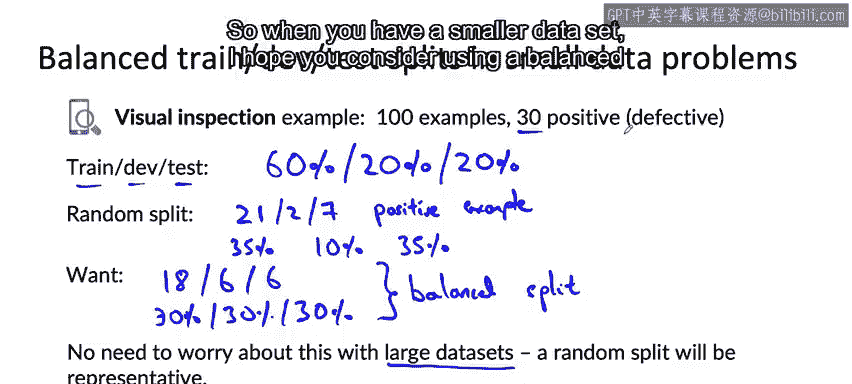

#  036：平衡的训练集、开发集和测试集 🎯

在本节课中，我们将要学习一个在数据量较小时能显著提升机器学习开发流程效率的技巧：如何创建平衡的训练集、开发集和测试集。

---

许多机器学习实践者习惯于将数据随机分割为训练集、开发集和测试集。然而，当你的数据集规模较小时，确保这些集合具有平衡的类别分布，可以极大地改善你的机器学习开发流程。让我们通过一个例子来深入理解这一点。

## 为何需要平衡分割？ ⚖️

上一节我们介绍了数据分割的基本概念，本节中我们来看看当数据量不足时，随机分割可能带来的问题。

以制造业视觉检测为例。假设你的训练集共有100张图像，这是一个相当小的数据集。其中包含30个正例（有缺陷的手机）和70个负例（无缺陷的手机）。

如果你采用60/20/20的比例进行随机分割，即：
*   60%的数据进入训练集
*   20%的数据进入开发集（验证集）
*   20%的数据进入测试集

那么，仅凭随机性，你最终可能会得到以下分布：
*   训练集：21个正例
*   开发集：2个正例
*   测试集：7个正例

以下是各集合的正例比例计算：
*   训练集：`21 / 60 ≈ 35%`
*   开发集：`2 / 20 = 10%`
*   测试集：`7 / 20 = 35%`

虽然训练集（35%）和测试集（35%）的正例比例与整体数据（30%）相差不大，但开发集的正例比例仅为10%。这意味着你的开发集**不具有代表性**，因为它只包含了2个正例，而非与整体分布匹配的6个正例。当数据集很小时，这种因随机性导致的不具代表性的分割发生的几率会更高。

## 什么是平衡分割？ ✅

我们真正希望的是每个集合都能准确地反映整体数据的分布。对于这个例子，理想的分割应该是：
*   训练集（60个样本）：`60 * 30% = 18` 个正例
*   开发集（20个样本）：`20 * 30% = 6` 个正例
*   测试集（20个样本）：`20 * 30% = 6` 个正例

这样，每个集合都保持了30%的正例比例。这种分割方式被称为**平衡分割**。它使得你的开发集和测试集能更可靠地衡量学习算法的性能。

## 何时使用平衡分割？ 📊

理解平衡分割的优势后，我们来看看它的适用场景。

*   **小数据集场景**：当你处理的数据集规模较小时，显式地确保进行平衡分割至关重要。这是能对你的模型性能产生重大影响的小技巧之一。
*   **大数据集场景**：如果你的数据集非常庞大，则无需担心此问题。随机分割极有可能产生具有代表性的子集，各子集中的正例比例会非常接近整体数据分布。

---

## 总结与课程回顾 🏁

本节课中我们一起学习了平衡分割的概念、方法及其重要性。核心要点是：**在处理小数据集时，采用平衡的训练集、开发集和测试集分割，可以使你的评估指标更加可靠。**

恭喜你完成本课程数据部分的所有视频学习！在过去的课程中，你还学习了建模与部署。接下来还有一个关于项目范围界定的可选章节，如果你有兴趣了解如何选择机器学习项目，欢迎继续观看。

无论如何，祝贺你完成了本课程所有必修内容！希望你收获颇丰，并能在未来的所有机器学习项目中应用这些思想。