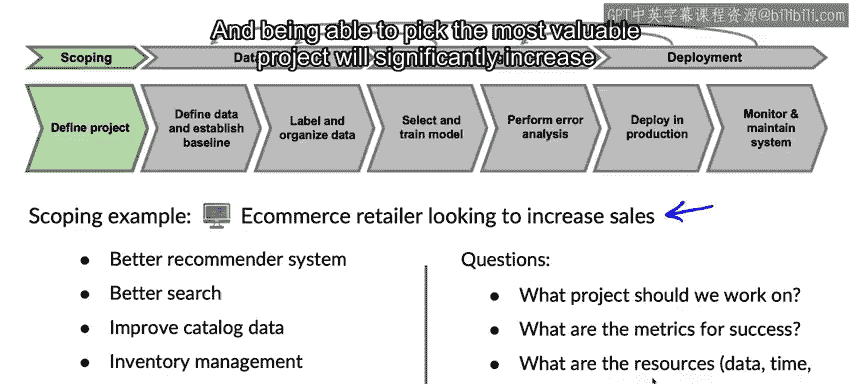

#  037：什么是确定范围

在本节课中，我们将学习如何为机器学习项目“确定范围”，即如何选择最有价值的工作项目并进行规划。这是当今人工智能领域一项至关重要且稀缺的技能。

## 项目范围确定的重要性

上一节我们介绍了课程背景，本节中我们来看看为什么需要仔细确定项目范围。

我记得在我年轻时，我倾向于直接投入第一个让我兴奋的项目。有时我很幸运，项目进展顺利。但当我积累了更多经验后，我发现，如果你或你的团队将要花费大量时间（数周、数月甚至更久）在一个项目上，那么花时间思考几个选项，并尝试在投入巨大努力之前选择最有前景的项目，是非常值得的。

因此，让我们深入探讨“确定范围”。

## 项目构思与头脑风暴

让我们以一个希望扩大规模的电子商务零售商为例。如果你坐下来头脑风暴一家电商公司可以做什么，你可能会想出很多点子。

以下是可能想到的一些项目想法：
*   更好的产品推荐系统。
*   更好的搜索功能，以便用户能找到他们想要的东西。
*   发现商品目录数据缺少字段或不完整，这影响了搜索和推荐结果，因此你可能启动一个项目来改进目录数据的质量。
*   帮助他们进行库存管理，例如决定购买多少衬衫以及将衬衫运往何处。
*   进行价格优化。

通过一次快速的头脑风暴，你可能会想出几十个帮助这家电商零售商的点子。

## 范围确定过程的核心问题

在范围确定过程中，我们希望回答以下问题：
*   我们应该从事哪个（或哪些）项目？
*   成功的衡量标准是什么？
*   执行这个项目需要哪些资源（例如数据、时间、人员）？

我在很多企业中观察到，在所有你可以从事的想法中，有些想法的价值会远高于其他想法，可能高出两倍、五倍甚至一百倍。能够选择最有价值的项目将显著增加你工作的影响力。

## 总结与过渡

机器学习是一个通用工具，我们可以用它做很多事情。那么，我们如何选择有价值的工作项目呢？

在下一节视频中，我们将更深入地探讨范围确定的具体过程。