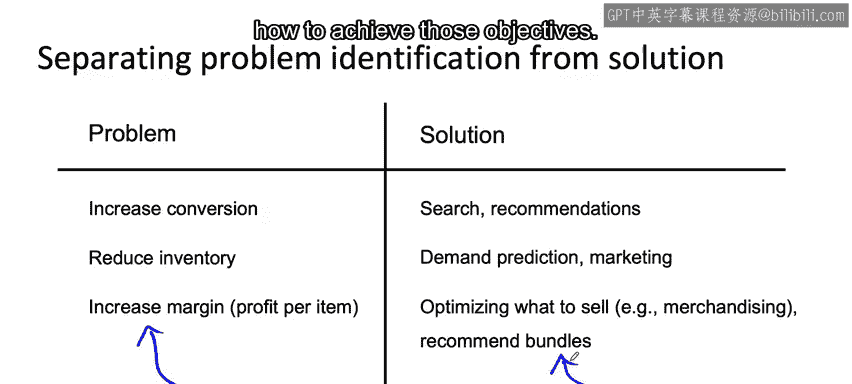

#  038：确定项目范围的过程 🎯

在本节课中，我们将学习一个用于确定机器学习项目范围的系统性过程。这个过程有助于在项目初期，清晰地识别业务问题并探索可能的AI解决方案，从而确保团队将精力投入到最具价值和可行性的项目上。

---

## 识别问题与解决方案

上一节我们介绍了项目范围确定的重要性，本节中我们来看看如何具体地识别业务问题与潜在的解决方案。

当首次与公司讨论AI项目时，我通常会与业务或产品负责人（通常不是AI专家）一起进行头脑风暴。这个阶段的目标是识别**业务问题**，而不是AI问题。

例如，在与一家电子商务零售公司交流时，我可能会问：“你们最希望改进的前三件事是什么？”他们可能会提出以下业务问题：
*   希望提高网站转化率（即访问者完成购买的比例）。
*   希望减少库存积压。
*   希望提高每件售出商品的利润率。

在这个阶段，我明确不关注AI问题。我的职责是与合作伙伴一起，判断是否存在AI解决方案。有时答案是否定的，这也没关系。

只有在明确了业务问题之后，我们才开始头脑风暴，探索是否存在可能的AI解决方案。并非所有问题都能用AI解决，但我们需要为一些业务问题构思机器学习算法的应用思路。

我发现，将**问题识别**与**解决方案识别**分开进行非常有帮助。作为工程师，我们擅长提出解决方案，但首先清晰地阐述问题是什么，往往能帮助我们想出更好的方案。这种问题与解决方案的分离，在设计思维的相关著作中也能见到。

---

## 探索解决方案示例

以下是针对之前提到的三个业务问题，可能产生的AI解决方案思路。

针对“提高转化率”的问题，可以构思多种解决方案：
*   **改进网站搜索结果质量**，让用户搜索时找到更相关的商品。
*   **基于用户购买历史提供更好的商品推荐**。
*   重新设计商品在页面上的展示方式。
*   找到有趣的方式，突出显示最相关的商品评论，帮助用户了解商品并促成购买。

针对“减少库存”的问题，可以构思的解决方案包括：
*   **启动需求预测项目**，以更准确地估计销量，从而避免采购过多或过少，实现更精准的库存管理。
*   策划营销活动，专门推动那些采购过多的商品的销售，引导更多购买以消化仓库库存。

针对“提高利润率”的问题，可以构思的解决方案有：
*   使用机器学习来优化销售品类（在零售业中有时称为商品规划），决定什么值得销售，什么不值得。
*   推荐商品捆绑销售，例如当用户购买相机时，向他们推荐相机保护套，这类捆绑销售也能提高利润率。

问题识别是思考“你想要实现什么目标”的步骤，而解决方案识别则是思考“如何实现这些目标”的过程。

---

## 发散思维与收敛思维

在探索了多种可能性后，我们需要进行评估和筛选。这个过程涉及从发散思维到收敛思维的转变。

我至今仍看到太多团队会直接跳入他们第一个感到兴奋的项目。根据我的经验，如果你对某个应用或行业有深厚的领域知识，你的直觉认为可行的第一个想法或许可以。但即便如此，我仍然认为首先进行**发散思维**是值得的，即头脑风暴出大量可能性；随后再进行**收敛思维**，将范围缩小到一个或少数几个最有前景的项目上集中精力。

我希望大家能避免的一种情况是：在一个项目上投入大量工作，创造了一定量的经济或社会价值，但如果有另一个项目，在相同的工作量下能创造**10倍**的价值。我认为这种项目范围确定过程将帮助你实现这一点。

---

## 评估与规划

在头脑风暴出各种不同的解决方案后，下一步就是评估这些方案的**可行性**和**价值**。我有时会用“尽职调查”这个词来指代这个阶段。这个词源自法律领域，但基本上意味着**双重验证**——验证一个AI解决方案在技术上是否真的可行、是否有价值，或者验证你希望成立的事情是否真的成立。

在验证了技术可行性和价值（或投资回报率ROI）之后，如果项目看起来仍然有希望，我们接着会细化项目的**里程碑**，并最终为项目**预算资源**。

---

本节课中我们一起学习了确定机器学习项目范围的系统过程：从识别核心业务问题出发，通过头脑风暴探索多种AI解决方案，并强调将问题与方案分离思考的重要性。接着，我们看到了从发散思维到收敛思维的过渡，以及通过评估可行性与价值来筛选最具潜力的项目。这个过程旨在帮助团队避免盲目投入，而是将资源集中在能创造最大价值的项目上。