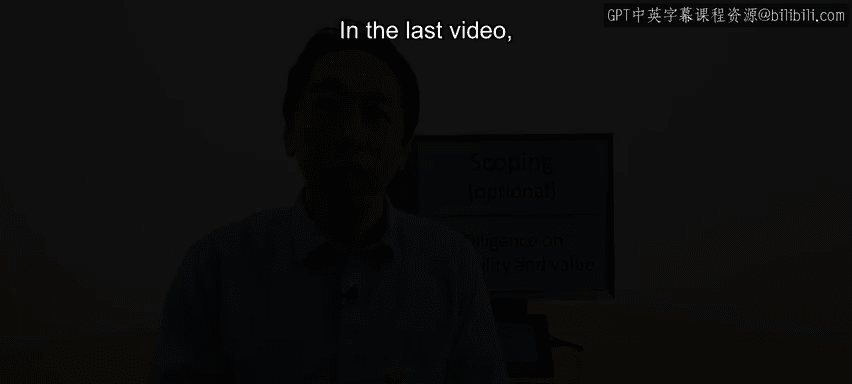
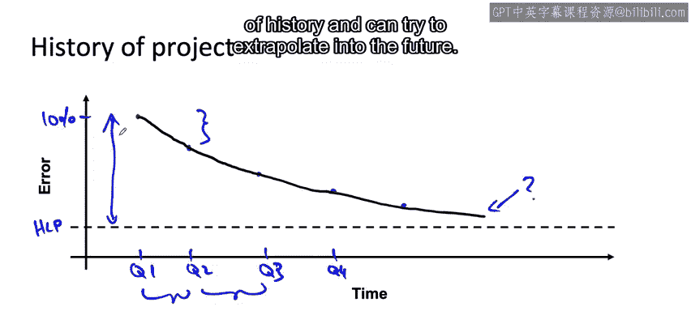

#  039：38_可行性和价值调查 📊

在本节课中，我们将学习如何对一个机器学习项目进行技术可行性和价值评估。我们将深入探讨如何通过尽职调查步骤，判断一个项目是否真正可行，以及其潜在价值有多大。

上一节我们介绍了项目评估的整体步骤，本节中我们来看看如何具体评估项目的技术可行性。

## 评估技术可行性

在启动一个机器学习项目之前，如何知道这个想法是否能够实现？

一种快速评估可行性的方法是使用外部基准。

例如，可以参考研究文献或其他形式的出版物。

或者，如果其他公司甚至竞争对手已经成功构建了某种类型的在线搜索系统、推荐系统或库存管理系统。

如果存在这样的外部基准，可能有助于你判断这个项目在技术上是否可行。

因为其他人已经成功完成了类似的事情。

为了补充这类外部基准，或者在缺乏此类基准的情况下，以下是评估可行性的其他方法。

我将构建一个2x2矩阵，根据你的问题是涉及非结构化数据（如语音、图像）还是结构化数据（如交易记录），以及是全新项目还是改进现有项目，来审视不同情况。

在另一个轴上，我将区分“全新”与“现有”。“全新”指你首次尝试构建一个系统来完成某项任务。

例如，如果你从未做过需求预测，现在正考虑构建一个。

而“现有”指你已经拥有一个执行此任务的现有系统（可能是机器学习系统，也可能不是），并且正在规划一个改进现有系统的项目。

因此，“全新”意味着你正在交付一个全新的能力，“现有”意味着你正在规划一个项目来改进现有能力。

在左上象限（非结构化数据，全新项目），要判断一个项目在技术上是否可行，我发现人类水平性能（HLP）对于给出初步判断非常有用。

在评估HLP时，我会给人类提供与学习算法相同的数据，然后询问：人类在给定相同数据的情况下，能否执行某项任务？

例如，人类在给定一张有划痕的智能手机图片时，能否可靠地检测出划痕？

如果人类能做到，那么这大大增加了机器学习算法也能做到的可能性。

对于现有项目，我也会将HLP作为参考。

如果你有一个视觉缺陷检测系统，并希望将其性能提升到某个水平，而人类能够达到你希望达到的水平，那么这可能让你更有信心认为它在技术上是可行的。

反之，如果你希望将性能提升到远超过人类水平，则表明该项目可能更困难或不可能实现。

除了HLP，我还经常使用项目的历史进展作为未来进展的预测指标。

我们将在接下来的几张幻灯片中详细讨论HLP和项目历史。

但项目过去的进展速度，可以合理地预测其未来的进展速度。我们将在本视频后面看到更多相关内容。

移动到右侧列（结构化数据，全新项目），我会问的问题是：我们是否有可用的预测性特征？

你是否有理由认为你所拥有的数据，即输入X，能够强有力地或足够地预测目标输出y？

在右下象限（结构化数据，现有项目），如果你试图改进一个现有系统，那么一件事会非常有帮助：你是否能识别出新的预测性特征？

也就是说，是否存在你尚未使用、但可以识别出来并能真正帮助预测y的特征？

同时，通过审视项目的历史进展。

在这张幻灯片中，你听到了三个概念：人类水平性能、预测性特征是否可用以及项目历史。让我们更深入地看看这三个概念。

## 深入探讨可行性评估概念

让我们从在非结构化数据（如图像）上使用HLP开始。

我使用HLP来基准化非结构化数据任务可能实现的目标，因为人类在非结构化数据任务上非常出色。

因此，评估项目可行性的关键标准是：人类在仅获得与学习算法完全相同的数据时，能否执行该任务？

让我们看一个例子。假设你正在构建一辆自动驾驶汽车，并且希望算法能分类交通灯当前是红色、黄色还是绿色。

我会从你的自动驾驶汽车上获取图片，然后让一个人看像这样的图像，看看仅凭图像，一个人能否分辨出哪个灯是亮的。在这个例子中，很明显是绿灯。

但如果你发现你也有像这样的图片，那么，在这个例子中，我无法分辨哪个灯是亮的。

这就是为什么对于这个HLP基准测试来说，确保人类只获得与你的学习算法相同的数据非常重要。

事实证明，也许一个坐在车里亲眼看到交通灯的人可以告诉你右边这个例子中哪个灯是亮的。

但那是因为人眼比大多数数码相机具有更好的对比度。

然而，有用的测试不是人眼能否识别哪个灯是亮的，有用的测试是如果这个人坐在办公室里，只能看到相机拍摄的图像，他们是否仍然能完成这个任务。

这能让你更好地判断可行性。

具体来说，它帮助你更好地猜测一个学习算法（它只能访问这张图像）是否也能准确检测出交通灯中哪个灯是亮的。

确保人类看到的与学习算法将看到的数据完全相同，这一点非常重要。

我见过很多项目，团队长时间致力于一个计算机视觉系统，他们认为可以做到，因为人类亲自检查手机或某物时可以检测到缺陷。

但花了很长时间才意识到，即使是人类只看图像也无法弄清楚发生了什么。

这样，你就可以更早地发现，以当前的相机设置，这根本不可行。更有效的做法是早期投资于更好的相机或更好的照明设置等，而不是继续在一个我认为在当时可用的成像设置下无法解决的问题上研究机器学习算法。

接下来，对于结构化数据问题，评估技术可行性的关键标准之一是：我们是否有看起来可以预测我们试图预测的Y的输入特征X？

让我们看几个例子。

在我们的电商例子中，如果你有显示用户过去购买记录的特征，并且你想预测未来的购买行为，这对我来说似乎是合理的，因为大多数人的过去购买记录可以预测未来的购买。

因此，如果你有过去的购买数据，你确实拥有似乎可以预测未来购买的特征，这个项目可能值得尝试。

或者，如果你在一家实体店工作，给定天气数据，如果你想预测购物中心的人流量（即有多少人会去商场），我们知道下雨时出门的人会少得多，所以天气可以预测购物中心的人流量。因此，我会说你有值得尝试的预测性特征。

让我们看更多的例子。

给定一个人的DNA，尝试预测这个人是否会患心脏病。这个我不确定。

从你的DNA到你是否会患心脏病，在生物学中是一个非常嘈杂的映射，这被称为基因型和表型。

但从基因型到表型，或者说从你的遗传信息到你的健康状况，是一个非常嘈杂的映射。

所以我对这个项目持复杂态度，因为事实证明，你的基因序列对是否会患心脏病只有轻微或中度的预测性。我会在那里放一个问号。

或者，给定社交媒体上的讨论，你能预测一种服装风格的需求吗？这是另一个例子。

我认为你可能能够预测当前服装风格的需求，但给定社交媒体上的讨论，你能预测六个月后流行的时尚趋势吗？这实际上似乎非常困难。

我见过人工智能项目失败的一种情况是，有这样一个想法：让我们使用社交媒体来了解人们在时尚方面谈论什么，然后制造服装并在六个月后销售。

有时数据就是没有那么强的预测性，最终你得到的只是一个比随机猜测好不了多少的学习算法。

这就是为什么审视你是否拥有你认为具有预测性的特征，是评估项目技术可行性的一个重要尽职调查步骤。

最后一个可能更清晰的例子：给定某只股票或特定股价的历史记录，尝试预测该股票的未来价格。

我所看到的所有证据表明，除非你获得其他一些巧妙的特征集，否则这是不可行的。

仅凭单一股票的历史价格来预测其未来价格是极其困难的。

根据我所看到的证据，我会说，如果这些是你仅有的特征，那么这些特征并不能预测该股票的未来价格。

因此，即使抛开预测股价进行交易能创造多少社会价值的问题，我有时认为这个项目在技术上也是不可行的。

最后，在这个图表中，我提到过几次的最后一个标准是项目的历史。让我们来看看这个。

当我从事一个机器学习应用项目许多个月后，我发现之前的改进速度可能是预测未来改进速度的一个令人惊讶的好指标。

以下是一个你可以使用的简单模型。

以语音识别为例。

假设这是人类水平性能，我将使用人类水平性能作为我们对基础误差或我们希望达到的不可减少的误差水平的估计。

假设在项目开始时，比如某年的第一季度（Q1），系统的错误率是10%。

随着时间的推移，在随后的季度中，错误率下降，像这样：Q2，Q3，Q4，等等。

事实证明，估计这条曲线的一个不算太差的模型是：如果你想估计团队未来能做得如何，我使用过的一个简单模型是，估计进展速度为：每段固定时间（比如每个季度），团队将相对于人类水平性能，将错误率降低某个百分比。

在这种情况下，当前性能水平与人类水平性能之间的差距似乎每个季度缩小了大约30%。

这就是为什么你得到这条向HLP呈指数衰减的曲线。

通过估计这个进展速度，你可以预测未来，希望在未来的季度中，你继续相对于HLP将错误率降低30%。

这将让你了解这个项目未来可能的合理进展速度，并让你对一个已有此类历史、可以尝试推断未来的现有项目，什么是可行的有一个概念。

在本视频中，你看到了如何使用人类水平性能、预测性特征是否可用以及项目历史来评估技术可行性。

下一节，让我们更深入地探讨如何评估项目的价值，我们将在下一个视频中进行。