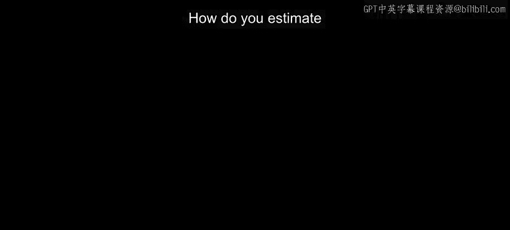
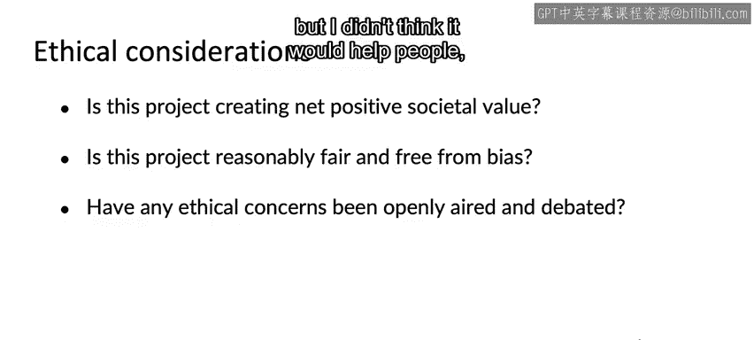

#  040：如何评估机器学习项目的价值 💰

在本节课中，我们将学习如何评估一个机器学习项目的价值。这并非易事，但我们将分享一些最佳实践，帮助你从技术指标和商业目标两个维度进行综合考量。

---

## 从技术指标到商业价值

上一节我们介绍了项目评估的重要性，本节中我们来看看如何将机器学习团队的技术指标与业务团队关心的商业价值联系起来。

以语音识别为例。假设你正在为智能手机应用开发一个更精准的语音搜索系统，允许用户通过语音进行网络搜索。

在大多数企业中，通常存在两类指标：
*   机器学习工程师习惯优化的技术指标。
*   产品或业务负责人希望最大化的商业指标。

这两者之间往往存在差距。

---

## 指标间的差距与妥协

构建机器学习系统时，学习算法优化的目标可能是**词级准确率**。例如，用户说了一定数量的词，我们正确识别了多少个。学习算法可能通过梯度下降来优化对数似然或其他标准。许多机器学习团队会致力于获得良好的词级准确率。

但在商业应用场景中，另一个关键指标是**查询级准确率**，即用户整个查询语句被完全正确识别的频率。对某些业务而言，词级准确率固然重要，但查询级准确率可能更为关键。

至此，我们已经离学习算法直接优化的目标（词级准确率）远了一步。

即使用户查询被正确识别，这对用户体验很重要，但用户更关心的是**搜索结果的质量**。业务方希望确保搜索结果质量，因为这能提供更好的用户体验，从而**提高用户参与度**，使用户更频繁地使用搜索引擎。这很重要，但这只是最终驱动业务收入的其中一步。

我经常看到机器学习团队和业务团队之间存在这样的差距：工程团队通常希望专注于技术指标（如词级准确率），而业务领导者则希望得到关于商业结果（如收入）的承诺。

为了让项目顺利进行，我通常尝试让技术团队和业务团队就双方都能接受的指标达成一致。这往往需要一些妥协：机器学习团队可能需要更多地向右（商业指标）靠拢，而业务团队则需要更多地向左（技术指标）靠拢。我们越向右靠拢，机器学习团队就越难给出确切的保证。

我希望更多问题可以通过梯度下降或优化测试集准确率来解决，但现实并非如此。许多实际问题需要我们做的不仅仅是优化测试集准确率。因此，技术团队和业务团队都稍微走出各自的舒适区，对于达成妥协、选取一套双方都能接受的指标至关重要。这套指标需要技术团队觉得通过努力可以实现，而业务团队也相信它能创造足够的商业价值。

---

## 建立粗略的关联估算

另一个有用的实践是，进行粗略的“信封背面”计算，将技术指标与右侧的商业指标关联起来。

例如，如果词级准确率提高1%，你可以大致估算这会使查询级准确率提高多少（也许是0.7%或0.8%），进而会如何改善搜索结果质量、用户参与度，甚至最终影响收入。

即使是非常粗略的估算（有时也称为费米估算，你可以在维基百科上了解更多），也能帮助弥合机器学习工程指标和商业指标之间的鸿沟。

---

## 项目价值的伦理考量

在评估项目价值时，我鼓励你也思考任何伦理方面的考量。例如：
*   这个项目是否创造了**净正面的社会价值**？如果没有，我希望你不要做。
*   这个项目是否**相对公平且没有偏见**？
*   任何基于伦理或价值观的担忧是否已被公开提出和讨论？

我发现价值观和伦理问题高度依赖于具体领域，在贷款、医疗保健和在线产品推荐等不同场景下差异很大。

因此，我鼓励你查找为你的行业和应用场景制定的任何伦理框架。如果你有任何担忧，请在团队内部提出来进行辩论。

最终，如果你认为你正在做的项目不能帮助他人或推动人类进步，我希望你能继续寻找其他更有意义的项目。

在我的工作中，我曾面临艰难的选择，当时我真的不确定是否应该参与某个特定项目，因为我不知道它是否会让人们的生活变得更好。我发现，让团队公开辩论和讨论，通常能帮助我们找到更好的答案，并对最终做出的决定感到更安心。我曾基于伦理考量终止了多个项目，尽管它们在经济上完全可行，但我认为它们不能真正帮助人们。我只是告诉团队我不想做，也不会做。

---

## 总结与展望

本节课中，我们一起学习了如何评估机器学习项目的价值。我们探讨了技术指标与商业目标之间的差距，以及通过妥协和粗略估算来弥合这一差距的方法。更重要的是，我们强调了在项目评估中纳入伦理考量的必要性，确保我们所从事的工作能够创造净正面的社会价值，帮助他人，并推动人类进步。

我希望这能为你提供一个评估项目价值的框架。在伦理和价值方面，我认为我们所有人都应该只从事那些能创造净正面社会价值、帮助他人、推动人类进步的项目。我个人曾仅基于这个理由终止过多个项目，尽管它们的经济价值完全合理，但我审视后认为它们并不能真正帮助人们。我因此终止了项目，并告诉我的团队让我们找点别的事情做，因为我不想做那些事。我希望你也能将精力集中在那些帮助他人、推动人类进步的项目上。