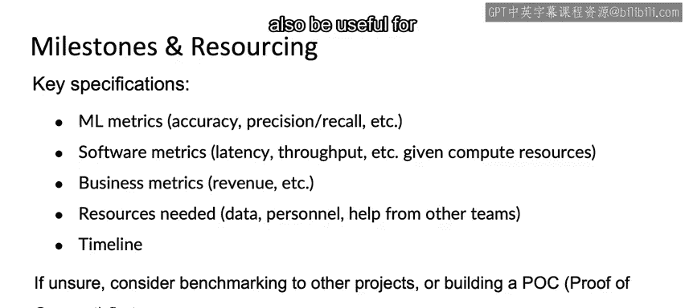

#  041：里程碑与资源分配 🎯

在本节课中，我们将学习项目范围界定流程的最后两个关键步骤：确定**里程碑**与**资源分配**。这两个步骤旨在将项目构想转化为具体、可执行的计划。

上一节我们讨论了技术可行性与价值评估，本节中我们来看看如何将评估结果转化为清晰的项目路线图。

## 确定里程碑与资源

确定里程碑与资源分配，涉及为你的项目撰写关键的技术规格说明。

这些规格说明通常包括：
*   **机器学习指标**：例如，对于分类任务，你可能需要关注**准确率**或**精确率与召回率**。在某些应用中，还可能包括**公平性**相关的指标。
*   **软件系统指标**：考虑到可用的计算资源，你需要定义软件层面的要求，例如**延迟**、**吞吐量**或**每秒查询数**。
*   **业务指标**：如果可能，还应预估项目希望推动的业务指标，例如**增量收入**的估算。

以下是撰写规格说明时需要考虑的核心方面：

*   **所需资源**：明确项目需要哪些资源。
*   **数据来源**：需要多少数据，以及从哪些团队获取。
*   **人员配置**：需要哪些人员，以及需要跨职能团队提供何种帮助。
*   **软件与集成**：需要哪些软件集成。
*   **外部支持**：是否需要数据标注支持或其他团队的支持。
*   **时间线**：希望在何时达成特定的里程碑或交付成果。

## 应对不确定性：基准测试与概念验证

如果你在定义上述关键规格时遇到困难，可以考虑以下两种方法：

1.  **进行基准测试**：与其他类似项目进行比较，了解行业或团队内的可行标准。
2.  **构建概念验证**：首先构建一个**POC**，以更准确地评估可实现的准确率、延迟、吞吐量等指标。

只有在完成概念验证后，你才能更自信地为项目的大规模执行规划里程碑和所需资源。

## 总结

本节课中，我们一起学习了项目范围界定流程的收尾工作。我们探讨了如何通过定义**机器学习指标**、**软件指标**和**业务指标**来确立项目里程碑，并详细规划了所需的**数据**、**人员**和**时间线**等资源。当面临不确定性时，进行**基准测试**或构建**概念验证**是有效的应对策略。

恭喜你完成了整个项目范围界定部分的学习。希望这些思路能帮助你选择有价值、有意义的项目进行工作。感谢你从部署、建模、训练一直追溯到范围界定的全程陪伴，希望这个完整的机器学习项目周期框架，能对你未来构建和部署的所有项目有所助益。